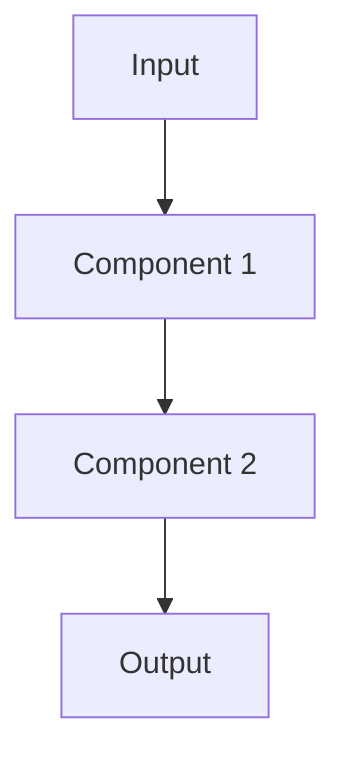

# POC High-Level Design — [Project Name]

> **Lightweight HLD Template for AI/ML/DL/GenAI Proof-of-Concept**
> 
> This template is designed to be completed in 30–60 minutes. Focus on feasibility validation, not production-readiness.

---

## Document Metadata

| Field | Value |
|-------|-------|
| **Title** | [POC Name] |
| **Author** | [Name] |
| **Date** | YYYY-MM-DD |
| **Status** | Proposed / In Progress / Completed / Abandoned |
| **Time Box** | [e.g., 2 weeks] |
| **JIRA/Ticket** | [Link] |

---

## 1. POC Objective

<!-- Clearly state what this POC is trying to prove. A good POC has a single, testable hypothesis. If you can't articulate a clear Go/No-Go criteria, the POC scope is too vague. -->

### 1.1 What Are We Validating?

<!-- One sentence: what specific question does this POC answer? E.g., "Can we use RAG to answer product support queries with >85% accuracy?" -->

### 1.2 Hypothesis

<!-- State the hypothesis in a falsifiable way. E.g., "We believe that an LLM with retrieval over our knowledge base can resolve 70%+ of Tier-1 support queries without human intervention." -->

### 1.3 Go / No-Go Criteria

<!-- Define the threshold that determines whether we proceed to full implementation or kill the idea. Be specific and measurable — this prevents ambiguous "it kind of works" conclusions. -->

| Criteria | Threshold | How Measured |
|----------|-----------|-------------|
| | | |
| | | |

---

## 2. Problem Statement

### 2.1 Business Problem

<!-- In 2-3 sentences: what is the business pain point? Who suffers and how much? Quantify if possible (e.g., "Engineers spend 6 hours/week searching documentation manually"). -->

### 2.2 Current State / Baseline

<!-- How is this problem handled today? What is the current performance? This becomes the baseline against which the POC is measured. E.g., "Manual resolution takes 15 minutes average; accuracy is ~60% based on customer feedback." -->

### 2.3 Why AI/ML?

<!-- Why do we believe AI/ML is the right approach here? What have we ruled out? This prevents building complex AI solutions for problems solvable with a simple keyword search or rule engine. -->

---

## 3. Scope & Boundaries

### 3.1 In-Scope

<!-- List the specific scenarios, data types, user groups, or features this POC will cover. Keep it narrow — a POC that tries to do everything proves nothing. -->

- 

### 3.2 Out-of-Scope

<!-- Explicitly state what we are NOT building in the POC. This manages expectations and prevents scope creep during the time box. E.g., "Production deployment, multi-language support, authentication, UI." -->

- 

### 3.3 Time Box

<!-- How long do we have? A POC without a time box becomes an eternal experiment. State the hard deadline and what must be delivered by then. -->

- **Duration:**
- **Start date:**
- **Demo/review date:**

---

## 4. Data Availability & Readiness

<!-- This is the most critical section for a POC. If data is not available or requires months of preparation, the POC cannot start. Be brutally honest about data readiness. -->

### 4.1 Data Requirements

<!-- What data does the POC need to function? List each data type/source required. E.g., "Product documentation (PDF), historical support tickets (JSON), customer FAQs." -->

| # | Data Needed | Purpose in POC |
|---|-------------|---------------|
| 1 | | |
| 2 | | |
| 3 | | |

### 4.2 Availability Assessment

<!-- For each data requirement above: do we have it today? Be honest — "we think it exists somewhere" is not "available." This table is the single biggest predictor of whether the POC can proceed. -->

| # | Data | Available? | Location / Owner | Access Granted? |
|---|------|-----------|-----------------|-----------------|
| 1 | | Yes / Partial / No | | Yes / Pending / No |
| 2 | | | | |
| 3 | | | | |

### 4.3 Format & Quality

<!-- What format is the data in? How clean is it? Raw messy data requires significant preparation before a POC can begin. -->

| # | Data | Format | Quality | Notes |
|---|------|--------|---------|-------|
| 1 | | PDF / CSV / JSON / DB / API / Unstructured | Clean / Noisy / Unknown | |
| 2 | | | | |

### 4.4 Volume

<!-- How much data is available vs how much the POC needs? A POC usually needs far less data than production, but there's still a minimum. -->

| # | Data | Available Volume | POC Minimum Needed | Sufficient? |
|---|------|-----------------|-------------------|-------------|
| 1 | | | | Yes / No |
| 2 | | | | |

### 4.5 Gaps & Blockers

<!-- What data is missing or inaccessible? What blocks us from starting? Be explicit — these become the first action items before POC work begins. -->

| Gap / Blocker | Impact | Mitigation / Action | Owner |
|--------------|--------|--------------------| ------|
| | | | |

### 4.6 Data Preparation Effort

<!-- How much work is needed to make the data POC-ready? If preparation takes 80% of the time box, the POC scope may be too ambitious. -->

| Task | Estimated Effort | Notes |
|------|-----------------|-------|
| | | |

### 4.7 Licensing & Sensitivity

<!-- Are there any restrictions on using this data for experimentation? PII concerns, licensing limitations, or security classifications that affect what we can do in a POC environment. -->

- **Contains PII?** Yes / No
- **Licensing restrictions?**
- **Security classification?**
- **Can be used in non-production environment?** Yes / No

---

## 5. Proposed Approach

### 5.1 AI/ML Technique

<!-- What category of AI/ML does this fall into and what specific approach will you try? E.g., "RAG with vector retrieval + GPT-4o" or "Fine-tuned BERT classifier" or "Multi-agent workflow with tool calling." -->

| Attribute | Value |
|-----------|-------|
| **Category** | RAG / Classification / Generation / Agent / Detection / Other |
| **Technique** | |
| **Model(s)** | |

### 5.2 Architecture Sketch

<!-- Draw the simplest possible diagram showing how data flows from input to output. This is a napkin sketch, not a production architecture. Show the key components and their interactions. -->

### 5.3 Key Components

<!-- List the main building blocks of the POC. What does each one do? What technology will you use? Keep it brief — we're not making production decisions here, just picking tools that let us validate fast. -->

| Component | Purpose | Technology / Tool |
|-----------|---------|-------------------|
| | | |
| | | |

---

## 6. Evaluation Plan

<!-- How will you know if the POC worked? Without clear evaluation, a POC produces opinions instead of evidence. Define metrics, thresholds, and the test dataset before building anything. -->

### 6.1 Metrics & Thresholds

<!-- What metrics will you measure and what constitutes "good enough" for a POC? These should map directly to the Go/No-Go criteria in Section 1.3. -->

| Metric | Threshold (POC pass) | How Measured |
|--------|---------------------|-------------|
| | | |
| | | |

### 6.2 Test Dataset

<!-- What data will you evaluate against? How will you create or obtain ground truth? For a POC, even 50-100 well-curated test cases can be sufficient. -->

- **Source:**
- **Size:**
- **Ground truth creation method:**

### 6.3 Baseline Comparison

<!-- What are you comparing against? This could be the current manual process, a keyword search, a random baseline, or a simpler model. Without a baseline, "85% accuracy" is meaningless. -->

- **Baseline:**
- **Baseline performance:**

---

## 7. Technical Decisions

<!-- Document the key technology choices for the POC. Keep justifications brief — for a POC, "fastest to prototype with" is a valid reason. These are NOT production commitments. -->

| Decision | Choice | Justification |
|----------|--------|--------------|
| LLM / Model | | |
| Vector DB / Storage | | |
| Framework | | |
| Language | | |
| Deployment (POC) | | Local / Notebook / Dev server |

---

## 8. Risks & Assumptions

### 8.1 Risks

<!-- What could make this POC fail? Think about data quality, model limitations, time constraints, and technical unknowns. For each risk, note how likely it is and what you'll do if it materializes. -->

| Risk | Likelihood | Impact | Mitigation |
|------|-----------|--------|-----------|
| | L/M/H | L/M/H | |
| | | | |

### 8.2 Assumptions

<!-- What are you assuming to be true? If any assumption proves false, the POC results may be invalid. Make these explicit so reviewers can challenge them early. -->

- 
- 

---

## 9. Resource & Timeline

### 9.1 Team

<!-- Who is working on this POC? What is their availability? A POC with 10% of someone's time over 3 months is usually worse than 100% for 1 week. -->

| Person | Role | Availability |
|--------|------|-------------|
| | | |

### 9.2 Requirements

<!-- What do we need to get started? Compute, API keys, data access, tools. List anything that isn't already available and needs to be provisioned. -->

- **Compute:**
- **API access:**
- **Data access:**
- **Other:**

### 9.3 Timeline

<!-- Break the time box into rough phases. A 2-week POC might be: Day 1-2 data prep, Day 3-7 build, Day 8-9 evaluate, Day 10 demo. -->

| Phase | Duration | Deliverable |
|-------|----------|-------------|
| Data preparation | | POC-ready dataset |
| Build / Experiment | | Working prototype |
| Evaluate | | Results + metrics |
| Document / Demo | | POC report + demo |

---

## 10. Exit Criteria & Next Steps

<!-- Define what happens after the POC ends. A POC without exit criteria lingers forever. Be explicit about both the success and failure paths. -->

### 10.1 If POC Succeeds

<!-- What's the path from successful POC to production? What's the next document to write (full HLD)? What additional work is needed? -->

- **Next step:**
- **Full HLD needed?** Yes / No
- **Estimated effort to production:**
- **Key gaps between POC and production:**

### 10.2 If POC Fails

<!-- What do we do if it doesn't meet the threshold? Kill the idea? Try a different approach? Identify what we learned. Failure is a valid outcome — it saved us from a bad production investment. -->

- **Pivot options:**
- **Kill criteria:**
- **Learnings to document:**

### 10.3 If Inconclusive

<!-- What if results are ambiguous? Under what conditions would we extend the POC vs make a decision? Define a maximum extension (e.g., 1 additional week). -->

- **Extend conditions:**
- **Maximum extension:**

---

## POC Readiness Checklist

<!-- Before starting the POC, verify all prerequisites are met. If any critical item is "No", resolve it before spending time building. -->

| # | Prerequisite | Ready? | Notes |
|---|-------------|--------|-------|
| 1 | Data available and accessible | Yes / No | |
| 2 | Compute / environment provisioned | Yes / No | |
| 3 | API keys / model access granted | Yes / No | |
| 4 | Evaluation dataset defined | Yes / No | |
| 5 | Go/No-Go criteria agreed by stakeholders | Yes / No | |
| 6 | Time box confirmed and calendar blocked | Yes / No | |
