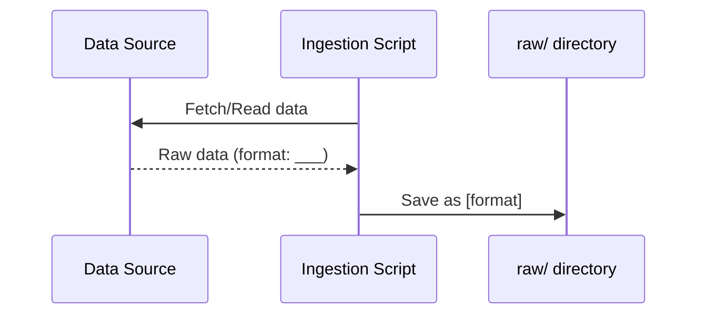
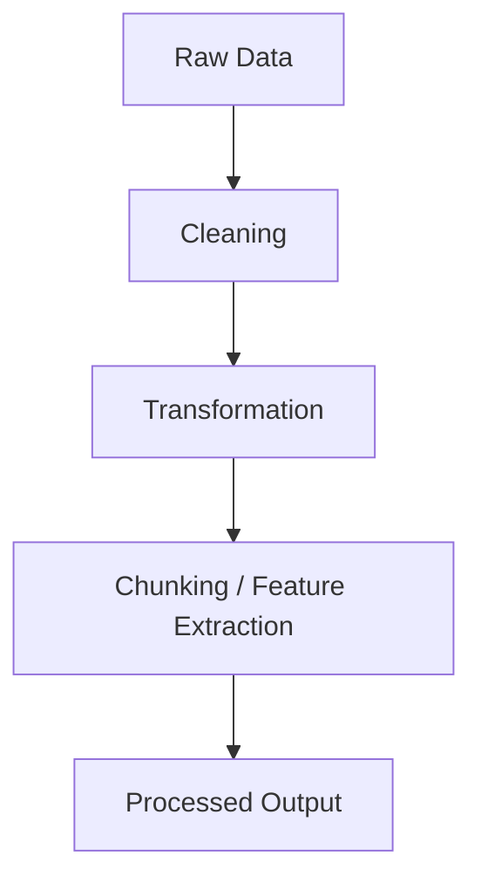
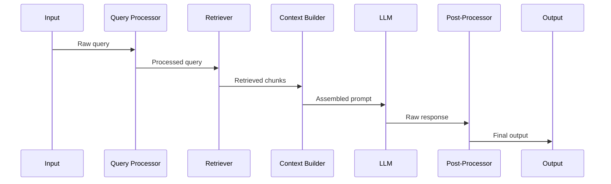
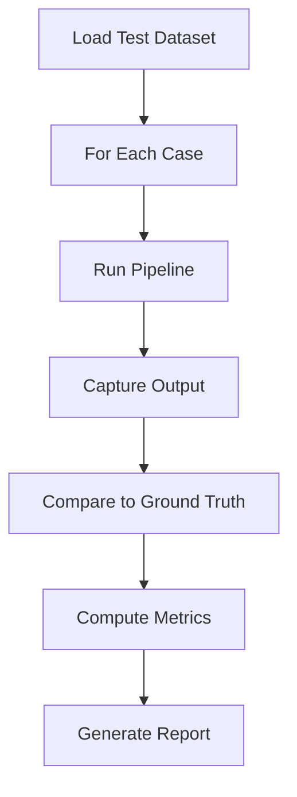

# POC Low-Level Design — [Project Name]

> **Lightweight LLD Template for AI/ML/DL/GenAI Proof-of-Concept**
>
> This document provides implementation-level detail for a POC. A developer should be able to start coding after reading this. It complements the POC HLD (which covers "what and why") by answering "how exactly."

---

## Document Metadata

| Field | Value |
|-------|-------|
| **Title** | [POC Name] — Low-Level Design |
| **Author** | [Name] |
| **Date** | YYYY-MM-DD |
| **Status** | Draft / Ready for Implementation / Implemented |
| **Linked HLD** | [Link to POC HLD] |
| **Repository** | [Link to repo] |

---

## 1. Implementation Overview

### 1.1 Component Summary

<!-- List every component from the HLD, now with concrete technology choices and implementation responsibility. This is the mapping from "architecture boxes" to "things we'll actually build." -->

| Component | Technology | Responsibility | Build / Reuse |
|-----------|-----------|---------------|---------------|
| | | | Build / Library / SaaS |
| | | | |

### 1.2 Technology Stack

<!-- Finalize the exact versions. In a POC, pinning versions prevents "works on my machine" issues when demonstrating results. -->

| Layer | Technology | Version |
|-------|-----------|---------|
| Language | | |
| AI/ML Framework | | |
| LLM | | |
| Embedding Model | | |
| Vector Store | | |
| Data Processing | | |
| API Framework (if any) | | |
| Notebook / Runner | | |

### 1.3 Project Structure

<!-- Define the directory layout. Even for a POC, a clear structure prevents the codebase from becoming a single unreadable notebook. -->

```text
project-root/
├── data/
│   ├── raw/                  # Original source data
│   ├── processed/            # Cleaned / chunked / ready-to-use
│   └── eval/                 # Evaluation dataset
├── src/
│   ├── ingestion/            # Data loading and processing
│   ├── pipeline/             # Core AI/ML pipeline
│   ├── evaluation/           # Evaluation scripts
│   └── utils/                # Shared utilities
├── prompts/                  # Prompt templates (versioned)
├── configs/                  # Configuration files
├── notebooks/                # Exploratory notebooks
├── outputs/                  # Results, logs, artifacts
├── requirements.txt          # Dependencies
├── .env.example              # Environment variable template
└── README.md                 # Setup and run instructions
```

---

## 2. Data Pipeline Implementation

### 2.1 Ingestion Logic

<!-- How does raw data get into the system? Describe the exact steps: where to read from, what format, any authentication needed, and where the raw data lands. -->

**Source → Raw:**



**Implementation details:**

| Step | Input | Output | Logic |
|------|-------|--------|-------|
| Fetch | | | |
| Validate | | | |
| Store | | | |

### 2.2 Processing & Transformation

<!-- How is raw data transformed into the format the AI pipeline needs? For RAG: chunking strategy. For ML: feature extraction. Be specific about parameters (chunk size, overlap, cleaning rules). -->

**Raw → Processed:**



**Processing parameters:**

| Parameter | Value | Rationale |
|-----------|-------|-----------|
| | | |

**Pseudocode:**

```text
for each document in raw/:
    1. [Cleaning step]
    2. [Transformation step]
    3. [Chunking / extraction step]
    4. Save to processed/
```

### 2.3 Storage Schema

<!-- Define the exact schema for stored data. For vector DBs: collection config, fields, index type. For databases: table schema. For files: JSON/CSV structure. -->

**Vector Store Collection (if applicable):**

```yaml
collection:
  name: ""
  vector_size: 
  distance_metric: cosine / dot / euclidean
  
  fields:
    - name: "id"
      type: "string"
    - name: "content"
      type: "string"
    - name: "embedding"
      type: "vector"
    - name: "metadata"
      type: "json"
      # Add metadata fields relevant to your use case
```

**Processed data format (if file-based):**

```json
{
  "id": "",
  "content": "",
  "metadata": {}
}
```

### 2.4 Data Flow Diagram

<!-- Show the complete data flow from source to consumption by the AI pipeline. Include all intermediate steps and storage locations. -->


---

## 3. Model / AI Component Implementation

### 3.1 Model Configuration

<!-- Exact model settings. These should be the actual parameters used in code — someone should be able to copy these directly into their config. -->

```yaml
# model_config.yaml
llm:
  model: ""
  temperature: 
  max_tokens: 
  top_p: 
  timeout_seconds: 

embedding:
  model: ""
  dimensions: 
  batch_size: 

retrieval:
  top_k: 
  similarity_threshold: 
  search_type: ""
```

### 3.2 Prompt Templates

<!-- Write the exact prompts with variable placeholders. Prompts are the most important implementation detail in GenAI POCs. Version them and store them as files, not inline strings. -->

**System Prompt:**

```text
[Write the exact system prompt here]

Variables: {variable_1}, {variable_2}
```

**User Prompt Template:**

```text
[Write the exact user prompt template here]

Variables: {query}, {context}
```

**Few-shot Examples (if used):**

```text
Example 1:
  Input: ...
  Output: ...

Example 2:
  Input: ...
  Output: ...
```

### 3.3 Pipeline Logic

<!-- Step-by-step flow of the core AI pipeline. Show how a single request moves through the system from input to output. Use pseudocode — detailed enough to implement, not actual code. -->



**Pseudocode:**

```text
def run_pipeline(query):
    1. processed_query = preprocess(query)
    2. embedding = embed(processed_query)
    3. candidates = vector_store.search(embedding, top_k=N)
    4. context = build_context(candidates)
    5. prompt = render_template(system_prompt, user_prompt, context, query)
    6. response = llm.generate(prompt)
    7. output = postprocess(response)
    8. return output
```

### 3.4 Input / Output Schemas

<!-- Define the exact data structures flowing between components. This eliminates ambiguity about what each function expects and returns. -->

**Pipeline Input:**

```python
class PipelineInput:
    query: str                    # User's question or input
    conversation_history: list    # Prior turns (if conversational)
    metadata: dict                # Optional filters or context
```

**Pipeline Output:**

```python
class PipelineOutput:
    answer: str                   # Generated response
    sources: list                 # Retrieved chunks used
    confidence: float             # Optional confidence score
    metadata: dict                # Latency, tokens used, etc.
```

**Retrieved Chunk:**

```python
class RetrievedChunk:
    id: str
    content: str
    score: float
    source: str                   # Document/file origin
    metadata: dict
```

### 3.5 Embedding Strategy (if applicable)

<!-- How are documents embedded and indexed? Specify the exact chunking parameters, embedding model, and indexing approach. -->

| Parameter | Value | Rationale |
|-----------|-------|-----------|
| Chunk size | | |
| Chunk overlap | | |
| Chunking method | | Fixed / Sentence / Semantic / Recursive |
| Embedding model | | |
| Embedding dimensions | | |
| Indexing algorithm | | HNSW / IVF / Flat |

---

## 4. Interface Design

### 4.1 API Endpoints (if exposing an API)

<!-- Define endpoints that will be called during the POC. Even for a demo, having a clean API makes the POC easier to test and present. Skip this if running purely as a script/notebook. -->

| Method | Path | Purpose |
|--------|------|---------|
| POST | `/query` | Submit a query to the pipeline |
| GET | `/health` | Check if system is running |

**POST /query:**

Request:
```json
{
  "query": "string",
  "options": {}
}
```

Response:
```json
{
  "answer": "string",
  "sources": [],
  "latency_ms": 0
}
```

### 4.2 Key Function Signatures

<!-- List the main public functions/methods that form the POC's backbone. These are the interfaces between components — getting them right early prevents rework. -->

```python
# Ingestion
def ingest_documents(source_path: str, output_path: str) -> int:
    """Load, clean, chunk documents. Returns count of processed chunks."""

# Indexing
def build_index(chunks_path: str, collection_name: str) -> None:
    """Embed chunks and store in vector DB."""

# Pipeline
def run_query(query: str, top_k: int = 5) -> PipelineOutput:
    """End-to-end: query → retrieve → generate → return."""

# Evaluation
def evaluate(test_dataset_path: str, output_path: str) -> EvalResults:
    """Run pipeline on test set and compute metrics."""
```

### 4.3 Inter-Component Communication

<!-- How do components call each other? Direct function calls, HTTP, message queue? For a POC, direct function calls are usually fine. Document the call chain. -->

```text
main.py
  → ingestion.ingest_documents()
  → indexing.build_index()
  → pipeline.run_query()         # For single queries
  → evaluation.evaluate()        # For batch evaluation
```

---

## 5. Evaluation Implementation

### 5.1 Test Harness Design

<!-- How does the evaluation run? Define the flow: load test cases, run pipeline on each, compute metrics, output results. This should be a repeatable script, not manual checking. -->



### 5.2 Test Dataset Format

<!-- Define the exact format of evaluation cases. This ensures anyone can add new test cases without ambiguity. -->

```json
{
  "cases": [
    {
      "id": "test-001",
      "query": "...",
      "expected_answer": "...",
      "expected_facts": ["fact1", "fact2"],
      "relevant_chunks": ["chunk_id_1"],
      "metadata": {"intent": "...", "difficulty": "..."}
    }
  ]
}
```

**Location:** `data/eval/test_dataset.json`

### 5.3 Metrics Computation

<!-- How is each metric computed? Be specific — "accuracy" is ambiguous. Define the exact formula or judge prompt used. -->

| Metric | Computation Method | Pass Threshold |
|--------|-------------------|---------------|
| | | |
| | | |

### 5.4 Evaluation Output Format

<!-- What does the evaluation report look like? Define the output structure so results are consistent across runs and easy to compare. -->

```json
{
  "run_id": "eval-2026-08-09-001",
  "timestamp": "...",
  "dataset": "test_dataset.json",
  "total_cases": 100,
  "results": {
    "metric_1": 0.0,
    "metric_2": 0.0
  },
  "per_case_results": [
    {
      "id": "test-001",
      "query": "...",
      "generated_answer": "...",
      "expected_answer": "...",
      "scores": {},
      "pass": true
    }
  ]
}
```

---

## 6. Configuration & Environment

### 6.1 Environment Variables

<!-- List all environment variables the POC needs. Provide an .env.example so anyone can set up quickly. Never hardcode API keys or secrets. -->

```bash
# .env.example
LLM_API_KEY=
EMBEDDING_API_KEY=
VECTOR_DB_URL=
VECTOR_DB_API_KEY=
LOG_LEVEL=INFO
```

### 6.2 Config File Structure

<!-- Externalize all tunable parameters into a config file. This makes it easy to experiment with different settings without modifying code. -->

```yaml
# configs/poc_config.yaml
data:
  raw_path: "data/raw/"
  processed_path: "data/processed/"
  eval_path: "data/eval/"

pipeline:
  # Model and retrieval settings (reference Section 3.1)

evaluation:
  test_dataset: "data/eval/test_dataset.json"
  output_path: "outputs/eval_results.json"
```

### 6.3 Dependencies

<!-- Pin exact versions. For a POC, this ensures reproducibility when you demo or hand off to another developer. -->

```text
# requirements.txt (key dependencies)
openai==x.x.x
langchain==x.x.x
qdrant-client==x.x.x
sentence-transformers==x.x.x
pandas==x.x.x
python-dotenv==x.x.x
```

### 6.4 Setup Instructions

<!-- Step-by-step: how does someone go from a fresh clone to a running POC? Keep it to <10 steps. -->

```bash
# 1. Clone and enter project
git clone <repo-url>
cd <project>

# 2. Create virtual environment
python -m venv venv
source venv/bin/activate

# 3. Install dependencies
pip install -r requirements.txt

# 4. Set up environment
cp .env.example .env
# Edit .env with your API keys

# 5. Ingest data
python src/ingestion/ingest.py

# 6. Build index
python src/ingestion/index.py

# 7. Run pipeline (single query)
python src/pipeline/run.py --query "your question here"

# 8. Run evaluation
python src/evaluation/evaluate.py
```

---

## 7. Key Algorithms & Logic

### 7.1 Core Algorithm Pseudocode

<!-- Document any non-obvious logic. If the pipeline has branching (e.g., "if no results found, try broader search"), document that here. The goal: another developer can implement this without guessing. -->

```text
# Example: Query routing logic
def route_query(query):
    intent = classify_intent(query)
    
    if intent == "factoid":
        return factoid_pipeline(query)
    elif intent == "comparison":
        return comparison_pipeline(query)
    elif intent == "procedural":
        return procedural_pipeline(query)
    else:
        return general_pipeline(query)
```

### 7.2 Decision Logic / Branching

<!-- Document any if/else paths, fallback logic, or conditional behavior. Use a flowchart if the branching is complex. -->

```mermaid
flowchart TD
    A[Query] --> B{Retrieval Results?}
    B -->|Results found| C[Build context + Generate]
    B -->|No results| D{Fallback strategy}
    D -->|Broaden search| E[Retry with relaxed filters]
    D -->|Admit uncertainty| F[Return "I don't know"]
    E --> B
```

### 7.3 Error Handling Approach

<!-- For a POC, error handling should be simple but not silent. Define what happens on failure — crash loudly, log and skip, or use a fallback. -->

| Error Scenario | Handling | Notes |
|---------------|----------|-------|
| LLM API timeout | Retry once, then fail with message | |
| Empty retrieval results | Return "insufficient information" response | |
| Invalid input | Validate upfront, return 400 error | |
| Embedding failure | Log and skip document (ingestion) | |

---

## 8. Limitations & Known Shortcuts

<!-- Be honest about what's simplified for the POC. This section prevents reviewers from thinking these are oversights and helps plan the path from POC to production. -->

### 8.1 POC Shortcuts

<!-- What's hardcoded, simplified, or skipped intentionally? E.g., "No authentication", "Single-user only", "Hardcoded to English", "No caching." -->

| Shortcut | Production Requirement |
|----------|----------------------|
| | |
| | |

### 8.2 Known Limitations

<!-- What won't work or will work poorly? E.g., "Doesn't handle tables in PDFs", "Slow for queries longer than 500 tokens", "No support for follow-up questions." -->

| Limitation | Impact | Would Need for Production |
|-----------|--------|--------------------------|
| | | |
| | | |

### 8.3 Production Gap Summary

<!-- Quick summary: what's the delta between this POC implementation and a production system? This feeds into the full HLD if the POC succeeds. -->

| Area | POC State | Production Need |
|------|-----------|----------------|
| Auth | None | OAuth2 / API keys |
| Scaling | Single process | Horizontal scaling |
| Monitoring | Print statements | Observability stack |
| Error handling | Basic retry | Circuit breakers, fallbacks |
| Data refresh | Manual | Automated pipeline |
| Evaluation | Manual script | CI/CD integrated |

---

## POC Implementation Checklist

<!-- Track implementation progress. Each item maps to a section above. -->

| # | Task | Status | Notes |
|---|------|--------|-------|
| 1 | Project structure created | ☐ | |
| 2 | Data ingestion working | ☐ | |
| 3 | Processing pipeline working | ☐ | |
| 4 | Index built and queryable | ☐ | |
| 5 | Core pipeline end-to-end | ☐ | |
| 6 | Prompt templates finalized | ☐ | |
| 7 | Evaluation dataset ready | ☐ | |
| 8 | Evaluation script working | ☐ | |
| 9 | Results meet threshold | ☐ | |
| 10 | Demo-ready | ☐ | |
