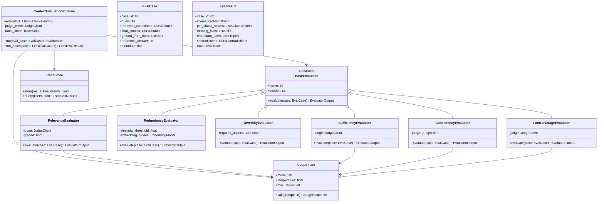
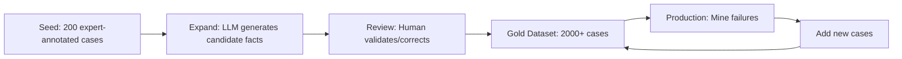
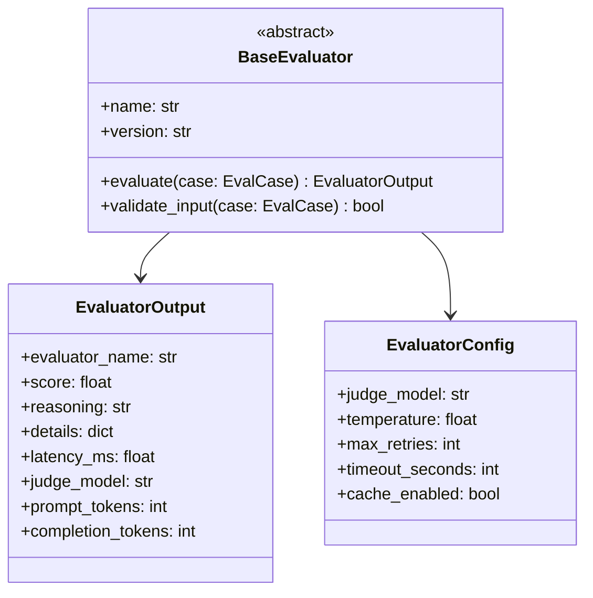
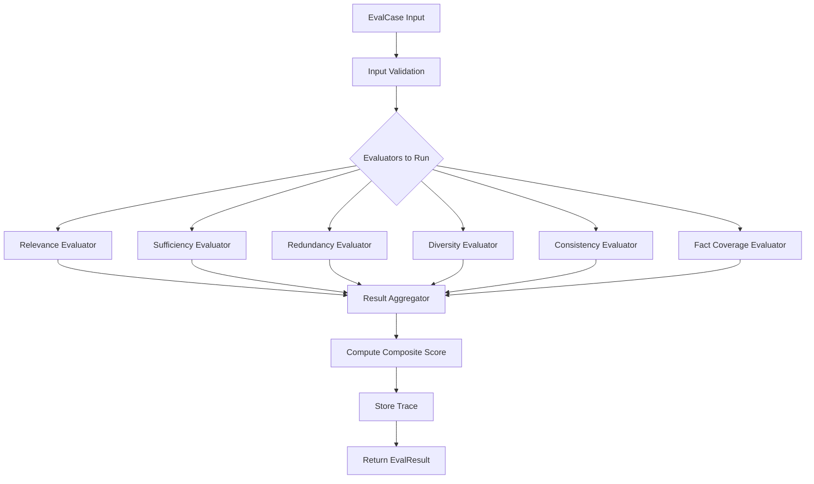
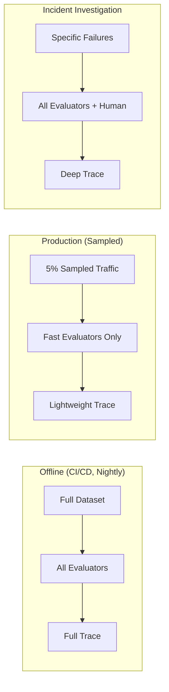
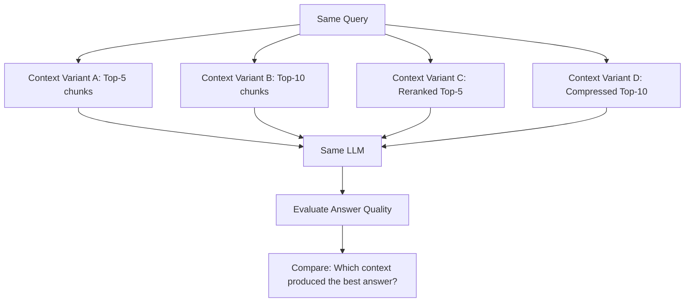
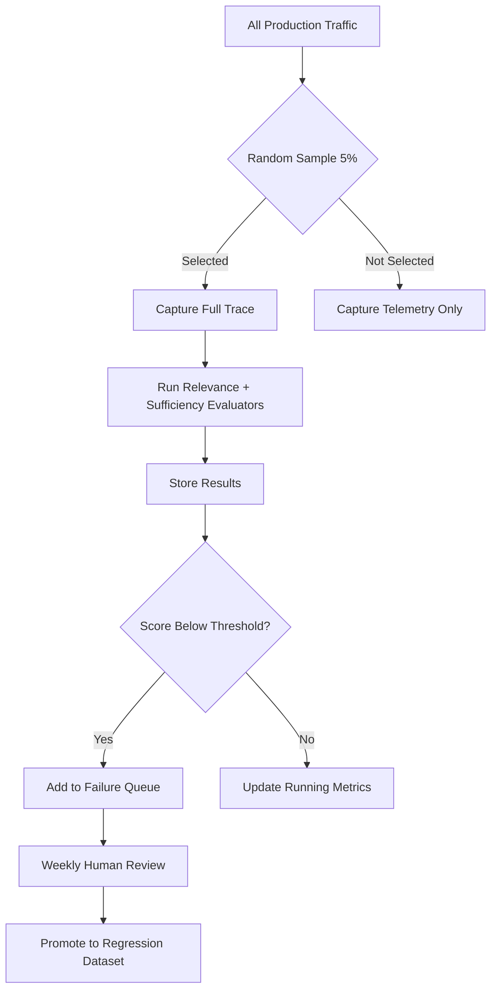

# Context Evaluation — Practical Implementation Guide

## Table of Contents

- [Overview](#overview)
- [System Architecture](#system-architecture)
- [Phase 1: Building the Evaluation Dataset](#phase-1-building-the-evaluation-dataset)
  - [Dataset Schema](#dataset-schema)
  - [Creating Ground Truth](#creating-ground-truth)
  - [Automated Fact Extraction](#automated-fact-extraction)
- [Phase 2: Implementing Context Evaluators](#phase-2-implementing-context-evaluators)
  - [Evaluator Architecture](#evaluator-architecture)
  - [Evaluator 1: Context Relevance](#evaluator-1-context-relevance)
  - [Evaluator 2: Context Sufficiency](#evaluator-2-context-sufficiency)
  - [Evaluator 3: Context Redundancy](#evaluator-3-context-redundancy)
  - [Evaluator 4: Context Diversity](#evaluator-4-context-diversity)
  - [Evaluator 5: Context Consistency](#evaluator-5-context-consistency)
  - [Evaluator 6: Fact Coverage](#evaluator-6-fact-coverage)
- [Phase 3: Judge Prompt Engineering](#phase-3-judge-prompt-engineering)
  - [Prompt Structure](#prompt-structure)
  - [Relevance Judge Prompt](#relevance-judge-prompt)
  - [Sufficiency Judge Prompt](#sufficiency-judge-prompt)
  - [Consistency Judge Prompt](#consistency-judge-prompt)
- [Phase 4: Evaluation Pipeline](#phase-4-evaluation-pipeline)
  - [Pipeline Architecture](#pipeline-architecture)
  - [Orchestration Flow](#orchestration-flow)
  - [Batch vs Real-Time Evaluation](#batch-vs-real-time-evaluation)
- [Phase 5: Scoring and Aggregation](#phase-5-scoring-and-aggregation)
  - [Per-Case Scoring](#per-case-scoring)
  - [Aggregation Strategy](#aggregation-strategy)
  - [Segmentation](#segmentation)
- [Phase 6: Storage and Tracing](#phase-6-storage-and-tracing)
  - [Trace Schema](#trace-schema)
  - [Storage Options](#storage-options)
- [Phase 7: Downstream Ablation Testing](#phase-7-downstream-ablation-testing)
- [Phase 8: Production Integration](#phase-8-production-integration)
  - [Sampling Strategy](#sampling-strategy)
  - [Alerting Rules](#alerting-rules)
- [Implementation Roadmap](#implementation-roadmap)
- [Tools and Libraries](#tools-and-libraries)
- [Anti-Patterns to Avoid](#anti-patterns-to-avoid)

---

## Overview

This document translates the theoretical context evaluation framework into a concrete implementation plan. The goal is to build a system that can answer:

> Given the retrieved chunks, did the context builder construct an evidence package that gives the LLM everything it needs?

We'll design evaluators for each dimension (relevance, sufficiency, redundancy, diversity, consistency, fact coverage) and wire them into an evaluation pipeline that works both offline and in production.

---

## System Architecture



---

## Phase 1: Building the Evaluation Dataset

### Dataset Schema

Each evaluation case needs these fields:

```yaml
# evaluation_case.yaml
case_id: "ctx-eval-001"
query: "What happens to employee health insurance after resignation?"
intent: "policy_lookup"
difficulty: "single-hop"

retrieved_candidates:
  - chunk_id: "chunk_17"
    content: "Health insurance continues for 30 days post-resignation..."
    source: "benefits_policy.pdf"
    page: 12
  - chunk_id: "chunk_42"
    content: "Employees must return company laptop..."
    source: "offboarding.pdf"
    page: 3
  # ... more chunks

final_context:
  - chunk_id: "chunk_17"
  - chunk_id: "chunk_93"
  - chunk_id: "chunk_42"

ground_truth_facts:
  - "Health insurance continues for 30 days after resignation"
  - "COBRA option available after 30-day grace period"
  - "Dental and vision terminate immediately"
  - "Employee must notify HR within 5 business days"

reference_answer: "After resignation, health insurance continues for 30 days..."

metadata:
  domain: "HR"
  language: "en"
  multi_hop: false
  created_by: "domain_expert"
  created_at: "2026-01-15"
```

### Creating Ground Truth

Three practical approaches, ranked by quality:

| Approach | Quality | Cost | Scale |
|----------|---------|------|-------|
| Domain expert annotation | Highest | Expensive | 100–500 cases |
| LLM-assisted + human review | High | Moderate | 500–5000 cases |
| Production failure mining | Medium | Low | Unlimited growth |

**Recommended workflow:**



### Automated Fact Extraction

For generating `ground_truth_facts` from reference answers at scale, use an LLM to decompose answers into atomic claims:

**Prompt template:**

```text
Given the following reference answer, extract every atomic factual claim.
Each claim should be a single, verifiable statement.

Reference Answer:
{reference_answer}

Output as a JSON list of strings.
```

Then have a human review sample to ensure quality. Target: each fact should be independently verifiable against the source documents.

---

## Phase 2: Implementing Context Evaluators

### Evaluator Architecture



Each evaluator follows the same contract:

1. Receives an `EvalCase`
2. Constructs a judge prompt specific to its dimension
3. Calls the judge LLM
4. Parses structured output
5. Returns an `EvaluatorOutput` with score, reasoning, and details

---

### Evaluator 1: Context Relevance

**What it measures:** Is each chunk in the final context useful for answering the query?

**Implementation approach:**

1. For each chunk in `final_context`, ask the judge: "Is this chunk relevant to the query?"
2. Use graded scoring (0–3)
3. Aggregate: `mean(scores) / max_score`

**Algorithm:**

```text
for each chunk in final_context:
    score = judge.evaluate_relevance(query, chunk)  → 0, 1, 2, or 3

context_relevance = mean(all_scores) / 3.0
```

**Key design decisions:**
- Evaluate each chunk independently (avoids position bias)
- Use graded relevance, not binary (more diagnostic value)
- Return per-chunk scores alongside aggregate

---

### Evaluator 2: Context Sufficiency

**What it measures:** Could the LLM answer correctly using only this context?

**Implementation approach:**

1. Send the full context + query to judge
2. Ask: "Given only this context, can the question be fully answered?"
3. If ground truth facts exist, also check coverage

**Algorithm:**

```text
sufficiency_judgment = judge.assess_sufficiency(query, final_context)
→ { sufficient: bool, missing_information: list, confidence: float }

if ground_truth_facts available:
    for each fact in ground_truth_facts:
        covered = judge.is_fact_present(fact, final_context)
    fact_coverage = count(covered) / total_facts

sufficiency_score = weighted_average(sufficiency_judgment.confidence, fact_coverage)
```

---

### Evaluator 3: Context Redundancy

**What it measures:** How much duplicate information exists in the context?

**Implementation approach — hybrid (embedding + LLM):**

1. Compute pairwise cosine similarity between all chunk embeddings
2. Flag pairs above threshold (e.g., 0.92) as potentially redundant
3. For flagged pairs, use LLM to confirm semantic duplication
4. Score: `1 - (redundant_pairs / total_pairs)`

**Algorithm:**

```text
embeddings = embed(all_chunks)
candidate_pairs = []

for i, j in combinations(chunks, 2):
    sim = cosine_similarity(embeddings[i], embeddings[j])
    if sim > 0.92:
        candidate_pairs.append((i, j))

confirmed_redundant = []
for pair in candidate_pairs:
    is_duplicate = judge.check_redundancy(chunk_i, chunk_j)
    if is_duplicate:
        confirmed_redundant.append(pair)

redundancy_score = len(confirmed_redundant) / len(combinations(chunks, 2))
context_efficiency = 1 - redundancy_score
```

**Why hybrid?** Embeddings alone have false positives (similar topic ≠ same information). The LLM confirmation step catches this.

---

### Evaluator 4: Context Diversity

**What it measures:** Are all necessary perspectives/aspects represented?

**Implementation approach:**

1. Extract required aspects from the query (e.g., comparison → both entities needed)
2. Check which aspects are present in the context
3. Score: `covered_aspects / required_aspects`

**Algorithm:**

```text
required_aspects = judge.extract_required_aspects(query)
# e.g., ["Product A specs", "Product B specs", "comparison criteria"]

for aspect in required_aspects:
    present = judge.is_aspect_covered(aspect, final_context)

diversity_score = count(present_aspects) / len(required_aspects)
```

**When to use:** Particularly important for comparison questions, multi-entity queries, and research tasks. For simple factoid questions, this evaluator can be skipped.

---

### Evaluator 5: Context Consistency

**What it measures:** Do chunks contradict each other?

**Implementation approach:**

1. Extract claims from each chunk
2. Check for contradictions across chunks
3. If contradictions found, check if metadata (dates, versions) resolves them

**Algorithm:**

```text
all_claims = []
for chunk in final_context:
    claims = judge.extract_claims(chunk)
    all_claims.extend(claims)

contradictions = judge.find_contradictions(all_claims)

for contradiction in contradictions:
    resolvable = check_metadata_resolution(contradiction, chunk_metadata)
    # e.g., newer version supersedes older

consistency_score = 1 - (unresolvable_contradictions / total_claim_pairs)
```

---

### Evaluator 6: Fact Coverage

**What it measures:** What percentage of required facts are present in the context?

**Implementation approach (requires ground truth facts):**

1. For each ground truth fact, check if it's supported by any chunk in the context
2. Return coverage ratio and list of missing facts

**Algorithm:**

```text
covered = []
missing = []

for fact in ground_truth_facts:
    found = judge.is_fact_supported(fact, final_context)
    if found:
        covered.append(fact)
    else:
        missing.append(fact)

fact_coverage = len(covered) / len(ground_truth_facts)
```

This is the most objective evaluator when ground truth is available.

---

## Phase 3: Judge Prompt Engineering

### Prompt Structure

Every judge prompt should follow this structure:

```text
[SYSTEM] You are an evaluation judge. Your task is...
[RUBRIC] Scoring criteria and definitions
[INPUT] The actual data to evaluate
[TASK] Specific instruction (reason first, then score)
[FORMAT] Required output format (JSON)
```

### Relevance Judge Prompt

```text
SYSTEM:
You are evaluating whether a retrieved text chunk is relevant
to answering a user's question.

RUBRIC:
Score 3: Directly contains information needed to answer the question
Score 2: Contains important supporting/background information
Score 1: Tangentially related but not useful for answering
Score 0: Completely irrelevant to the question

INPUT:
Question: {query}
Chunk: {chunk_content}

TASK:
First, explain in 1-2 sentences why this chunk is or isn't relevant.
Then assign a score from 0-3.

OUTPUT FORMAT:
{
  "reasoning": "...",
  "score": <0|1|2|3>
}
```

### Sufficiency Judge Prompt

```text
SYSTEM:
You are evaluating whether the provided context contains enough
information for an AI assistant to correctly and completely
answer the user's question.

INPUT:
Question: {query}
Context:
{formatted_context}

TASK:
1. Identify what information is needed to fully answer the question.
2. Check which of those information needs are met by the context.
3. Identify any gaps.
4. Assign a sufficiency score from 0.0 to 1.0.

OUTPUT FORMAT:
{
  "information_needs": ["...", "..."],
  "needs_met": ["...", "..."],
  "gaps": ["...", "..."],
  "sufficient": true/false,
  "score": 0.0-1.0
}
```

### Consistency Judge Prompt

```text
SYSTEM:
You are checking whether the provided chunks contain
contradictory information.

INPUT:
Chunk A: {chunk_a}
Chunk B: {chunk_b}

TASK:
1. Extract factual claims from each chunk.
2. Determine if any claims contradict each other.
3. If contradictions exist, note whether metadata (dates, versions)
   could resolve them.

OUTPUT FORMAT:
{
  "claims_a": ["...", "..."],
  "claims_b": ["...", "..."],
  "contradictions": [
    {
      "claim_a": "...",
      "claim_b": "...",
      "resolvable_by_metadata": true/false
    }
  ],
  "consistent": true/false
}
```

---

## Phase 4: Evaluation Pipeline

### Pipeline Architecture



### Orchestration Flow

Key implementation decisions:

| Decision | Recommendation | Why |
|----------|---------------|-----|
| Parallelism | Run independent evaluators concurrently | Reduces wall-clock time by 3–5x |
| Caching | Cache judge responses by (prompt_hash, model) | Avoid re-evaluation of unchanged cases |
| Retries | Retry on parse failure up to 3 times | LLM output isn't always valid JSON |
| Timeout | 30s per evaluator call | Prevent pipeline stalls |
| Fallback | Return partial results if one evaluator fails | Don't lose all data due to one failure |

### Batch vs Real-Time Evaluation



| Mode | Evaluators | Latency Budget | Frequency |
|------|-----------|---------------|-----------|
| Offline regression | All 6 | Minutes per batch | Every release |
| CI/CD critical | Relevance + Sufficiency + Fact Coverage | 30s per case | Every commit |
| Production sampling | Relevance + Sufficiency | 10s per case | 5% of traffic |
| Incident deep-dive | All 6 + manual review | Unbounded | On demand |

---

## Phase 5: Scoring and Aggregation

### Per-Case Scoring

Each case produces a scorecard:

```yaml
case_id: "ctx-eval-001"
scores:
  relevance: 0.83          # mean graded relevance / max
  sufficiency: 0.75        # judge confidence + fact coverage
  redundancy: 0.12         # lower is better (redundancy ratio)
  diversity: 0.91          # covered aspects / required aspects
  consistency: 1.0         # 1 - contradiction ratio
  fact_coverage: 0.75      # covered facts / total facts

composite_score: 0.82      # weighted combination

per_chunk:
  - chunk_id: "chunk_17"
    relevance: 3
  - chunk_id: "chunk_42"
    relevance: 0
  - chunk_id: "chunk_93"
    relevance: 2

missing_facts:
  - "COBRA option available after 30-day grace period"

contradictions: []
```

### Aggregation Strategy

For computing the composite score, I recommend a weighted harmonic mean (penalizes low scores more harshly than arithmetic mean):

| Metric | Weight | Rationale |
|--------|--------|-----------|
| Sufficiency | 0.30 | Most important — can the LLM answer? |
| Fact Coverage | 0.25 | Objective measure when ground truth exists |
| Relevance | 0.20 | Is noise polluting the context? |
| Consistency | 0.15 | Contradictions directly cause errors |
| Diversity | 0.05 | Important for multi-aspect queries only |
| Redundancy (inverted) | 0.05 | Efficiency concern |

Weights should be tuned based on correlation with downstream task success in your domain.

### Segmentation

Always compute metrics segmented by:

- Query intent (factoid, comparison, procedural, troubleshooting)
- Difficulty (single-hop vs multi-hop)
- Domain/department
- Language
- Number of required facts

Averages hide failures. A system scoring 90% overall might score 40% on multi-hop questions.

---

## Phase 6: Storage and Tracing

### Trace Schema

```yaml
# Stored for every evaluated case
trace:
  case_id: str
  timestamp: datetime
  pipeline_version: str

  input:
    query: str
    retrieved_candidates: List[ChunkRef]
    final_context: List[ChunkRef]
    ground_truth_facts: List[str]

  evaluator_traces:
    - evaluator: "relevance_v2"
      judge_model: "gpt-4o"
      prompt_hash: "abc123"
      prompt_tokens: 1240
      completion_tokens: 186
      latency_ms: 2340
      raw_response: "..."
      parsed_output: {...}
      score: 0.83

    - evaluator: "sufficiency_v1"
      # ...

  aggregate:
    composite_score: 0.82
    pass: true
    threshold: 0.70

  metadata:
    environment: "ci"
    git_sha: "def456"
    experiment_id: "exp-2026-08-01"
```

### Storage Options

| Option | Use Case | Tools |
|--------|----------|-------|
| JSON files (local) | Development, small datasets | File system |
| SQLite | Single-developer, prototype | sqlite3 |
| PostgreSQL + JSONB | Team, production | PostgreSQL |
| Object store + metadata DB | Large-scale, full traces | S3/GCS + Postgres |
| Evaluation platform | Enterprise | LangSmith, Braintrust, Phoenix |

Recommendation: Start with PostgreSQL + JSONB. Migrate to a dedicated platform when you exceed 100K evaluations.

---

## Phase 7: Downstream Ablation Testing

This is the most powerful (and often neglected) technique. Instead of only judging context quality in isolation, test its **causal effect on generation**.

**Implementation:**



**What to ablate:**

| Variable | Variants to Test |
|----------|-----------------|
| Top-K | 3, 5, 10, 20 |
| Reranking | With/without reranker |
| Compression | None, extractive, abstractive |
| Ordering | Relevance-first, chronological, reverse |
| Deduplication | None, embedding-based, LLM-based |

**Key insight:** If context A and context B produce identical answer quality, prefer the smaller/cheaper context.

---

## Phase 8: Production Integration

### Sampling Strategy



### Alerting Rules

| Condition | Action |
|-----------|--------|
| Context relevance P50 drops below 0.70 | Warning alert |
| Context sufficiency drops 10%+ vs 7-day average | Critical alert |
| Contradiction rate exceeds 5% | Investigation trigger |
| Fact coverage drops below 60% for any segment | Segment-specific alert |

---

## Implementation Roadmap

| Week | Milestone | Deliverable |
|------|-----------|-------------|
| 1 | Dataset bootstrap | 100 expert-annotated cases with ground truth facts |
| 2 | Core evaluators | Relevance + Sufficiency evaluators working end-to-end |
| 3 | Pipeline wiring | Batch pipeline running all 6 evaluators, storing traces |
| 4 | Judge calibration | Measure judge agreement vs human on 50 cases, tune prompts |
| 5 | CI/CD integration | Evaluation runs on every PR, blocks on regression |
| 6 | Redundancy + Consistency | Add remaining evaluators, ablation testing setup |
| 7 | Production sampling | 5% traffic evaluated, alerting configured |
| 8 | Dashboard + reporting | Segmented metrics dashboard, weekly report automation |

---

## Tools and Libraries

| Purpose | Recommended Tools |
|---------|-------------------|
| LLM Judge calls | LiteLLM (model-agnostic), OpenAI SDK |
| Embeddings (redundancy) | sentence-transformers, OpenAI embeddings |
| Evaluation frameworks | Ragas, DeepEval, Phoenix (for reference/inspiration) |
| Pipeline orchestration | Python asyncio, or Prefect/Airflow for scheduled runs |
| Storage | PostgreSQL + JSONB |
| Dashboards | Grafana, Streamlit, or Superset |
| Experiment tracking | MLflow, Weights & Biases |
| Dataset versioning | DVC, or git-tracked YAML/JSON |

---

## Anti-Patterns to Avoid

| Anti-Pattern | Why It's Bad | What to Do Instead |
|-------------|-------------|-------------------|
| Single composite score only | Hides which dimension failed | Always expose per-dimension scores |
| Evaluating context without ground truth | Sufficiency becomes subjective guess | Invest in fact-level ground truth |
| Same model as judge and generator | Self-preference bias | Use a different model family for judging |
| Running all evaluators in production | Too expensive and slow | Sample + use fast evaluators only |
| Binary relevance only | Loses diagnostic granularity | Use graded relevance (0–3) |
| No prompt versioning | Can't reproduce results | Hash and version every judge prompt |
| Ignoring multi-hop queries | System looks healthy while failing on complex questions | Segment by query complexity |
| Optimizing redundancy too aggressively | Some overlap is needed for robustness | Target < 20% redundancy, not zero |
