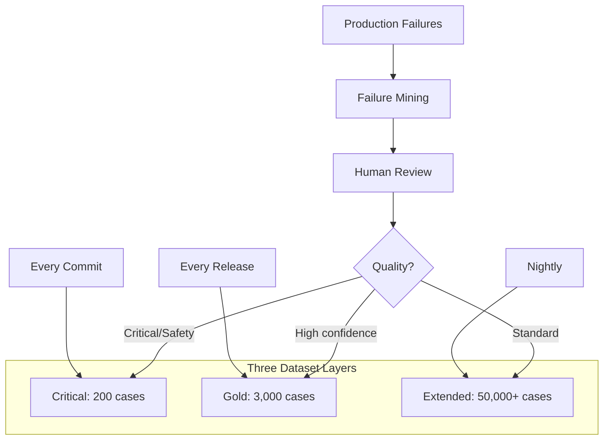
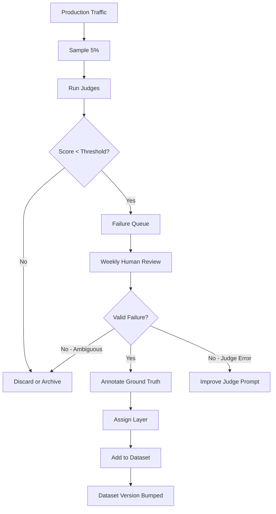
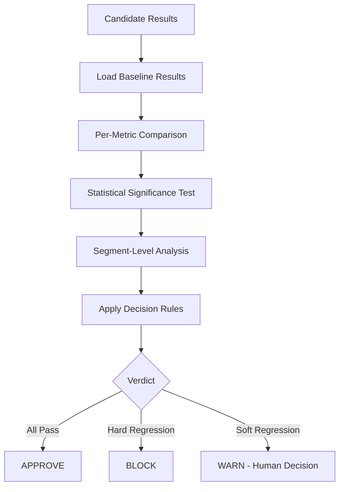
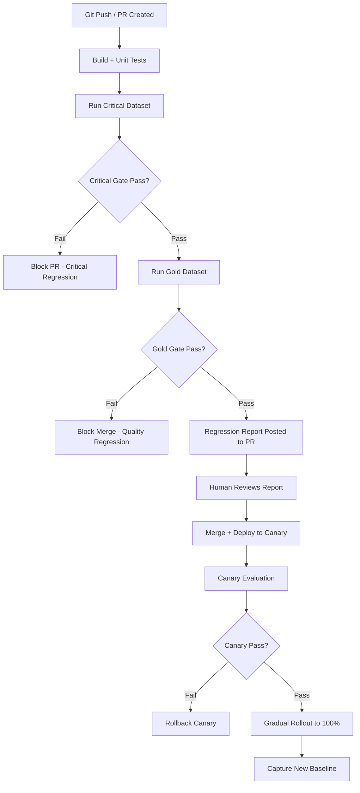
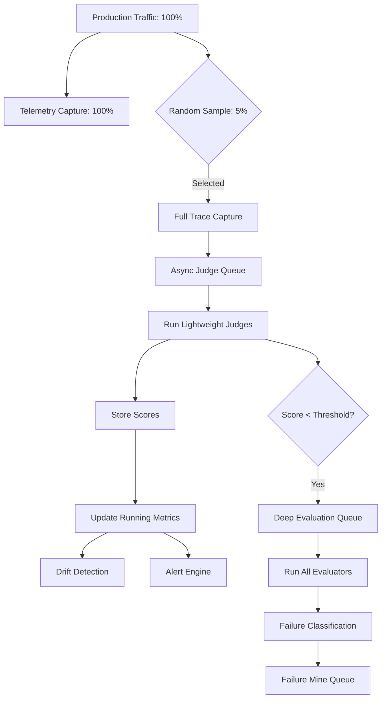
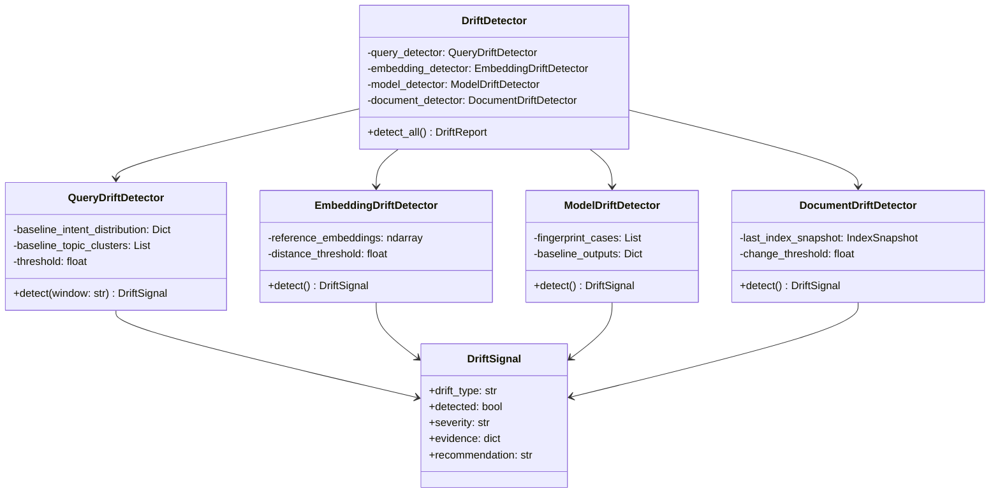
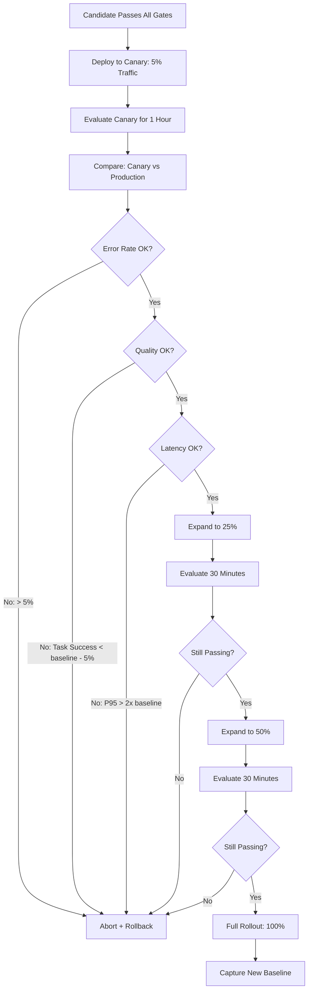
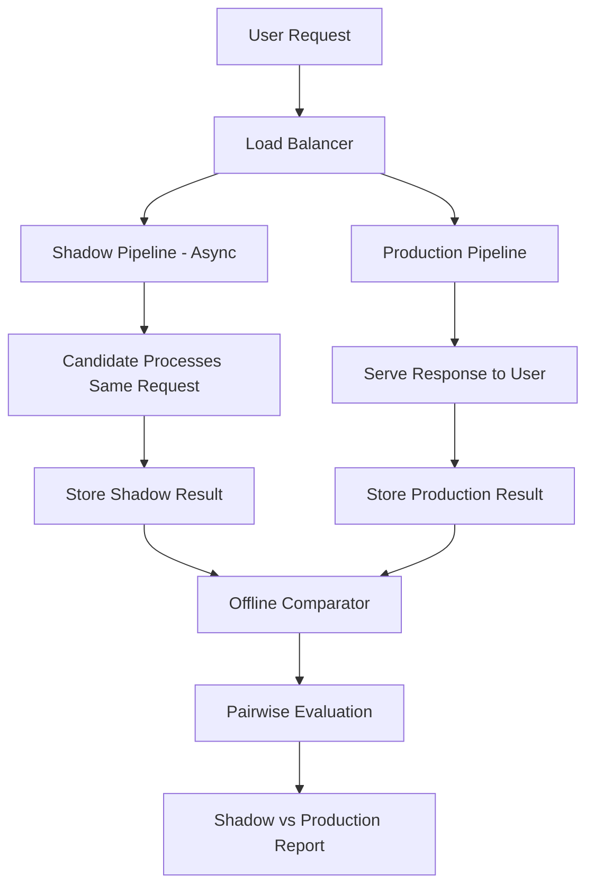
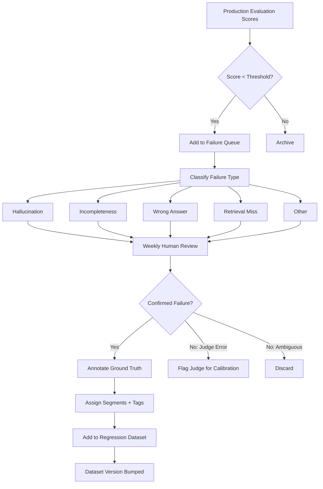

# Regression & Continuous Evaluation — Practical Implementation Guide

## Table of Contents

- [Overview](#overview)
- [System Architecture](#system-architecture)
- [Phase 1: Regression Dataset Management](#phase-1-regression-dataset-management)
  - [Dataset Architecture](#dataset-architecture)
  - [Dataset Layers and Configuration](#dataset-layers-and-configuration)
  - [Case Schema](#case-schema)
  - [Dataset Growth Pipeline](#dataset-growth-pipeline)
  - [Versioning Strategy](#versioning-strategy)
- [Phase 2: Baseline Management](#phase-2-baseline-management)
  - [Baseline Capture](#baseline-capture)
  - [Baseline Storage](#baseline-storage)
  - [Baseline Rotation](#baseline-rotation)
- [Phase 3: Regression Detection Engine](#phase-3-regression-detection-engine)
  - [Comparison Pipeline](#comparison-pipeline)
  - [Multi-Dimensional Comparison](#multi-dimensional-comparison)
  - [Segmented Analysis](#segmented-analysis)
  - [Statistical Significance Testing](#statistical-significance-testing)
- [Phase 4: CI/CD Integration (Regression Gates)](#phase-4-cicd-integration-regression-gates)
  - [Gate Architecture](#gate-architecture)
  - [Gate Configuration](#gate-configuration)
  - [Gate Decision Logic](#gate-decision-logic)
- [Phase 5: Continuous Production Evaluation](#phase-5-continuous-production-evaluation)
  - [Sampling Pipeline](#sampling-pipeline)
  - [Online Judge Execution](#online-judge-execution)
  - [Score Storage and Trending](#score-storage-and-trending)
- [Phase 6: Drift Detection](#phase-6-drift-detection)
  - [Drift Types and Detectors](#drift-types-and-detectors)
  - [Query Distribution Monitoring](#query-distribution-monitoring)
  - [Embedding Space Drift](#embedding-space-drift)
  - [Model Drift Detection](#model-drift-detection)
- [Phase 7: Canary and Shadow Evaluation](#phase-7-canary-and-shadow-evaluation)
  - [Canary Deployment Pipeline](#canary-deployment-pipeline)
  - [Shadow Evaluation Architecture](#shadow-evaluation-architecture)
- [Phase 8: Failure Mining and Dataset Growth](#phase-8-failure-mining-and-dataset-growth)
  - [Failure Mining Pipeline](#failure-mining-pipeline)
  - [Auto-Promotion to Regression Suite](#auto-promotion-to-regression-suite)
- [Phase 9: Experiment Tracking](#phase-9-experiment-tracking)
- [Phase 10: Alerting and Reporting](#phase-10-alerting-and-reporting)
- [Implementation Roadmap](#implementation-roadmap)
- [Tools and Libraries](#tools-and-libraries)
- [Anti-Patterns to Avoid](#anti-patterns-to-avoid)

---

## Overview

This document translates the theoretical regression and continuous evaluation framework into a concrete implementation plan. The core principle:

> **Every change to a RAG system must prove it improves without breaking anything — and production must be continuously monitored for silent degradation.**

We'll build a system that manages evaluation datasets, detects regressions before deployment, continuously evaluates production traffic, detects drift, and automatically grows its test suite from production failures.

---

## System Architecture

```mermaid
classDiagram
    class ContinuousEvalPlatform {
        +run_regression(candidate: str, baseline: str) RegressionReport
        +start_continuous_eval() void
        +detect_drift() DriftReport
        +run_canary(config: CanaryConfig) CanaryResult
        +run_shadow(config: ShadowConfig) ShadowResult
        -dataset_manager: DatasetManager
        -baseline_store: BaselineStore
        -regression_engine: RegressionEngine
        -production_sampler: ProductionSampler
        -drift_detector: DriftDetector
        -failure_miner: FailureMiner
        -experiment_tracker: ExperimentTracker
    }

    class DatasetManager {
        +get_layer(layer: str) Dataset
        +add_case(case: EvalCase, layer: str) void
        +promote_case(case_id: str, from: str, to: str) void
        +version() str
        +diff(v1: str, v2: str) DatasetDiff
        -critical: Dataset
        -gold: Dataset
        -extended: Dataset
    }

    class BaselineStore {
        +capture(version: str, results: EvalResults) void
        +get_current() Baseline
        +get_by_version(version: str) Baseline
        +rotate(new_baseline: Baseline) void
    }

    class RegressionEngine {
        +compare(candidate: EvalResults, baseline: Baseline) RegressionReport
        +is_significant(metric: str, delta: float, n: int) bool
        +segment_analysis(results: EvalResults, segments: List) SegmentReport
        -significance_threshold: float
        -min_practical_improvement: Dict
    }

    class ProductionSampler {
        +sample(traffic: RequestStream, rate: float) List~SampledRequest~
        +evaluate(samples: List) List~JudgeResult~
        +store(results: List) void
        -sample_rate: float
        -judge_pipeline: JudgePipeline
    }

    class DriftDetector {
        +detect_query_drift(window: str) DriftSignal
        +detect_embedding_drift() DriftSignal
        +detect_model_drift() DriftSignal
        +detect_document_drift() DriftSignal
        -baseline_distributions: Dict
        -thresholds: Dict
    }

    class FailureMiner {
        +mine(period: str) List~FailureCase~
        +classify(failures: List) Dict~str, List~
        +create_eval_cases(failures: List) List~EvalCase~
        +auto_promote(cases: List) void
    }

    class ExperimentTracker {
        +create_experiment(name: str, config: dict) Experiment
        +log_results(exp_id: str, results: EvalResults) void
        +compare_experiments(exp_ids: List) ComparisonReport
    }

    ContinuousEvalPlatform --> DatasetManager
    ContinuousEvalPlatform --> BaselineStore
    ContinuousEvalPlatform --> RegressionEngine
    ContinuousEvalPlatform --> ProductionSampler
    ContinuousEvalPlatform --> DriftDetector
    ContinuousEvalPlatform --> FailureMiner
    ContinuousEvalPlatform --> ExperimentTracker
```



---

## Phase 1: Regression Dataset Management

### Dataset Architecture



### Dataset Layers and Configuration

| Layer | Size | When It Runs | Latency Budget | Purpose |
|-------|------|-------------|----------------|---------|
| Critical | 100–300 cases | Every commit/PR | < 5 min | Must-not-break cases |
| Gold | 2,000–5,000 cases | Before release | < 30 min | Comprehensive quality gate |
| Extended | 50,000+ cases | Nightly | < 4 hours | Deep regression detection, segment analysis |

**What goes in Critical:**
- Known production failures (bugs that were filed)
- Safety edge cases
- High-revenue customer scenarios
- Multi-hop queries that historically break
- Queries where the system previously hallucinated

### Case Schema

```yaml
case_id: "reg-2026-0842"
created_at: "2026-07-15"
source: "production_failure"        # expert | synthetic | production_failure
source_ticket: "JIRA-4521"

query: "What is the maximum concurrent connection limit for Enterprise tier?"
intent: "factoid"
difficulty: "easy"
segments:
  language: "en"
  domain: "product"
  tier: "enterprise"
  query_type: "factoid"

ground_truth:
  reference_answer: "Enterprise tier supports up to 10,000 concurrent connections."
  required_facts:
    - "10,000 concurrent connections"
    - "Enterprise tier specific"
  relevant_chunks: ["chunk_482", "chunk_491"]

expected_metrics:
  task_success: 1.0
  faithfulness: ">= 0.95"
  groundedness: ">= 0.95"

layer: "critical"
tags: ["production_bug", "enterprise", "limits"]
```

### Dataset Growth Pipeline



**Growth target:** Add 20–50 high-quality cases per week from production failures.

### Versioning Strategy

```yaml
dataset_version: "v2026.08.03"
layers:
  critical:
    version: "v42"
    cases: 245
    last_modified: "2026-08-01"
    checksum: "sha256:abc..."
  gold:
    version: "v18"
    cases: 3,421
    last_modified: "2026-07-28"
    checksum: "sha256:def..."
  extended:
    version: "v7"
    cases: 52,180
    last_modified: "2026-08-03"
    checksum: "sha256:ghi..."

changelog:
  - "v2026.08.03: Added 12 cases from JIRA-4600 series (enterprise limits)"
  - "v2026.07.28: Promoted 45 cases from extended to gold after review"
```

**Storage:** Git-tracked YAML/JSON for Critical + Gold. Object store (S3) with metadata DB for Extended.

---

## Phase 2: Baseline Management

### Baseline Capture

Every deployment to production becomes the new baseline:

```text
# After successful deployment:
baseline = {
    version: "v2.4.1",
    deployed_at: "2026-08-03T14:00:00Z",
    git_sha: "abc123",
    
    config: {
        retriever: "hybrid_v3",
        embedding_model: "text-embedding-3-small",
        llm: "gpt-4o-2026-05",
        prompt_version: "rag_answer_v4",
        top_k: 10,
        reranker: "cohere-rerank-v3"
    },
    
    scores: {
        critical: { task_success: 97.2, faithfulness: 98.1, ... },
        gold: { task_success: 94.1, faithfulness: 96.8, ... },
        extended: { task_success: 93.5, faithfulness: 96.2, ... }
    },
    
    operational: {
        p95_latency: 3.8,
        cost_per_request: 0.022,
        error_rate: 0.003
    }
}
```

### Baseline Storage

```yaml
# Store last N baselines for historical comparison
baselines:
  current: "v2.4.1"
  history:
    - version: "v2.4.1"
      scores: {...}
    - version: "v2.4.0"
      scores: {...}
    - version: "v2.3.2"
      scores: {...}
  retention: 20  # Keep last 20 baselines
```

### Baseline Rotation

```text
# Rotation rules:
1. New deployment succeeds all gates → becomes new baseline
2. Rollback → revert to previous baseline
3. Never delete baselines — archive for trend analysis
4. Weekly: compute trend across last 10 baselines → detect gradual degradation
```

---

## Phase 3: Regression Detection Engine

### Comparison Pipeline



### Multi-Dimensional Comparison

Every candidate produces a comparison matrix:

```yaml
regression_report:
  candidate: "v2.5.0-rc1"
  baseline: "v2.4.1"
  dataset: "gold"
  cases_evaluated: 3421

  metrics:
    task_success:
      baseline: 94.1
      candidate: 95.2
      delta: +1.1
      p_value: 0.003
      significant: true
      verdict: "IMPROVEMENT"

    faithfulness:
      baseline: 96.8
      candidate: 97.1
      delta: +0.3
      p_value: 0.12
      significant: false
      verdict: "NO_CHANGE"

    latency_p95:
      baseline: 3.8
      candidate: 4.2
      delta: +0.4
      threshold: 5.0
      verdict: "WITHIN_SLA"

    cost_per_request:
      baseline: 0.022
      candidate: 0.028
      delta: +27%
      threshold: 50%
      verdict: "WARNING"

    safety:
      baseline: 99.1
      candidate: 98.9
      delta: -0.2
      hard_floor: 98.0
      verdict: "PASS"

  overall_verdict: "APPROVE_WITH_WARNINGS"
  warnings: ["Cost increase of 27% — monitor closely"]
  blockers: []
```

### Segmented Analysis

Always break down by segments to catch hidden regressions:

**Algorithm:**

```text
segments = [language, intent, difficulty, domain, customer_tier]

for metric in [task_success, faithfulness, recall]:
    for segment in segments:
        for value in segment.unique_values():
            subset = filter(results, segment == value)
            delta = mean(subset.candidate) - mean(subset.baseline)
            
            if delta < regression_threshold:
                report.add_segment_regression(metric, segment, value, delta)
```

**Example output:**

```yaml
segment_regressions:
  - metric: "task_success"
    segment: "language"
    value: "German"
    baseline: 91.2
    candidate: 78.4
    delta: -12.8
    severity: "CRITICAL"
    cases_affected: 142

  - metric: "faithfulness"
    segment: "intent"
    value: "comparison"
    baseline: 95.1
    candidate: 89.3
    delta: -5.8
    severity: "WARNING"
    cases_affected: 89
```

### Statistical Significance Testing

**Implementation:**

```text
# For each metric comparison:
def is_significant(baseline_scores, candidate_scores, alpha=0.05):
    # Use bootstrap confidence interval
    n_bootstrap = 1000
    deltas = []
    for i in range(n_bootstrap):
        sample_b = random_sample(baseline_scores, len(baseline_scores))
        sample_c = random_sample(candidate_scores, len(candidate_scores))
        deltas.append(mean(sample_c) - mean(sample_b))
    
    ci_lower = percentile(deltas, 2.5)
    ci_upper = percentile(deltas, 97.5)
    
    # Significant if CI doesn't contain 0
    significant = (ci_lower > 0) or (ci_upper < 0)
    
    # Practical significance
    practical = abs(mean(deltas)) > min_practical_improvement[metric]
    
    return significant and practical
```

**Minimum practical improvements (configurable):**

| Metric | Min Improvement to Care |
|--------|------------------------|
| Task Success | 1.0% |
| Faithfulness | 0.5% |
| Recall@10 | 1.0% |
| Latency P95 | 500ms |
| Cost/request | 10% |

---

## Phase 4: CI/CD Integration (Regression Gates)

### Gate Architecture



### Gate Configuration

```yaml
# regression_gates.yaml
gates:
  critical:
    dataset: "critical"
    runs_on: "every_commit"
    timeout_minutes: 5
    
    hard_blocks:
      - metric: "task_success"
        condition: "candidate < baseline - 2%"
      - metric: "safety"
        condition: "candidate < 98%"
      - metric: "faithfulness"
        condition: "candidate < baseline - 3%"
    
    soft_warnings:
      - metric: "latency_p95"
        condition: "candidate > baseline * 1.5"
      - metric: "cost"
        condition: "candidate > baseline * 1.3"

  gold:
    dataset: "gold"
    runs_on: "pre_merge"
    timeout_minutes: 30
    
    hard_blocks:
      - metric: "task_success"
        condition: "candidate < baseline - 1%"
      - metric: "any_segment_regression"
        condition: "delta < -10% for any segment with n > 50"
    
    soft_warnings:
      - metric: "latency_p95"
        condition: "candidate > baseline + 1s"

  canary:
    evaluation_period_minutes: 60
    traffic_percentage: 5
    
    abort_conditions:
      - metric: "error_rate"
        condition: "> 5%"
      - metric: "task_success"
        condition: "< baseline - 5%"
```

### Gate Decision Logic

```text
# Decision matrix
def evaluate_gate(report: RegressionReport, gate_config: GateConfig) -> GateDecision:
    
    # Check hard blocks — any single one blocks
    for block in gate_config.hard_blocks:
        if violates(report, block):
            return BLOCK(reason=block)
    
    # Check segment regressions
    for seg_regression in report.segment_regressions:
        if seg_regression.severity == "CRITICAL":
            return BLOCK(reason=seg_regression)
    
    # Check soft warnings — accumulate
    warnings = []
    for warn in gate_config.soft_warnings:
        if violates(report, warn):
            warnings.append(warn)
    
    if warnings:
        return APPROVE_WITH_WARNINGS(warnings)
    
    return APPROVE
```

---

## Phase 5: Continuous Production Evaluation

### Sampling Pipeline



### Online Judge Execution

Key design decisions for production judge execution:

| Decision | Recommendation | Rationale |
|----------|---------------|-----------|
| Synchronous vs Async | Async (queue-based) | Don't add latency to user requests |
| Which judges | Lightweight only (relevance + groundedness) | Cost management |
| Frequency | 5% of requests | Balance between visibility and cost |
| Budget | $100–500/day for mid-scale | ~5K–25K evaluations/day |
| SLA for results | < 5 min from request | Near-real-time drift detection |

**Queue architecture:**

```text
Production Request → Trace Store → Sample Selector → Judge Queue (SQS/Redis)
                                                          │
                                                    Judge Workers (async)
                                                          │
                                                    Score Store → Dashboard
```

### Score Storage and Trending

```yaml
# Per-evaluated-request record
production_eval:
  request_id: "req-xyz"
  timestamp: "2026-08-08T15:30:00Z"
  
  scores:
    groundedness: 0.92
    relevance: 0.88
    task_success: 1.0
  
  metadata:
    intent: "procedural"
    language: "en"
    model: "gpt-4o"
    latency_ms: 3200

# Trending (computed every hour)
hourly_metrics:
  timestamp: "2026-08-08T15:00:00Z"
  period: "1h"
  sample_size: 247
  
  groundedness: { mean: 0.94, p25: 0.88, p50: 0.96, p75: 1.0 }
  relevance: { mean: 0.91, p25: 0.85, p50: 0.93, p75: 0.98 }
  task_success: { mean: 0.92, p25: 0.85, p50: 1.0, p75: 1.0 }
```

---

## Phase 6: Drift Detection

### Drift Types and Detectors



### Query Distribution Monitoring

**Algorithm:**

```text
# Capture intent/topic distribution weekly
current_distribution = get_intent_distribution(period="7d")
baseline_distribution = get_intent_distribution(period="prior_30d")

# Compute divergence
kl_divergence = KL(current || baseline)
js_divergence = JS(current, baseline)

if js_divergence > 0.15:
    alert(QueryDrift, severity="warning", evidence={
        "new_intents": find_new_clusters(current, baseline),
        "volume_shifts": find_volume_changes(current, baseline)
    })
```

**What to track:**
- Intent distribution (% factoid, procedural, comparison, etc.)
- Topic clusters (via embedding clustering of queries)
- Query complexity distribution (single-hop vs multi-hop)
- New entity mentions (products, features not in KB)

### Embedding Space Drift

Detect when the retrieval landscape changes:

```text
# Weekly: Embed 500 reference queries, compare to baseline embeddings
reference_queries = load_reference_queries()  # Fixed set
current_embeddings = embed(reference_queries)
baseline_embeddings = load_baseline_embeddings()

# Compute average pairwise distance shift
distances = pairwise_cosine_distance(current_embeddings, baseline_embeddings)
mean_drift = mean(distances)

if mean_drift > 0.05:
    alert(EmbeddingDrift, evidence={"mean_distance": mean_drift})
    # Likely cause: embedding model silently updated
```

### Model Drift Detection

Detect when LLM providers silently update models:

```text
# "Fingerprint" cases: Fixed inputs that should produce stable outputs
fingerprint_cases = [
    {"query": "What is 2+2?", "expected_pattern": "4"},
    {"query": "Summarize in one word: happy", "expected_pattern": "happy|joyful|content"},
    # ... 20-50 simple, deterministic cases
]

# Run weekly
for case in fingerprint_cases:
    output = llm.generate(case.query, temperature=0)
    if not matches(output, case.expected_pattern):
        flag_model_drift(case, output)

# Also track: output length distribution, vocabulary usage, refusal rate
current_avg_length = mean(output_lengths, period="7d")
baseline_avg_length = mean(output_lengths, period="prior_30d")

if abs(current_avg_length - baseline_avg_length) / baseline_avg_length > 0.2:
    alert(ModelDrift, evidence={"length_shift": current - baseline})
```

---

## Phase 7: Canary and Shadow Evaluation

### Canary Deployment Pipeline



**Canary configuration:**

```yaml
canary:
  initial_percentage: 5
  evaluation_window_minutes: 60
  expansion_steps: [5, 25, 50, 100]
  
  abort_conditions:
    - metric: "error_rate"
      threshold: 0.05
      comparison: "absolute"
    - metric: "task_success"
      threshold: -0.05
      comparison: "relative_to_baseline"
    - metric: "latency_p95"
      threshold: 2.0
      comparison: "multiplier_of_baseline"
  
  minimum_samples_per_step: 100  # Don't decide with too few samples
```

### Shadow Evaluation Architecture



**Implementation details:**

| Aspect | Recommendation |
|--------|---------------|
| Shadow traffic % | 10–100% (no user impact, only cost) |
| Latency impact | Zero (fully async, fire-and-forget) |
| Comparison method | Pairwise LLM judge ("Which answer is better?") |
| Storage | Store both outputs + judge verdict |
| Decision threshold | Shadow must win > 55% of pairwise comparisons |
| Duration | Run for 1 week minimum before deciding |

---

## Phase 8: Failure Mining and Dataset Growth

### Failure Mining Pipeline



### Auto-Promotion to Regression Suite

Some failures can be automatically promoted without human review:

```yaml
auto_promotion_rules:
  # If same failure pattern appears 3+ times, auto-add to Extended
  - condition: "same_query_cluster_fails >= 3"
    action: "promote_to_extended"
    require_human: false

  # Safety failures always go to Critical (but flagged for review)
  - condition: "safety_score < 0.5"
    action: "promote_to_critical"
    require_human: true   # Must be reviewed within 24h

  # Repeated hallucination on same topic
  - condition: "hallucination on entity X >= 5 times in 7d"
    action: "promote_to_gold"
    require_human: true
```

**Growth metrics:**

| Metric | Target |
|--------|--------|
| New cases added per week | 20–50 |
| Cases reviewed per week | 100+ |
| Promotion rate (review → dataset) | 30–50% |
| Time from failure → regression test | < 2 weeks |

---

## Phase 9: Experiment Tracking

Track every configuration change as a formal experiment:

```yaml
experiment:
  id: "exp-2026-08-042"
  name: "Switch reranker from Cohere v2 to v3"
  hypothesis: "Reranker v3 improves context quality without latency penalty"
  
  config_changes:
    reranker: "cohere-rerank-v2 → cohere-rerank-v3"
  
  datasets_evaluated: ["critical", "gold"]
  
  results:
    critical:
      task_success: { baseline: 97.2, candidate: 97.8, delta: +0.6 }
      faithfulness: { baseline: 98.1, candidate: 98.4, delta: +0.3 }
      latency_p95: { baseline: 3.8, candidate: 3.9, delta: +0.1 }
    gold:
      task_success: { baseline: 94.1, candidate: 94.9, delta: +0.8 }
      context_sufficiency: { baseline: 88.2, candidate: 91.5, delta: +3.3 }
  
  segment_regressions: []
  
  verdict: "APPROVE"
  approved_by: "engineer@company.com"
  deployed_at: "2026-08-05T10:00:00Z"
```

**Experiment comparison view:**

| Experiment | Change | Task Success Δ | Latency Δ | Cost Δ | Verdict |
|-----------|--------|----------------|-----------|--------|---------|
| exp-038 | Prompt v4 → v5 | +1.2% | -100ms | 0% | ✅ Approved |
| exp-039 | Top-K 10 → 15 | +0.3% | +800ms | +20% | ⚠️ Rejected (latency) |
| exp-040 | GPT-4o → GPT-4o-mini | -2.1% | -1.2s | -60% | ⚠️ Trade-off decision |
| exp-041 | Add reranker | +1.8% | +200ms | +5% | ✅ Approved |
| exp-042 | Reranker v2 → v3 | +0.8% | +100ms | 0% | ✅ Approved |

---

## Phase 10: Alerting and Reporting

**Continuous evaluation alerts:**

| Condition | Severity | Action |
|-----------|----------|--------|
| Task success drops 3%+ vs 7-day baseline | Critical | Page on-call |
| Any segment drops 10%+ | Critical | Investigate immediately |
| Query drift detected (JS divergence > 0.15) | Warning | Review KB coverage |
| Model drift detected (fingerprint mismatch) | Warning | Verify model version |
| Embedding drift detected | Warning | Check embedding model |
| Failure rate increases 50%+ | Warning | Investigate root cause |
| Judge cost exceeds daily budget | Info | Review sampling rate |

**Weekly automated report:**

```yaml
weekly_report:
  period: "2026-08-01 to 2026-08-07"
  
  health_summary:
    task_success_trend: "stable (93.8% → 94.1%)"
    worst_segment: "German procedural queries (82%)"
    
  dataset_growth:
    cases_added: 34
    cases_promoted_to_gold: 12
    cases_promoted_to_critical: 2
    
  experiments_completed: 3
  experiments_approved: 2
  experiments_rejected: 1
  
  drift_signals:
    query_drift: "low"
    model_drift: "none"
    document_drift: "12 new documents added"
    
  cost:
    evaluation_cost_this_week: $892
    avg_cost_per_eval: $0.004
    
  action_items:
    - "German procedural queries need investigation (ticket: JIRA-4621)"
    - "Calibrate faithfulness judge (agreement dropped to 0.76)"
```

---

## Implementation Roadmap

| Week | Milestone | Deliverable |
|------|-----------|-------------|
| 1 | Dataset infrastructure | Critical + Gold datasets created, versioning, schema |
| 2 | Baseline management | Capture/store/rotate baselines from current production |
| 3 | Regression engine | Multi-metric comparison with significance testing |
| 4 | CI/CD gate (Critical) | Every commit evaluated against Critical dataset |
| 5 | CI/CD gate (Gold) | Pre-merge evaluation against Gold dataset |
| 6 | Production sampling | 5% traffic evaluated continuously, scores stored |
| 7 | Drift detection | Query, embedding, and model drift monitors active |
| 8 | Failure mining | Weekly pipeline: mine failures → review → promote |
| 9 | Canary evaluation | Automated canary with abort conditions |
| 10 | Shadow evaluation | Shadow pipeline for risk-free A/B testing |
| 11 | Experiment tracking | All config changes tracked as formal experiments |
| 12 | Reporting + Alerting | Weekly reports automated, alert rules active |

---

## Tools and Libraries

| Purpose | Recommended Tools |
|---------|-------------------|
| Dataset storage | Git (Critical/Gold YAML), S3 + Postgres (Extended) |
| Dataset versioning | DVC, or custom git-tracked checksums |
| CI/CD integration | GitHub Actions, GitLab CI, or Jenkins pipeline steps |
| Statistical testing | scipy (bootstrap CI, KL divergence), numpy |
| Experiment tracking | MLflow, Weights & Biases, or custom Postgres tables |
| Production sampling | Custom (async queue), or Helicone/LangSmith |
| Drift detection | Custom (scipy for distribution tests), or Evidently AI |
| Canary deployment | Kubernetes + Istio (traffic splitting), or custom |
| Shadow evaluation | Custom async forking at load balancer level |
| Alerting | PagerDuty (critical), Slack (warning), email (weekly) |
| Dashboards | Grafana (metrics trending), Streamlit (experiment comparison) |
| Report generation | Jinja2 templates → Markdown → Slack/email |

---

## Anti-Patterns to Avoid

| Anti-Pattern | Why It's Bad | What to Do Instead |
|-------------|-------------|-------------------|
| No regression testing before deploy | Silent quality degradation | Gate every deployment with Critical dataset |
| Only testing averages | Hides segment-specific failures | Always segment by intent, language, difficulty |
| Reacting to noise | Wastes engineering time on non-issues | Use statistical significance + minimum practical improvement |
| Static regression dataset | New failure patterns emerge, old tests become stale | Continuously mine production failures and grow dataset |
| No baseline management | Can't tell if things improved or regressed | Capture baseline at every successful deployment |
| Deploy to 100% immediately | No opportunity to catch issues | Always canary at 5% → 25% → 50% → 100% |
| Manual regression analysis | Doesn't scale, inconsistent | Automate comparison + gate decisions in CI/CD |
| Ignoring drift | System degrades without any code change | Monitor query, embedding, model, and document drift weekly |
| No experiment tracking | Can't learn from past decisions | Log every config change as a formal experiment |
| Evaluation dataset not versioned | Can't reproduce or compare past results | Version + checksum every dataset layer |
| Only offline evaluation | Misses production-specific failures | Sample and evaluate production traffic continuously |
| No feedback loop | Same failures repeat | Mine failures → regression test → prevent recurrence |

