# Knowledge Base Evaluation — Practical Implementation Guide

> Companion to `data_knowledge_base.md`. That doc covers *what* and *why*. This one covers **how** — metrics, computation strategies, comparison methods, and automation.

---

## Table of Contents

- [Architecture Overview](#architecture-overview)
- [Evaluation Class Structure](#evaluation-class-structure)
- [Tools & Dependencies](#tools--dependencies)
- [1. Coverage Evaluation](#1-coverage-evaluation)
  - [Domain Coverage — Deep Dive](#domain-coverage--deep-dive)
  - [Intent Coverage — Deep Dive](#intent-coverage--deep-dive)
  - [Entity Coverage — Deep Dive](#entity-coverage--deep-dive)
- [2. Freshness Evaluation](#2-freshness-evaluation)
  - [Where Does Freshness Metadata Come From?](#where-does-freshness-metadata-come-from)
- [3. Document Quality Evaluation](#3-document-quality-evaluation)
- [4. Chunk Quality Evaluation](#4-chunk-quality-evaluation)
- [5. Metadata & Index Quality](#5-metadata--index-quality)
- [6. Comparison Framework — KB A vs KB B](#6-comparison-framework--kb-a-vs-kb-b)
- [7. Health Dashboard & Automation](#7-health-dashboard--automation)
- [Quick Reference — All Metrics Summary](#quick-reference--all-metrics-summary)
- [FAQ](#faq)

---

## Architecture Overview

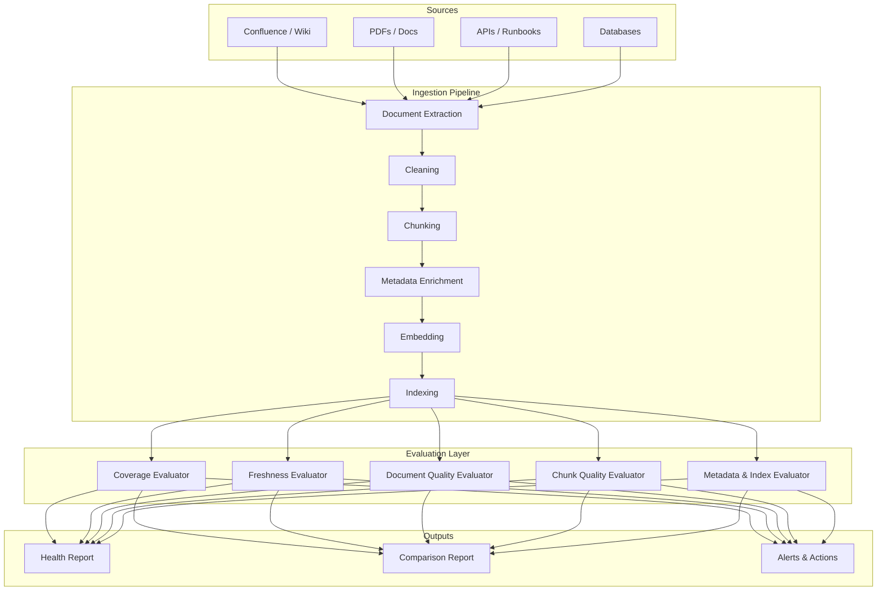

---

## Evaluation Class Structure

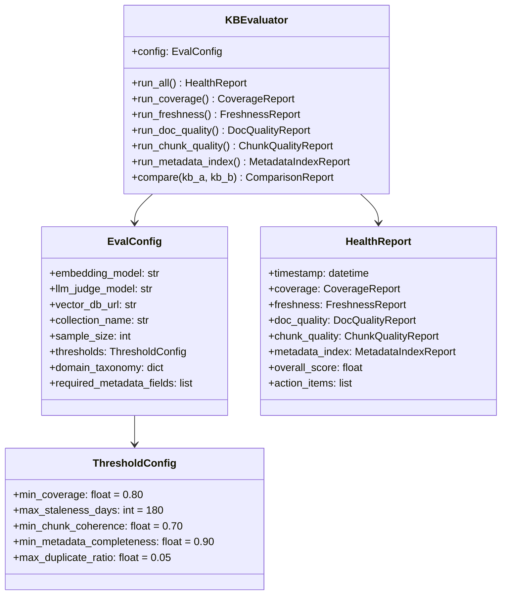

---

## Tools & Dependencies

| Category | Tools |
|----------|-------|
| Embeddings | `sentence-transformers`, OpenAI Embeddings API |
| Clustering | `scikit-learn` (KMeans, HDBSCAN) |
| NER | `spaCy` (entity extraction) |
| Token counting | `tiktoken` |
| Readability | `textstat` |
| LLM-as-judge | OpenAI / local LLM via `litellm` |
| Vector DB client | `qdrant-client` / `chromadb` / `pgvector` |
| Visualization | `matplotlib`, `seaborn` |
| Orchestration | `prefect` / `airflow` / cron |


---

## 1. Coverage Evaluation

> "Does the KB actually contain information for the questions users ask?"

### Metrics

| Metric | Formula | What It Tells You |
|--------|---------|-------------------|
| **Domain Coverage** | `covered_subdomains / total_subdomains` | Are all topic areas represented? |
| **Intent Coverage** | `query_clusters_with_matching_chunks / total_query_clusters` | Can the KB support what users actually ask? |
| **Entity Coverage** | `entities_in_KB ∩ entities_in_queries / entities_in_queries` | Are all products/systems/people documented? |

### How to Compute

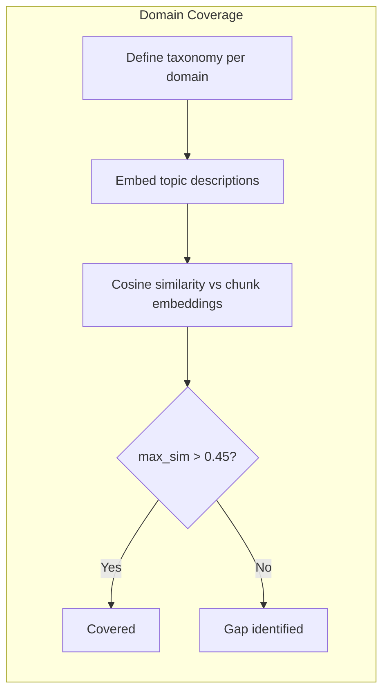

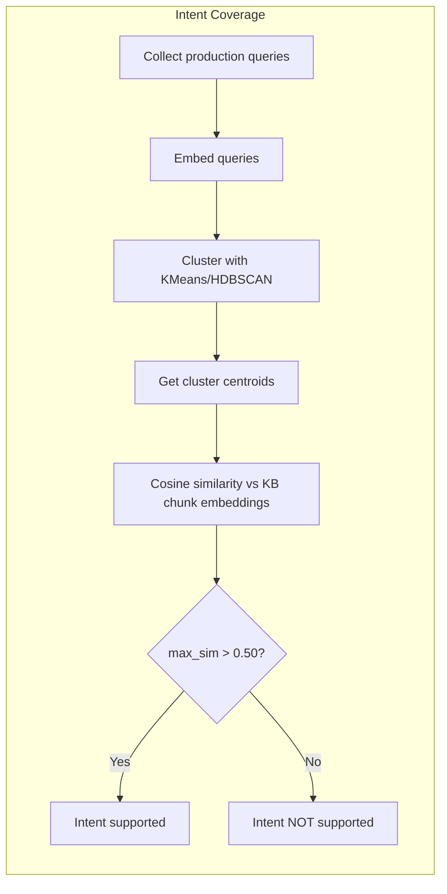

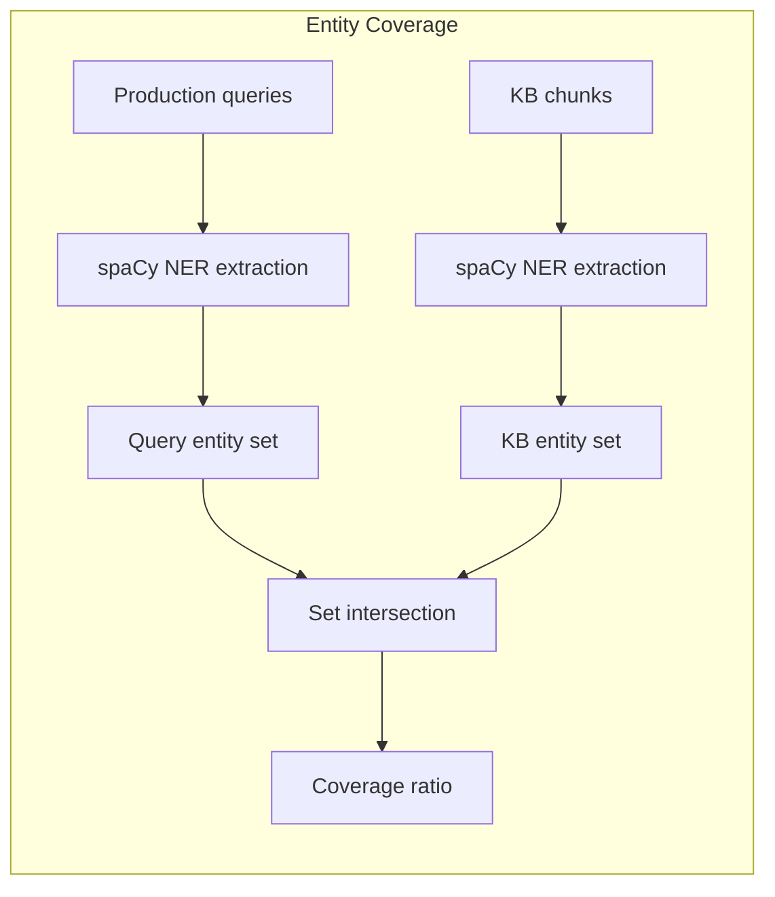

### Implementation Approach

1. **Domain Coverage**
   - Define a taxonomy: `{ "hr": ["payroll", "leave", "benefits"], "eng": ["apis", "runbooks"] }`
   - Embed each subdomain as a natural language description
   - Compute max cosine similarity against all chunk embeddings
   - Threshold: 0.45 (tune per embedding model)

2. **Intent Coverage**
   - Collect 10k–100k production queries (or generate synthetic via LLM)
   - Embed and cluster into 50–200 intent groups
   - For each cluster centroid, find best-matching chunk
   - Uncovered clusters = content gaps to prioritize

3. **Entity Coverage**
   - Run NER on queries → frequently-asked entities (≥ 3 occurrences)
   - Run NER on KB chunks → known entities
   - Set difference = missing entities

### Thresholds

| Metric | ✅ Good | ⚠️ Warning | 🔴 Critical |
|--------|---------|------------|-------------|
| Domain Coverage | > 90% | 70–90% | < 70% |
| Intent Coverage | > 85% | 60–85% | < 60% |
| Entity Coverage | > 80% | 50–80% | < 50% |

### Actions on Failure

- **Uncovered domains** → Source new documents, engage content owners
- **Uncovered intents** → Analyze query clusters, create targeted content
- **Missing entities** → Check if docs exist but weren't ingested vs. don't exist at all

---

### Domain Coverage — Deep Dive

#### Where do domains and subdomains come from?

The taxonomy is **not auto-discovered** — it is a deliberate design decision made by the team building the RAG system. You define it based on:

| Source | How |
|--------|-----|
| **Business requirements** | "Our assistant must handle HR, Engineering, and Product questions" |
| **Existing content structure** | Mirror your Confluence space hierarchy, SharePoint sites, or folder structures |
| **Stakeholder interviews** | Ask content owners: "What topics does your team produce documentation for?" |
| **Production query analysis** | Cluster past queries to discover what users actually ask about (this bootstraps the taxonomy) |

**Example taxonomy for an internal enterprise assistant:**

```yaml
taxonomy:
  hr:
    - payroll
    - leave_policy
    - benefits
    - recruitment
    - compliance
    - performance_reviews
  engineering:
    - api_documentation
    - architecture_decisions
    - runbooks
    - deployment_guides
    - coding_standards
  product:
    - feature_specs
    - release_notes
    - roadmap
    - pricing
```

#### How is the taxonomy maintained when new data is ingested?

The taxonomy is a **living configuration file** — not computed at ingestion time. It evolves through:

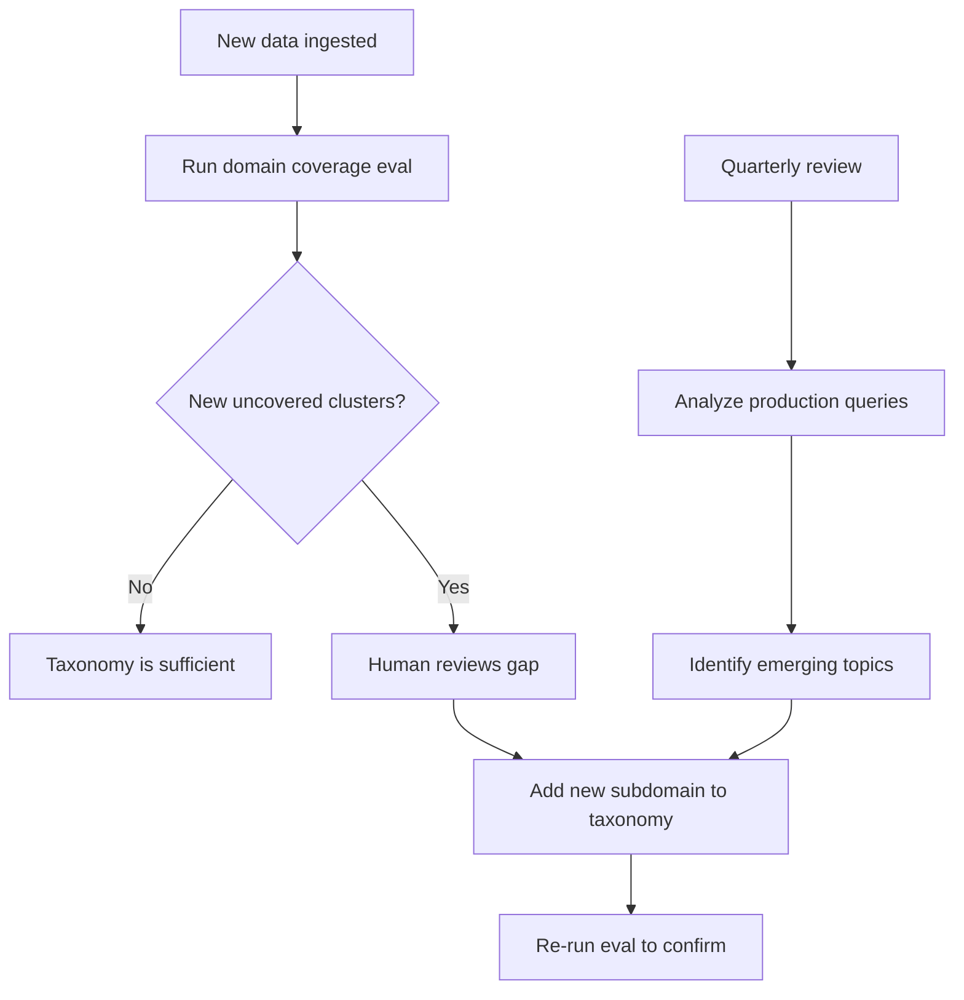

In practice:
- The taxonomy is stored in a **config file** (`taxonomy.yaml`) alongside your evaluation pipeline
- When coverage eval runs and finds chunks that don't match any topic, it's a signal to **update the taxonomy** (not a bug)
- Mature teams re-evaluate their taxonomy quarterly based on production query patterns

#### What are "topic descriptions" and where do they come from?

Topic descriptions are **natural language sentences** you write to represent each subdomain. They're needed because you can't meaningfully embed a single word like "payroll" — it's too short and ambiguous.

**You write them manually as part of defining the taxonomy:**

```yaml
topic_descriptions:
  hr.payroll: "Employee salary payments, payslips, tax deductions, and compensation processing"
  hr.leave_policy: "Annual leave, sick leave, parental leave rules, how to apply for time off"
  hr.benefits: "Health insurance, retirement plans, employee perks and wellness programs"
  engineering.api_documentation: "REST API endpoints, request/response formats, authentication, rate limits"
  engineering.runbooks: "Operational procedures for incident response, deployment, rollback, and monitoring"
```

These descriptions become the **embedding targets** you compare against your KB chunks.

#### What does "cosine similarity vs chunk embeddings" mean?

Yes — exactly what you suspected. The process is:

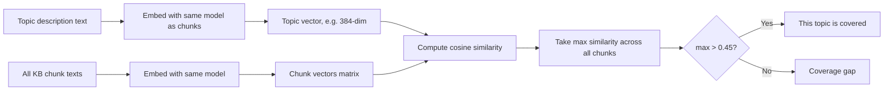

**Key points:**
- You use the **same embedding model** for both topics and chunks (critical — different models produce incompatible vector spaces)
- You compare **one topic description** against **all chunk embeddings** and take the **maximum** similarity
- If the best-matching chunk is above threshold (0.45), that topic is considered covered
- The threshold (0.45) depends on your embedding model — tune it by spot-checking results

---

### Intent Coverage — Deep Dive

#### The complete workflow explained

Intent coverage answers: *"For the types of questions users actually ask, does the KB have relevant content?"*

Unlike domain coverage (which uses a pre-defined taxonomy), intent coverage is **data-driven** — it's discovered from actual user behavior.

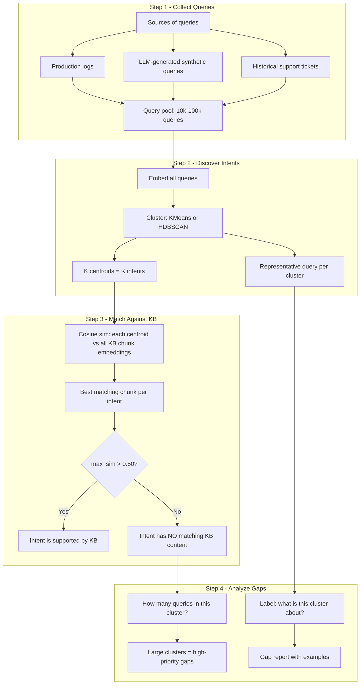

#### Step-by-step explanation

**Step 1 — Get queries:**
- If you have a production system: export query logs
- If you're pre-launch: generate synthetic queries with an LLM ("Given this KB is about X, what would users ask?")
- Aim for 10k+ queries to get meaningful clusters

**Step 2 — Discover intent groups:**
- Embed all queries using the same embedding model as your KB
- Cluster them (KMeans with K=50–200, or HDBSCAN for auto-K)
- Each cluster represents an **intent group** — a category of similar questions
- The **centroid** (center point) of each cluster represents that intent in embedding space
- Pick the query closest to the centroid as the "representative query" (human-readable label)

**Step 3 — Check KB support:**
- For each cluster centroid, compute cosine similarity against all chunk embeddings in your KB
- If the best match is above threshold → the KB has content for this intent
- If below → users are asking questions the KB cannot support

**Step 4 — Prioritize gaps:**
- Large clusters with no KB support = many users hitting a wall
- The representative query tells you *what* content is missing
- This directly feeds your content creation backlog

#### Example output

```
Intent Cluster #7 (1,842 queries):
  Representative: "How do I reset my VPN token?"
  Best KB match similarity: 0.32 (below 0.50 threshold)
  Status: ❌ NOT COVERED
  Action: Need VPN troubleshooting documentation

Intent Cluster #12 (956 queries):
  Representative: "What is the reimbursement process for travel expenses?"
  Best KB match similarity: 0.71
  Status: ✅ COVERED
```

---

### Entity Coverage — Deep Dive

#### The complete workflow explained

Entity coverage answers: *"Are all the specific things (products, systems, people, places) that users ask about actually documented in the KB?"*

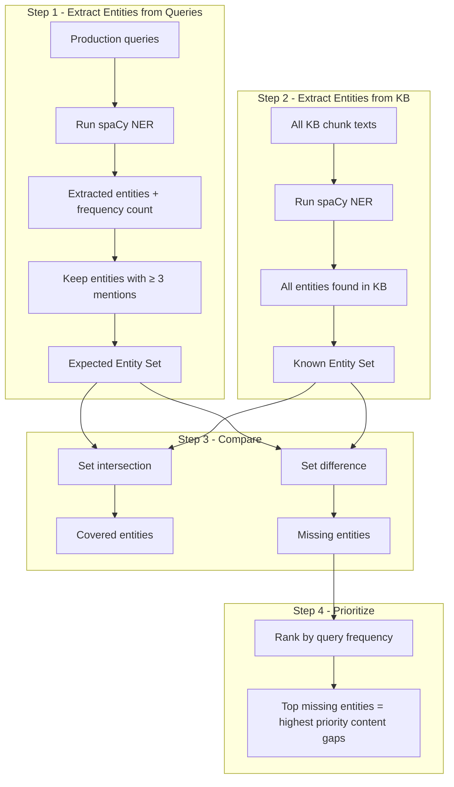

#### Step-by-step explanation

**Step 1 — What do users ask about?**
- Run Named Entity Recognition (NER) on all production queries
- Focus on entity types: `PRODUCT`, `ORG`, `PERSON`, `GPE` (geopolitical), `FAC` (facilities)
- Count how often each entity appears
- Filter to entities mentioned ≥ 3 times (removes noise/typos)
- Result: a set of entities users care about, ranked by frequency

**Step 2 — What does the KB contain?**
- Run the same NER pipeline on all KB chunks
- Collect every entity mentioned in the KB
- Result: the set of "known" entities

**Step 3 — Compute the gap**
- Intersection = entities both asked about AND present in KB ✅
- Difference (query entities - KB entities) = entities users ask about but KB doesn't cover ❌
- Coverage ratio = `|intersection| / |expected entities|`

**Step 4 — Prioritize what's missing**
- Sort missing entities by query frequency
- "Product X" mentioned in 500 queries but absent from KB = critical gap
- "Product Y" mentioned in 4 queries but absent = low priority

#### Important nuance

NER is not perfect. You'll get false positives (non-entities detected) and false negatives (missed entities). Mitigations:
- Use a domain-specific NER model if available
- Supplement with a **curated entity list** (e.g., product catalog, employee directory)
- The frequency filter (≥ 3 mentions) naturally removes most NER noise


---

## 2. Freshness Evaluation

> "Is the information in the KB still current and correct?"

### Metrics

| Metric | Formula | What It Tells You |
|--------|---------|-------------------|
| **Document Age** | `now - last_updated` | How old is the content? |
| **Update Lag** | `kb_ingestion_time - source_modification_time` | How fast does the pipeline propagate changes? |
| **Staleness Score** | `actual_age / expected_refresh_interval` | Is this document overdue for a refresh? (>1.0 = overdue) |

### How to Compute

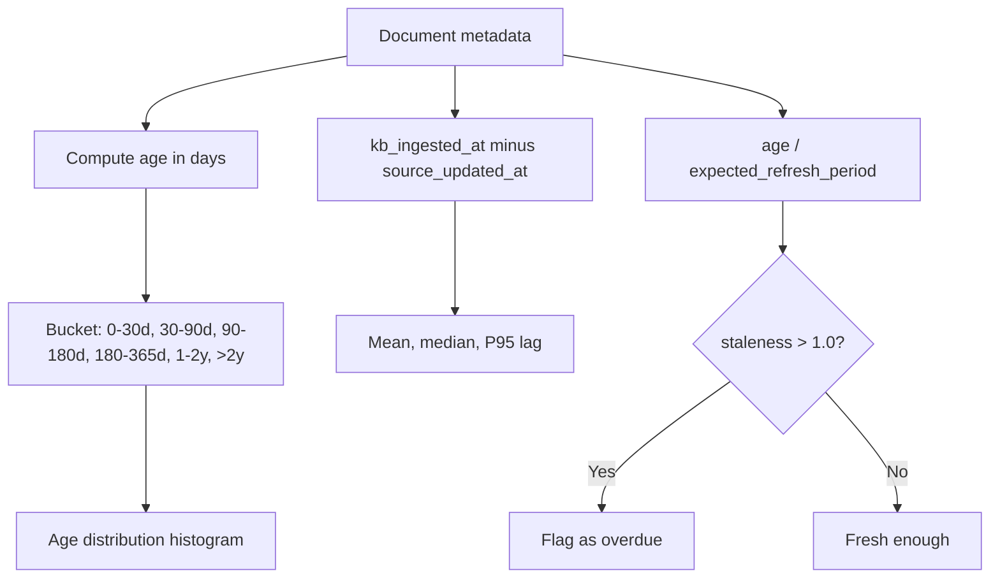

### Implementation Approach

1. **Age Distribution**
   - Pull `updated_at` or `created_at` from document metadata
   - Compute age in days, bucket into ranges
   - Report: mean, median, P90, distribution histogram

2. **Update Lag**
   - Requires two timestamps per doc: `source_updated_at` and `kb_ingested_at`
   - Lag = difference in hours
   - Flag anything > 7 days as problematic

3. **Staleness Score**
   - Define expected refresh intervals per doc type:
     - `policy` → 180 days
     - `api_docs` → 90 days
     - `release_notes` → 30 days
     - `runbook` → 180 days
     - `architecture` → 365 days
   - Score = `actual_age / expected_interval`
   - Score > 1.0 = overdue, > 2.0 = critically stale

### Thresholds

| Metric | ✅ Good | ⚠️ Warning | 🔴 Critical |
|--------|---------|------------|-------------|
| Mean Document Age | < 180 days | 180–365 days | > 365 days |
| Median Update Lag | < 24 hours | 1–7 days | > 7 days |
| % Overdue (staleness > 1) | < 10% | 10–30% | > 30% |
| % Critically Stale (> 2) | < 5% | 5–15% | > 15% |

### Actions on Failure

- **High mean age** → Prioritize re-ingestion of oldest docs
- **High update lag** → Fix pipeline scheduling (increase sync frequency)
- **High staleness in specific types** → Alert content owners, set up refresh reminders
- **Missing dates** → Fix metadata extraction at ingestion time

---

### Where Does Freshness Metadata Come From?

This is a practical question many teams overlook. You need timestamps, but **documents don't magically carry them** — your ingestion pipeline must extract and store them deliberately.

#### Sources of timestamp metadata

| Source System | How to Get Dates | What You Get |
|---------------|------------------|--------------|
| **Confluence / Wiki** | API: `page.version.when`, `page.history.createdDate` | Created, last modified, last editor |
| **SharePoint** | API: `Modified`, `Created` fields | Created, modified timestamps |
| **Git repos** | `git log --format=%ai <file>` | First commit date, last commit date |
| **S3 / Cloud storage** | Object metadata: `LastModified` | Upload timestamp (not authoring date!) |
| **PDFs** | PDF metadata: `/CreationDate`, `/ModDate` | Author's creation/modification date |
| **Databases** | `updated_at`, `created_at` columns | Row-level timestamps |
| **Web scraping** | HTTP `Last-Modified` header, page footer dates | Variable reliability |

#### Where to store this metadata

All timestamps should be stored as **chunk-level metadata** in your vector database:

```yaml
chunk_metadata:
  document_id: "doc_12345"
  chunk_index: 3
  source: "confluence"
  source_url: "https://wiki.example.com/pages/12345"
  
  # Freshness fields (critical)
  source_created_at: "2025-03-15T10:30:00Z"    # When doc was first created in source
  source_updated_at: "2026-06-20T14:22:00Z"    # When doc was last modified in source
  kb_ingested_at: "2026-06-21T02:00:00Z"       # When this chunk entered the KB
  kb_last_reindexed_at: "2026-07-01T02:00:00Z" # When this chunk was last re-embedded
```

#### The ingestion pipeline must capture this

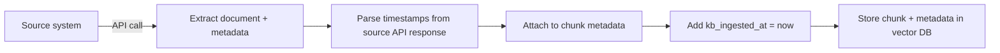

**Key principle:** If your ingestion pipeline doesn't extract dates, you lose them forever. This must be a **day-one design decision**, not an afterthought.

#### What if you DON'T have timestamps?

| Situation | Workaround |
|-----------|------------|
| PDFs with no metadata | Use file system `mtime`, or flag as "unknown age" |
| Scraped pages with no dates | Use `Last-Modified` header, or scrape date from page content |
| Legacy documents with no source | Set `source_created_at = kb_ingested_at` as a starting point, mark as "estimated" |
| Source system doesn't expose dates | File a request with the platform team; until then, mark as "freshness unknown" |

Documents with unknown freshness should be tracked separately and treated as potentially stale by default.


---

## 3. Document Quality Evaluation

> "Was each document correctly extracted and is it readable?"

### Metrics

| Metric | Formula | What It Tells You |
|--------|---------|-------------------|
| **OCR Confidence** | Average confidence score from OCR engine | Are scanned docs being read correctly? |
| **Extraction Success Rate** | `fully_parsed_docs / total_docs` | How many docs survived extraction without errors? |
| **Duplicate Rate** | `near_duplicate_pairs / total_docs` | Are we indexing the same content multiple times? |
| **Readability Score** | Flesch-Kincaid or similar | Is the extracted text coherent and readable? |
| **Corruption Rate** | `docs_with_issues / total_docs` | Missing pages, broken tables, garbled text? |

### How to Compute

1. **OCR Confidence**
   - If using Tesseract: extract per-word confidence, average per doc
   - If using cloud OCR (AWS Textract, GCP Document AI): use API confidence field
   - Threshold: mean confidence < 80% → flag for manual review

2. **Extraction Validation**
   - After parsing, run heuristic checks:
     - Text length > minimum (e.g., > 50 chars)
     - No garbled character sequences (regex for repeated `???` or `\x00`)
     - Tables have consistent row/column counts
     - Code blocks are properly delimited
   - Report % of docs passing all checks

3. **Near-Duplicate Detection**
   - Approach A: **MinHash + LSH** — fast, scalable for large corpora
   - Approach B: **Embedding similarity** — embed all docs, flag pairs with cosine > 0.95
   - Approach C: **Exact content hash** — SHA-256 of normalized text for exact duplicates
   - Recommended: MinHash for scale, embedding sim for semantic duplicates

4. **Readability Scoring**
   - Use `textstat` library: Flesch Reading Ease, Gunning Fog, etc.
   - Not a quality gate itself, but useful for identifying garbled extractions
   - Extremely low readability (< 10 Flesch) on a doc that should be readable → extraction issue

### Thresholds

| Metric | ✅ Good | ⚠️ Warning | 🔴 Critical |
|--------|---------|------------|-------------|
| OCR Confidence | > 90% | 80–90% | < 80% |
| Extraction Success | > 98% | 95–98% | < 95% |
| Duplicate Rate | < 5% | 5–15% | > 15% |
| Corruption Rate | < 2% | 2–5% | > 5% |

### Actions on Failure

- **Low OCR confidence** → Re-process with better OCR model, or manually review
- **Extraction failures** → Fix parser for specific doc formats (e.g., multi-column PDFs)
- **High duplicates** → Deduplicate at ingestion time with content hashing
- **Corruption** → Add validation step in pipeline before indexing


---

## 4. Chunk Quality Evaluation

> "Are chunks well-formed, coherent, and self-contained enough for retrieval?"

This is arguably the most impactful evaluation — retrievers return **chunks**, not documents.

### Metrics

| Metric | Formula | What It Tells You |
|--------|---------|-------------------|
| **Semantic Coherence** | LLM/embedding-based: does the chunk discuss one concept? | Are chunks semantically unified? |
| **Boundary Integrity** | % of chunks with split tables/code/procedures | Did chunking break logical units? |
| **Self-Containedness** | Can a chunk answer a question without neighbors? | Is each chunk useful in isolation? |
| **Size Distribution** | Token count stats (mean, std, min, max) | Is chunking consistent? |
| **Redundancy / Overlap** | Pairwise similarity of adjacent chunks | Too much or too little overlap? |

### How to Compute

```mermaid
flowchart TD
    subgraph Coherence
        C1[Sample N chunks] --> C2[Embed each sentence in chunk]
        C2 --> C3[Compute intra-chunk sentence similarity]
        C3 --> C4[Mean pairwise cosine = coherence score]
    end

    subgraph Boundary Integrity
        B1[Sample N chunks] --> B2[Check for truncated patterns]
        B2 --> B3[Incomplete code blocks, split tables, broken lists]
        B3 --> B4[% with boundary violations]
    end

    subgraph Self-Containedness
        SC1[Sample N chunks] --> SC2[Generate question from chunk via LLM]
        SC2 --> SC3[Attempt to answer using ONLY that chunk]
        SC3 --> SC4[LLM judges: answerable yes/no?]
        SC4 --> SC5[% answerable = self-containedness score]
    end

    subgraph Size Distribution
        SD1[All chunks] --> SD2[Count tokens per chunk]
        SD2 --> SD3[Histogram + stats]
        SD3 --> SD4[Flag outliers: < 50 or > 2000 tokens]
    end
```

### Implementation Approach

1. **Semantic Coherence** (embedding-based, no LLM needed)
   - Split chunk into sentences
   - Embed each sentence
   - Compute average pairwise cosine similarity within the chunk
   - Score range: 0–1 (higher = more coherent)
   - Alternative: Use LLM to rate coherence 1–5 on a sample

2. **Boundary Integrity** (rule-based heuristics)
   - Detect patterns indicating bad splits:
     - Chunk starts mid-sentence (no capital letter, starts with lowercase)
     - Unmatched code fences (opens ``` but never closes)
     - Truncated numbered lists (starts at step 3)
     - Table rows without headers
     - Incomplete JSON/XML
   - % of chunks with ≥ 1 violation = boundary violation rate

3. **Self-Containedness** (LLM-as-judge)
   - For a sample of chunks:
     - Ask LLM: "Generate a factual question this chunk can answer"
     - Then ask LLM: "Given ONLY this chunk, answer the question. Is the answer complete?"
     - Score: % of chunks rated as self-contained

4. **Size Distribution**
   - Count tokens (use `tiktoken` with `cl100k_base`)
   - Compute: mean, std, P5, P95, min, max
   - Flag chunks outside expected range (e.g., < 100 or > 1500 tokens)
   - High std dev = inconsistent chunking strategy

5. **Overlap / Redundancy**
   - For adjacent chunk pairs: compute cosine similarity
   - Expected overlap: 10–25% (if using sliding window)
   - > 50% similarity between non-adjacent chunks = true duplicates

### Thresholds

| Metric | ✅ Good | ⚠️ Warning | 🔴 Critical |
|--------|---------|------------|-------------|
| Mean Coherence Score | > 0.70 | 0.50–0.70 | < 0.50 |
| Boundary Violation Rate | < 5% | 5–15% | > 15% |
| Self-Containedness | > 80% | 60–80% | < 60% |
| Size Std Dev / Mean (CV) | < 0.3 | 0.3–0.6 | > 0.6 |
| Duplicate Chunk Rate | < 5% | 5–10% | > 10% |

### Actions on Failure

- **Low coherence** → Switch chunking strategy (semantic chunking > fixed-size)
- **Boundary violations** → Add format-aware splitting (respect code blocks, tables, headers)
- **Low self-containedness** → Increase chunk size or add context window / parent reference
- **High size variance** → Standardize chunking parameters, fix parser edge cases
- **High duplication** → Deduplicate post-chunking or reduce overlap window


---

## 5. Metadata & Index Quality

> "Is every chunk properly tagged and correctly indexed?"

### Metrics

| Metric | Formula | What It Tells You |
|--------|---------|-------------------|
| **Metadata Completeness** | `chunks_with_all_required_fields / total_chunks` | Can we filter and route effectively? |
| **Metadata Consistency** | `chunks_without_contradictions / total_chunks` | Are labels coherent across fields? |
| **Embedding Success Rate** | `successfully_embedded_chunks / total_chunks` | Did any chunks fail embedding? |
| **Index Completeness** | `vectors_in_index / expected_vectors` | Are all chunks actually searchable? |
| **Orphan Vector Rate** | `vectors_without_source_doc / total_vectors` | Are there dangling embeddings? |
| **Dimensionality Consistency** | `vectors_with_correct_dim / total_vectors` | Mixed models or corruption? |

### How to Compute

1. **Metadata Completeness**
   - Define required fields: `[source, document_id, chunk_index, created_at, updated_at, language, department, version]`
   - For each chunk, check presence and non-null/non-empty
   - Score = % of chunks with ALL required fields present
   - Also report per-field fill rates to identify specific gaps

2. **Metadata Consistency**
   - Cross-field validation rules:
     - If `language=en`, text should be predominantly English
     - If `department=hr`, content should relate to HR topics
     - `created_at` should be ≤ `updated_at`
     - `chunk_index` should be sequential within a `document_id`
   - Use simple heuristics or LLM spot-checks on a sample

3. **Embedding Success Rate**
   - Count chunks in source store vs. vectors in index
   - Any mismatch = embedding failures
   - Check for zero vectors or NaN vectors (corruption)

4. **Index Completeness**
   - Query vector DB for total point count
   - Compare against expected count from ingestion pipeline
   - Delta = lost/orphaned data

5. **Orphan Detection**
   - For each vector ID in the index, verify source document still exists
   - Orphans = vectors pointing to deleted/moved documents
   - These pollute search results with stale content

### Thresholds

| Metric | ✅ Good | ⚠️ Warning | 🔴 Critical |
|--------|---------|------------|-------------|
| Metadata Completeness | > 95% | 85–95% | < 85% |
| Metadata Consistency | > 90% | 80–90% | < 80% |
| Embedding Success Rate | > 99.5% | 99–99.5% | < 99% |
| Index Completeness | > 99.9% | 99–99.9% | < 99% |
| Orphan Rate | < 1% | 1–5% | > 5% |

### Actions on Failure

- **Low metadata completeness** → Fix extraction pipeline, add defaults, validate at ingestion
- **Consistency issues** → Add cross-field validation rules as pipeline gates
- **Embedding failures** → Check for chunks exceeding model's max token limit, empty chunks, encoding errors
- **Index gaps** → Reindex missing chunks, add reconciliation job
- **Orphans** → Periodic garbage collection job to remove stale vectors


---

## 6. Comparison Framework — KB A vs KB B

> "How do I compare two versions of a knowledge base, or two different chunking strategies?"

This is essential for iterating on your KB pipeline. Every change (new chunking strategy, different embedding model, updated sources) needs a structured comparison.

### When to Compare

- Before/after re-chunking
- Before/after adding new sources
- Different embedding models
- Different metadata enrichment strategies
- Weekly KB snapshots (regression detection)

### Comparison Architecture

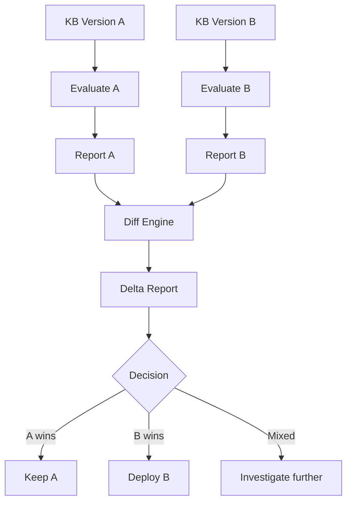

### What to Compare

| Dimension | Comparison Method |
|-----------|-------------------|
| Coverage | Side-by-side coverage scores; did B fill gaps A had? |
| Freshness | Age distribution shift; is B more current? |
| Chunk Quality | Mean coherence, boundary violations, size distribution |
| Retrieval Impact | Run same query set against both, compare Recall@K |
| Duplicates | Duplicate rate A vs B |
| Index Size | Total chunks, total tokens, storage footprint |

### Comparison Metrics Table

For each metric `m`:

```
delta(m) = score_B(m) - score_A(m)
relative_change(m) = delta(m) / score_A(m) * 100%
```

Report as:

| Metric | KB A | KB B | Delta | Relative Change | Verdict |
|--------|------|------|-------|-----------------|---------|
| Domain Coverage | 0.82 | 0.91 | +0.09 | +11% | ✅ B wins |
| Mean Coherence | 0.71 | 0.68 | -0.03 | -4% | ⚠️ Regression |
| Staleness % | 22% | 8% | -14% | -64% | ✅ B wins |
| Duplicate Rate | 3% | 12% | +9% | +300% | 🔴 Regression |

### Retrieval-Level Comparison (Golden Query Set)

The strongest comparison uses a **golden query set** — a curated set of queries with known correct chunks/documents.

```mermaid
flowchart LR
    GQ[Golden Query Set] --> RA2[Retrieve from KB A]
    GQ --> RB2[Retrieve from KB B]
    
    RA2 --> MA[Recall@5, MRR, Precision@5]
    RB2 --> MB[Recall@5, MRR, Precision@5]
    
    MA --> COMP[Statistical comparison]
    MB --> COMP
    COMP --> SIG{Significant difference?}
    SIG -->|Yes| WINNER[Report winner]
    SIG -->|No| TIE[No meaningful difference]
```

**How to build a golden query set:**
1. Sample 200–500 real production queries
2. For each query, have a human (or strong LLM) identify the ideal chunk(s)
3. Store as: `{ query, relevant_chunk_ids, relevant_doc_ids }`
4. Run retrieval against both KBs, compute IR metrics

### Decision Framework

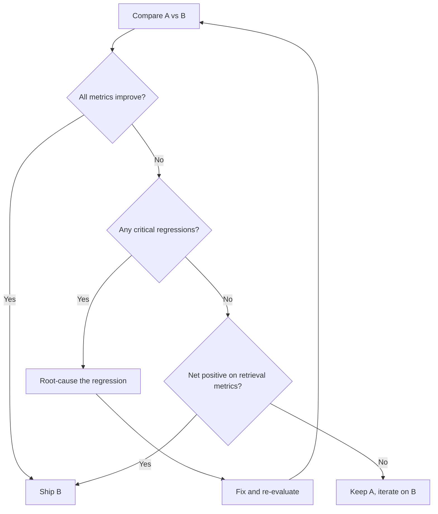


---

## 7. Health Dashboard & Automation

### Composite Health Score

Combine all dimension scores into a single KB health score:

```
KB_Health = w1 * coverage + w2 * freshness + w3 * doc_quality + w4 * chunk_quality + w5 * metadata_index
```

Suggested weights (adjust per project):

| Dimension | Weight | Rationale |
|-----------|--------|-----------|
| Coverage | 0.25 | No coverage = no answer possible |
| Freshness | 0.15 | Wrong answers are worse than no answer |
| Document Quality | 0.15 | Garbage in, garbage out |
| Chunk Quality | 0.30 | Directly impacts retrieval quality |
| Metadata & Index | 0.15 | Enables filtering and routing |

### Dashboard Layout

| Section | Visualizations |
|---------|---------------|
| Summary | Overall health score (gauge), trend over time |
| Coverage | Domain heatmap, intent coverage bar chart, gap list |
| Freshness | Age histogram, staleness distribution, overdue doc list |
| Doc Quality | Extraction success rate trend, duplicate count |
| Chunk Quality | Size histogram, coherence distribution, boundary violation % |
| Metadata | Field completeness heatmap, consistency score |
| Comparison | Side-by-side delta table (if A/B comparison ran) |

### Automation Pipeline

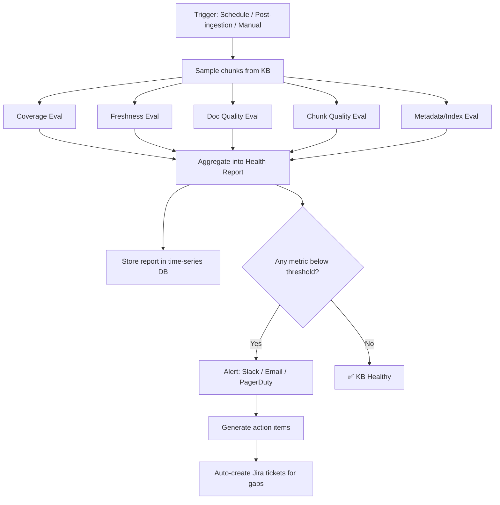

### Recommended Schedule

| Trigger | What Runs | Why |
|---------|-----------|-----|
| **Daily** | Freshness + Index completeness | Catch stale data and ingestion failures fast |
| **Weekly** | Full evaluation (all dimensions) | Comprehensive health check |
| **Post-ingestion** | Coverage + Chunk quality + Metadata | Validate new content quality |
| **Pre-release** | Full eval + Comparison vs. production | Gate bad KBs from reaching users |

### Implementation Plan (Phased)

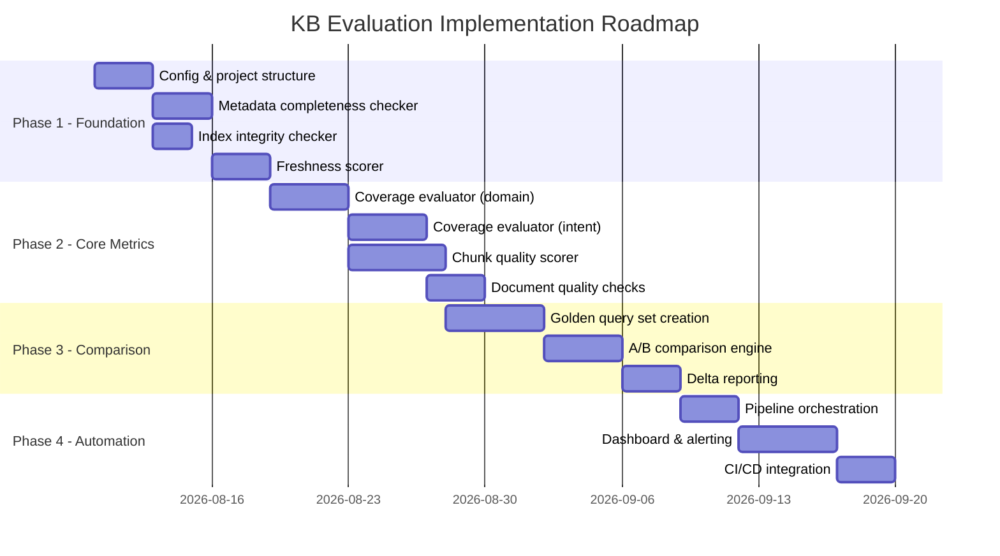

---

## Quick Reference — All Metrics Summary

| # | Dimension | Metric | How to Compute | Threshold |
|---|-----------|--------|----------------|-----------|
| 1 | Coverage | Domain Coverage | Embed taxonomy topics, cosine sim vs chunks | > 90% |
| 2 | Coverage | Intent Coverage | Cluster queries, match centroids to chunks | > 85% |
| 3 | Coverage | Entity Coverage | NER on queries vs NER on KB, set overlap | > 80% |
| 4 | Freshness | Document Age | `now - updated_at`, bucket distribution | median < 180d |
| 5 | Freshness | Update Lag | `kb_ingested_at - source_updated_at` | median < 24h |
| 6 | Freshness | Staleness Score | `age / expected_refresh_interval` | < 10% overdue |
| 7 | Doc Quality | OCR Confidence | OCR engine confidence scores | > 90% |
| 8 | Doc Quality | Extraction Success | Heuristic validation post-parse | > 98% |
| 9 | Doc Quality | Duplicate Rate | MinHash LSH or embedding similarity > 0.95 | < 5% |
| 10 | Chunk Quality | Semantic Coherence | Intra-chunk sentence embedding similarity | > 0.70 |
| 11 | Chunk Quality | Boundary Integrity | Rule-based: split code/tables/lists detection | < 5% violations |
| 12 | Chunk Quality | Self-Containedness | LLM-as-judge: can chunk answer its own Q? | > 80% |
| 13 | Chunk Quality | Size Distribution | Token count stats, coefficient of variation | CV < 0.3 |
| 14 | Metadata | Completeness | Required fields present & non-empty | > 95% |
| 15 | Metadata | Consistency | Cross-field validation rules | > 90% |
| 16 | Index | Embedding Success | Chunks in source vs vectors in index | > 99.5% |
| 17 | Index | Orphan Rate | Vectors without valid source doc | < 1% |

---

## Key Principle

> Treat your knowledge base like source code: **versioned, tested, gated, and observable.**

Every pipeline run should produce a health report. Every comparison should be data-driven. No KB change should reach production without passing quality gates.

---

## FAQ

### General

**Q: Should KB evaluation run as part of the ingestion pipeline or separately?**

Both. Fast, cheap checks (metadata completeness, chunk size validation, duplicate hashing, embedding success) run **inline as quality gates** during ingestion — they block bad data from entering. Expensive, holistic evaluations (coverage, coherence, intent coverage, A/B comparisons) run as **separate batch jobs** — they require the full KB state or production query data.

**Q: How often should I run the full evaluation?**

- Daily: freshness + index completeness (cheap, catches ingestion failures)
- Weekly: full evaluation across all 6 dimensions
- Post-ingestion: coverage + chunk quality + metadata (validate new content)
- Pre-release: full eval + comparison vs. production (quality gate)

**Q: What's the minimum viable KB evaluation I should start with?**

Start with three things: (1) metadata completeness check, (2) chunk size distribution, and (3) index reconciliation (chunks in source vs vectors in DB). These are cheap, require no LLM, and catch the most common problems. Add coverage and coherence once you have production query data.

---

### Coverage

**Q: What if I don't have production queries yet (pre-launch)?**

Generate synthetic queries using an LLM. Prompt: "Given a knowledge base about [your domain], generate 500 diverse questions users might ask, covering different topics, difficulty levels, and intent types." This bootstraps your intent coverage evaluation until real data arrives.

**Q: How do I choose the cosine similarity threshold (0.45 for domain, 0.50 for intent)?**

These are starting points. Calibrate by:
1. Running the evaluation with a range of thresholds (0.3 to 0.7)
2. Spot-checking 50 "covered" and 50 "not covered" results manually
3. Finding the threshold where human judgment and the metric agree ~90% of the time

Different embedding models produce different similarity distributions — `all-MiniLM-L6-v2` tends to produce lower max similarities than `text-embedding-3-large`.

**Q: The taxonomy feels arbitrary. What if I define it wrong?**

An imperfect taxonomy is better than none. Start with your content structure (wiki spaces, folder hierarchy), refine with production data. The taxonomy is a living document — if coverage eval repeatedly flags certain chunks as "uncovered", it's a signal your taxonomy needs a new subdomain, not that the KB is broken.

**Q: Does entity coverage work for non-English content?**

spaCy has models for many languages (`de_core_news_sm`, `zh_core_web_sm`, etc.), but NER quality varies. For multilingual KBs, either: (a) use a multilingual model, (b) run language-specific NER per detected language, or (c) supplement NER with a curated entity list (product catalogs, org charts) which is language-agnostic.

---

### Freshness

**Q: What if 80% of my documents don't have timestamps?**

This is common in legacy migrations. Remediation path:
1. For future ingestion: fix the pipeline to extract dates (non-negotiable)
2. For existing content: use file system `mtime` or set `source_created_at = kb_ingested_at` and mark as "estimated"
3. Track "freshness unknown" documents as a separate metric — they're a liability
4. Progressively backfill: when documents are updated in source, the pipeline captures the new timestamp

**Q: How do I define "expected refresh interval" for staleness scoring?**

Ask content owners: "How often does this type of content change?" If they say "when regulations change" (unpredictable), set a conservative interval (180 days) and flag for human review when overdue. The intervals don't need to be perfect — they're a heuristic for prioritization.

---

### Chunk Quality

**Q: Semantic coherence scoring seems expensive. How do I do it at scale?**

You don't evaluate every chunk. Sample 500–1000 chunks randomly. For the embedding-based approach (intra-chunk sentence similarity), it's actually quite fast — embed all sentences in a batch, compute pairwise cosine. No LLM needed. The LLM-as-judge approach (self-containedness) is expensive — limit to 200–300 samples.

**Q: What's the difference between semantic coherence and self-containedness?**

- **Coherence** = "Does this chunk talk about one thing?" (topic unity)
- **Self-containedness** = "Can this chunk answer a question without needing neighboring chunks?" (information completeness)

A chunk can be coherent but not self-contained (e.g., a focused paragraph about step 3 of a procedure — coherent topic, but useless without steps 1-2). Both matter.

**Q: My chunks have high coherence but low retrieval quality. Why?**

Coherence alone doesn't guarantee good retrieval. Other factors:
- Chunks might be coherent but too short (lack context)
- Chunks might be coherent but poorly aligned with how users phrase questions (vocabulary mismatch)
- The embedding model might not capture the specific domain well
- Coverage gaps — the right content simply doesn't exist

---

### Comparison & Operations

**Q: How many queries do I need in a golden query set?**

200–500 is a solid starting point. More important than quantity:
- Cover all intent clusters proportionally
- Include easy AND hard queries
- Include queries with multiple valid answers
- Have human-verified ground truth (which chunks are actually relevant)

**Q: When is a metric delta "significant" in A/B comparison?**

Rules of thumb:
- Coverage metrics: > 5% change is meaningful
- Chunk quality scores: > 0.05 change in coherence/containedness is notable
- Retrieval metrics (Recall@5): > 3% change matters
- For statistical rigor: use bootstrapped confidence intervals or paired t-tests on per-query retrieval scores

**Q: Should I version my knowledge base like code?**

Yes. Practical approaches:
- **Vector DB snapshots**: Qdrant supports collection snapshots, ChromaDB can be backed up
- **Content versioning**: Store chunk content + metadata in a versioned store (git, DVC, or DB with history)
- **Evaluation results**: Store every health report with a KB version identifier
- This enables rollback, root-cause analysis, and trend tracking

**Q: What's the single most impactful thing I can do to improve KB quality?**

Fix your chunking. Most KB quality problems trace back to bad chunking — broken procedures, lost context, split tables, or inconsistent sizes. Switch from naive fixed-size chunking to format-aware semantic chunking, and you'll see improvements across coherence, self-containedness, and downstream retrieval quality without changing anything else.


