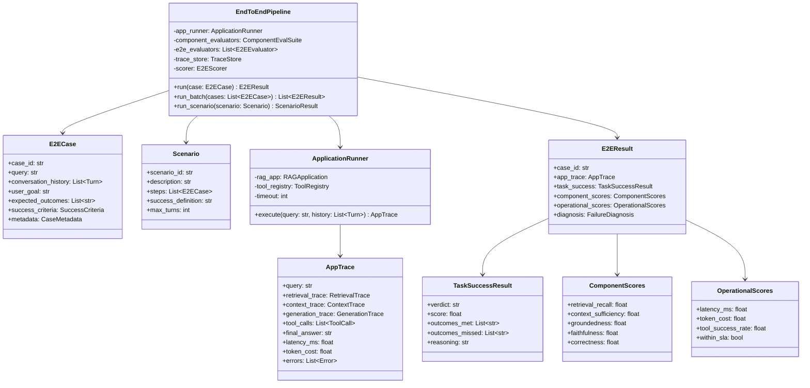
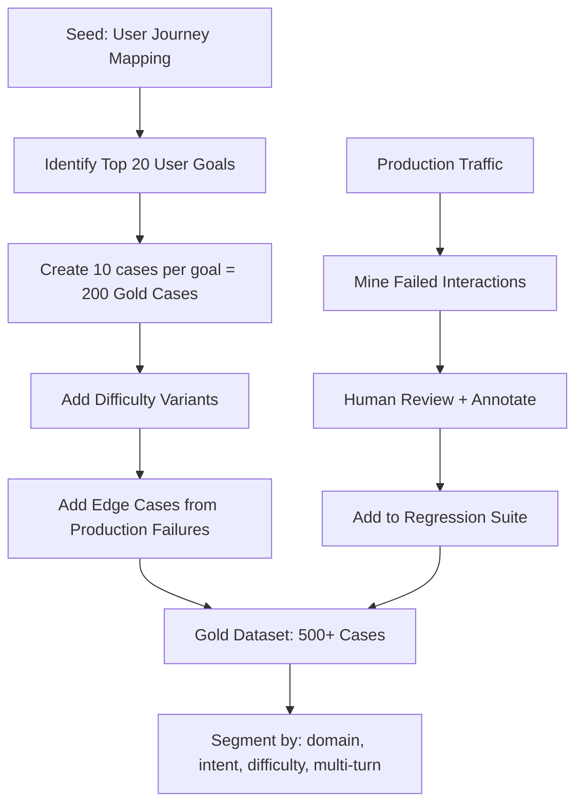
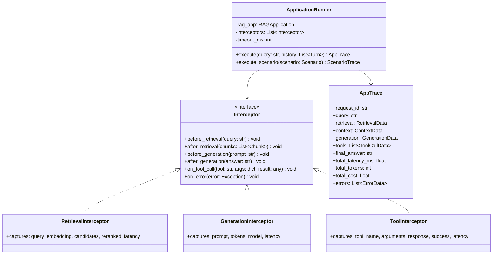
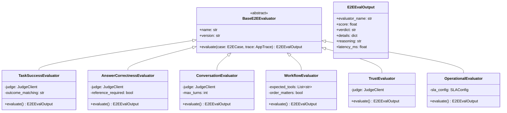
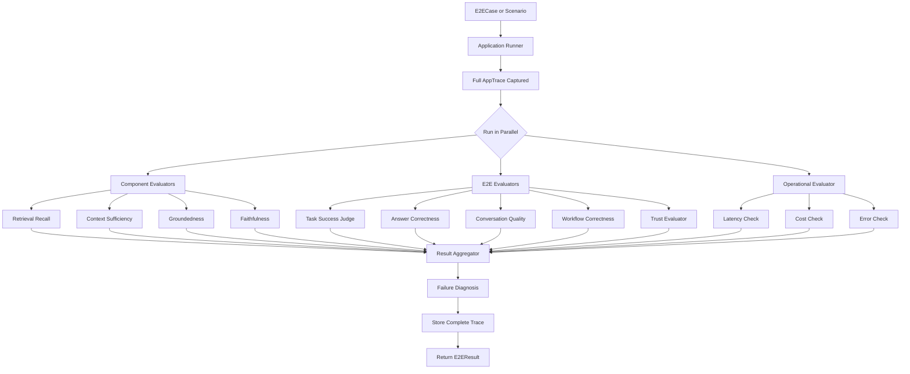
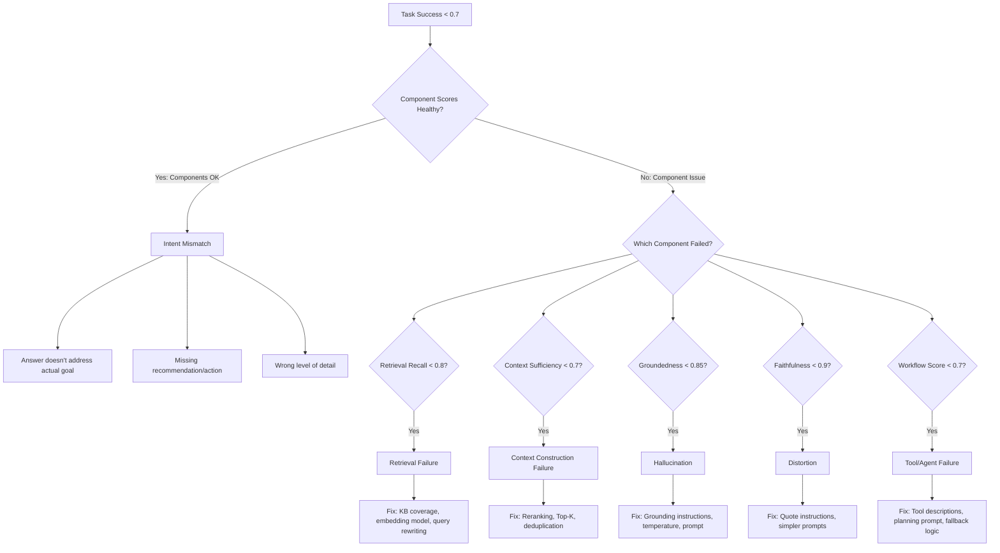
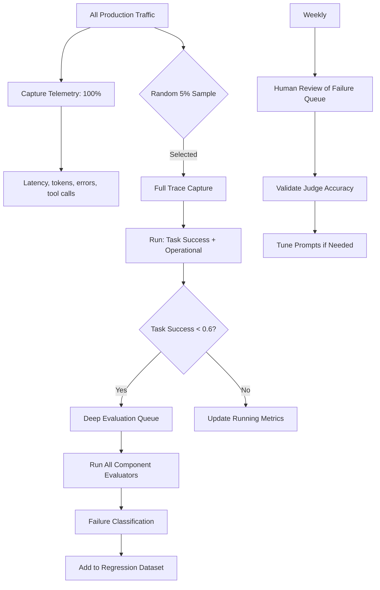

# End-to-End RAG Evaluation — Practical Implementation Guide

## Table of Contents

- [Overview](#overview)
- [System Architecture](#system-architecture)
- [Phase 1: Designing the Evaluation Dataset](#phase-1-designing-the-evaluation-dataset)
  - [Single-Turn Case Schema](#single-turn-case-schema)
  - [Multi-Turn / Conversation Schema](#multi-turn--conversation-schema)
  - [Scenario Schema](#scenario-schema)
  - [Dataset Creation Strategy](#dataset-creation-strategy)
- [Phase 2: The Application Runner](#phase-2-the-application-runner)
  - [Runner Architecture](#runner-architecture)
  - [Trace Capture](#trace-capture)
- [Phase 3: Implementing End-to-End Evaluators](#phase-3-implementing-end-to-end-evaluators)
  - [Evaluator Hierarchy](#evaluator-hierarchy)
  - [Evaluator 1: Task Success](#evaluator-1-task-success)
  - [Evaluator 2: Answer Correctness](#evaluator-2-answer-correctness)
  - [Evaluator 3: Conversation Quality](#evaluator-3-conversation-quality)
  - [Evaluator 4: Workflow Correctness](#evaluator-4-workflow-correctness)
  - [Evaluator 5: Trust and Calibration](#evaluator-5-trust-and-calibration)
  - [Evaluator 6: Operational Quality](#evaluator-6-operational-quality)
- [Phase 4: Judge Prompt Engineering](#phase-4-judge-prompt-engineering)
  - [Task Success Judge Prompt](#task-success-judge-prompt)
  - [Conversation Quality Judge Prompt](#conversation-quality-judge-prompt)
  - [Workflow Correctness Judge Prompt](#workflow-correctness-judge-prompt)
- [Phase 5: Orchestrating the Full Pipeline](#phase-5-orchestrating-the-full-pipeline)
  - [Pipeline Architecture](#pipeline-architecture)
  - [Component vs End-to-End Evaluation](#component-vs-end-to-end-evaluation)
  - [Execution Modes](#execution-modes)
- [Phase 6: Scoring, Aggregation, and Attribution](#phase-6-scoring-aggregation-and-attribution)
  - [Per-Case Scoring](#per-case-scoring)
  - [Metric Attribution Analysis](#metric-attribution-analysis)
- [Phase 7: Failure Diagnosis and Root Cause](#phase-7-failure-diagnosis-and-root-cause)
- [Phase 8: Production Integration](#phase-8-production-integration)
  - [Sampling and Live Evaluation](#sampling-and-live-evaluation)
  - [Business Metrics Correlation](#business-metrics-correlation)
  - [Alerting and Dashboards](#alerting-and-dashboards)
- [Implementation Roadmap](#implementation-roadmap)
- [Tools and Libraries](#tools-and-libraries)
- [Anti-Patterns to Avoid](#anti-patterns-to-avoid)

---

## Overview

This document translates the theoretical end-to-end evaluation framework into a concrete implementation plan. The core shift:

> **Stop asking "Did each component work?" and start asking "Did the user accomplish their goal?"**

We'll build a system that runs the entire RAG application, captures a full trace, evaluates task success across multiple dimensions, and correlates component metrics with user outcomes to guide engineering decisions.

---

## System Architecture



---

## Phase 1: Designing the Evaluation Dataset

### Single-Turn Case Schema

The simplest evaluation unit — one question, one answer:

```yaml
case_id: "e2e-001"
query: "What is the refund policy for digital products?"
user_goal: "Understand refund eligibility and process for digital purchases"

expected_outcomes:
  - "Refund timeframe stated (14 days)"
  - "Digital vs physical distinction mentioned"
  - "Process/steps explained"
  - "Exceptions noted (opened software)"

success_criteria:
  type: "outcome_checklist"
  min_outcomes_met: 3          # At least 3 of 4 outcomes
  must_include: ["Refund timeframe stated (14 days)"]  # Non-negotiable

metadata:
  domain: "ecommerce"
  intent: "policy_lookup"
  difficulty: "easy"
  requires_tools: false
  language: "en"
```

### Multi-Turn / Conversation Schema

For conversational evaluation:

```yaml
case_id: "e2e-conv-015"
scenario_type: "multi_turn"
user_goal: "Configure SSO for the development team"

turns:
  - role: "user"
    message: "How do I set up SSO?"
  - role: "expected_assistant"
    must_contain: ["identity provider options", "prerequisites"]
  - role: "user"
    message: "We use Okta. What are the steps?"
  - role: "expected_assistant"
    must_contain: ["Okta-specific config", "SAML or OIDC choice", "redirect URLs"]
  - role: "user"
    message: "We went with SAML. Getting a 403 error now."
  - role: "expected_assistant"
    must_contain: ["troubleshooting steps for 403", "certificate check", "attribute mapping"]

success_criteria:
  type: "conversation_completion"
  max_turns: 8
  all_must_contain_satisfied: true
  context_retained: true        # Later turns reference earlier context correctly

metadata:
  domain: "devops"
  intent: "configuration + troubleshooting"
  difficulty: "multi-hop"
```

### Scenario Schema

For evaluating entire user journeys:

```yaml
scenario_id: "onboarding-new-engineer"
description: "New engineer onboarding — full workflow"
success_definition: "Engineer has all systems configured and access granted"

steps:
  - case_id: "onboard-01"
    query: "I just joined. How do I get VPN access?"
    expected_outcomes: ["VPN request process", "approval timeline"]
    
  - case_id: "onboard-02"
    query: "VPN is working. Now how do I access GitLab?"
    depends_on: "onboard-01"
    expected_outcomes: ["GitLab URL", "SSH key setup", "group access request"]

  - case_id: "onboard-03"
    query: "I need to set up my dev environment for the payments service"
    depends_on: "onboard-02"
    expected_outcomes: ["repo location", "dependencies", "local setup steps", "env variables"]

scenario_success:
  all_steps_passed: true
  total_turns_budget: 12
  total_latency_budget_ms: 60000
```

### Dataset Creation Strategy



**Recommended dataset composition:**

| Category | % of Dataset | Purpose |
|----------|-------------|---------|
| Simple factoid | 20% | Baseline sanity check |
| Procedural | 25% | Multi-step instructions |
| Comparison/recommendation | 15% | Tests reasoning + diversity |
| Multi-hop | 15% | Tests context chaining |
| Conversational (3+ turns) | 15% | Tests memory + coherence |
| Edge cases / adversarial | 10% | Tests calibration + safety |

---

## Phase 2: The Application Runner

### Runner Architecture

The runner executes your actual RAG application and captures everything:



### Trace Capture

What gets captured at each stage:

| Stage | Captured Data |
|-------|--------------|
| Query Processing | Original query, rewritten query, detected intent |
| Retrieval | Query embedding, top-100 candidates, scores, latency |
| Reranking | Input chunks, reranked order, scores, latency |
| Context Construction | Selected chunks, token count, deduplication actions |
| Prompt | Full prompt text, template version, token count |
| Generation | Model, temperature, answer text, tokens, latency |
| Tool Calls | Tool name, arguments, response, success/fail, latency |
| Post-Processing | Citation extraction, formatting, filters applied |

**Implementation tip:** Use interceptors/middleware pattern rather than modifying your app code. Wrap each component with a tracing decorator that logs inputs/outputs without changing behavior.

---

## Phase 3: Implementing End-to-End Evaluators

### Evaluator Hierarchy



### Evaluator 1: Task Success

**What it measures:** Did the application accomplish the user's goal?

**Algorithm:**

```text
# Step 1: Check expected outcomes against the answer
outcomes_met = []
outcomes_missed = []

for outcome in case.expected_outcomes:
    met = judge.check_outcome(outcome, trace.final_answer, trace.tool_calls)
    if met:
        outcomes_met.append(outcome)
    else:
        outcomes_missed.append(outcome)

# Step 2: Apply success criteria
if case.success_criteria.type == "outcome_checklist":
    # Check minimum outcomes met
    passed = len(outcomes_met) >= case.success_criteria.min_outcomes_met
    # Check must-include outcomes
    for required in case.success_criteria.must_include:
        if required not in outcomes_met:
            passed = False

# Step 3: Compute score
score = len(outcomes_met) / len(case.expected_outcomes)
verdict = "SUCCESS" if passed else ("PARTIAL" if score > 0.5 else "FAILURE")
```

**Key design decision:** Task success is NOT the same as answer correctness. A factually correct answer that doesn't address the user's actual goal is a task failure.

---

### Evaluator 2: Answer Correctness

**What it measures:** Is the final answer factually accurate?

**Algorithm:**

```text
if case.reference_answer available:
    # Semantic comparison against reference
    result = judge.compare_semantic(
        generated=trace.final_answer,
        reference=case.reference_answer,
        query=case.query
    )
    correctness = result.score

elif case.ground_truth_facts available:
    # Fact-level verification
    for fact in case.ground_truth_facts:
        present = judge.is_fact_in_answer(fact, trace.final_answer)
    correctness = count(present) / total_facts

else:
    # No ground truth — use component groundedness as proxy
    correctness = component_scores.groundedness
```

---

### Evaluator 3: Conversation Quality

**What it measures:** For multi-turn interactions — coherence, memory, efficiency.

**Algorithm:**

```text
# Only runs for multi-turn cases
if len(trace.turns) < 2:
    return skip

metrics = {}

# Context retention: Does the system remember earlier turns?
metrics["context_retention"] = judge.check_memory(
    earlier_turns=trace.turns[:-1],
    current_answer=trace.turns[-1].answer
)

# Coherence: Are answers logically consistent across turns?
metrics["coherence"] = judge.check_coherence(trace.turns)

# Efficiency: Did the system resolve the issue in reasonable turns?
metrics["efficiency"] = min(1.0, case.max_turns / len(trace.turns))

# Clarification quality: Were clarifying questions useful?
clarifications = [t for t in trace.turns if t.role == "assistant" and t.is_clarification]
if clarifications:
    metrics["clarification_quality"] = judge.assess_clarifications(clarifications)

score = weighted_mean(metrics, weights={"context_retention": 0.35, "coherence": 0.30, "efficiency": 0.20, "clarification_quality": 0.15})
```

---

### Evaluator 4: Workflow Correctness

**What it measures:** For agentic/tool-calling systems — did it call the right tools in the right order?

**Algorithm:**

```text
actual_tools = [tc.tool_name for tc in trace.tool_calls]
expected_tools = case.expected_tools  # From dataset

# Tool presence: Were all required tools called?
tool_recall = len(set(expected_tools) & set(actual_tools)) / len(expected_tools)

# Tool precision: Were there unnecessary tool calls?
if actual_tools:
    tool_precision = len(set(expected_tools) & set(actual_tools)) / len(actual_tools)
else:
    tool_precision = 0.0 if expected_tools else 1.0

# Order correctness (if order matters)
if case.order_matters:
    order_score = longest_common_subsequence(expected_tools, actual_tools) / len(expected_tools)
else:
    order_score = 1.0

# Tool execution success
tool_success_rate = count(successful_calls) / count(all_calls)

# Argument correctness (spot-check tool arguments)
arg_correctness = judge.check_tool_arguments(trace.tool_calls, case.expected_tool_args)

workflow_score = weighted_mean({
    "tool_recall": tool_recall,
    "tool_precision": tool_precision,
    "order": order_score,
    "success_rate": tool_success_rate,
    "arg_correctness": arg_correctness
})
```

---

### Evaluator 5: Trust and Calibration

**What it measures:** Did the system behave in a trustworthy manner?

**Algorithm:**

```text
trust_signals = {}

# Citations present and valid
if trace.citations:
    valid_citations = [c for c in trace.citations if c.source in trace.context_chunks]
    trust_signals["citation_accuracy"] = len(valid_citations) / len(trace.citations)
else:
    trust_signals["citation_accuracy"] = 0.0  # No citations when expected

# Appropriate uncertainty
context_sufficient = component_scores.context_sufficiency > 0.7
answer_confident = not judge.detects_hedging(trace.final_answer)

if not context_sufficient and answer_confident:
    trust_signals["calibration"] = 0.0   # Overconfident
elif context_sufficient and not answer_confident:
    trust_signals["calibration"] = 0.5   # Under-confident
else:
    trust_signals["calibration"] = 1.0   # Well-calibrated

# No hallucinated sources
hallucinated_sources = [c for c in trace.citations if c.source not in trace.context_sources]
trust_signals["no_hallucinated_citations"] = 1.0 if not hallucinated_sources else 0.0

trust_score = mean(trust_signals.values())
```

---

### Evaluator 6: Operational Quality

**What it measures:** Did the system meet performance SLAs?

**Algorithm (no LLM judge needed — purely deterministic):**

```text
sla = case.metadata.sla_config or default_sla

operational_scores = {}

# Latency
operational_scores["latency_pass"] = 1.0 if trace.total_latency_ms < sla.max_latency_ms else 0.0
operational_scores["latency_ratio"] = min(1.0, sla.max_latency_ms / trace.total_latency_ms)

# Cost
operational_scores["cost_pass"] = 1.0 if trace.total_cost < sla.max_cost else 0.0

# Errors
operational_scores["error_free"] = 1.0 if not trace.errors else 0.0

# Token efficiency
if trace.total_tokens > 0:
    operational_scores["token_efficiency"] = min(1.0, sla.target_tokens / trace.total_tokens)

within_sla = all(v >= 1.0 for k, v in operational_scores.items() if k.endswith("_pass"))
```

This evaluator is fast (no LLM calls) and runs on 100% of traffic.

---

## Phase 4: Judge Prompt Engineering

### Task Success Judge Prompt

```text
SYSTEM:
You are evaluating whether an AI application successfully helped
a user accomplish their goal. You are NOT evaluating factual
accuracy alone — you are evaluating task completion.

INPUT:
User Goal: {user_goal}
User Query: {query}
Expected Outcomes:
{expected_outcomes_formatted}

Application Response:
{final_answer}

Tool Calls Made:
{tool_calls_formatted}

TASK:
1. For each expected outcome, determine if it was achieved.
2. Consider whether the response actually helps the user
   accomplish their goal (not just provides correct facts).
3. Assign a verdict: SUCCESS, PARTIAL_SUCCESS, or FAILURE.

OUTPUT FORMAT:
{
  "outcomes_assessment": [
    {"outcome": "...", "met": true/false, "evidence": "..."}
  ],
  "goal_achieved": true/false,
  "verdict": "SUCCESS|PARTIAL_SUCCESS|FAILURE",
  "score": 0.0-1.0,
  "reasoning": "..."
}
```

### Conversation Quality Judge Prompt

```text
SYSTEM:
You are evaluating the quality of a multi-turn conversation
between a user and an AI assistant.

INPUT:
User Goal: {user_goal}
Conversation:
{formatted_turns}

TASK:
Evaluate the conversation on these dimensions:
1. Context Retention — Does the assistant remember and use
   information from earlier turns?
2. Coherence — Are responses logically consistent?
3. Progress — Does each turn move closer to the goal?
4. Clarification Quality — Were clarifying questions helpful?
5. Resolution — Was the goal ultimately achieved?

OUTPUT FORMAT:
{
  "context_retention": {"score": 0.0-1.0, "evidence": "..."},
  "coherence": {"score": 0.0-1.0, "evidence": "..."},
  "progress": {"score": 0.0-1.0, "evidence": "..."},
  "clarification_quality": {"score": 0.0-1.0, "evidence": "..."},
  "resolved": true/false,
  "total_score": 0.0-1.0,
  "reasoning": "..."
}
```

### Workflow Correctness Judge Prompt

```text
SYSTEM:
You are evaluating whether an AI agent called the correct tools
with the correct arguments to accomplish a task.

INPUT:
User Query: {query}
Expected Workflow:
{expected_tools_and_args}

Actual Tool Calls:
{actual_tool_calls_formatted}

TASK:
1. Were all necessary tools called?
2. Were tool arguments correct and complete?
3. Was the execution order logical?
4. Were there unnecessary or redundant calls?
5. Did any tool calls fail, and was recovery attempted?

OUTPUT FORMAT:
{
  "missing_tools": ["..."],
  "unnecessary_tools": ["..."],
  "argument_errors": [{"tool": "...", "issue": "..."}],
  "order_correct": true/false,
  "recovery_attempted": true/false,
  "workflow_score": 0.0-1.0,
  "reasoning": "..."
}
```

---

## Phase 5: Orchestrating the Full Pipeline

### Pipeline Architecture



### Component vs End-to-End Evaluation

Both run in the same pipeline but serve different purposes:

| Aspect | Component Evaluators | E2E Evaluators |
|--------|---------------------|----------------|
| Purpose | Explain WHY performance is good/bad | Measure WHETHER user succeeded |
| Audience | Engineers debugging | Product/business stakeholders |
| Examples | Recall@10, Faithfulness, Groundedness | Task Success, Workflow Score |
| Required for | Root cause analysis | Deployment decisions |
| Can pass independently | Yes — all components perfect | Yes — even if components seem imperfect |

**Critical insight:** Component success does NOT guarantee E2E success, and vice versa. You need both.

### Execution Modes

| Mode | What Runs | When | Cost |
|------|-----------|------|------|
| Full Offline | App + All Component + All E2E + Operational | Release gate, nightly | High |
| CI/CD Fast | App + Task Success + Operational | Every commit | Medium |
| Production Sample | Trace capture + Task Success + Operational | 5% live traffic | Low per-request |
| Scenario Regression | Full scenario execution + All evaluators | Weekly | High |
| Incident Deep-Dive | App + All evaluators + Human review | On demand | Very high |

---

## Phase 6: Scoring, Aggregation, and Attribution

### Per-Case Scoring

```yaml
case_id: "e2e-042"

# What the user asked
query: "Compare Kubernetes Ingress vs Istio Gateway and recommend one"
user_goal: "Get a recommendation with reasoning"

# E2E scores (user-facing)
e2e_scores:
  task_success: 0.50          # Compared but didn't recommend
  answer_correctness: 0.92    # Facts about both were correct
  trust: 0.85                 # Citations present and valid
  operational: 1.0            # Within SLA

# Component scores (debugging)
component_scores:
  retrieval_recall: 0.98
  context_sufficiency: 0.95
  groundedness: 0.97
  faithfulness: 0.96

# Diagnosis
diagnosis:
  task_failed: true
  failure_reason: "Answer compared but did not make a recommendation"
  component_healthy: true     # All components worked!
  root_cause: "generation_instruction_gap"
  action: "Add explicit instruction to make a recommendation when asked"

# Verdict
verdict: "PARTIAL_SUCCESS"
composite_e2e: 0.72
composite_component: 0.96
```

Notice: Component score (0.96) is excellent, but E2E score (0.72) reveals the real failure. This is exactly why E2E evaluation exists.

### Metric Attribution Analysis

After collecting E2E results across many cases, correlate component metrics with task success:

```text
# Compute correlation: which component metric best predicts task success?
correlations = {}
for metric in [recall, context_sufficiency, groundedness, faithfulness]:
    correlations[metric] = pearson_correlation(metric_scores, task_success_scores)
```

**Expected findings (example):**

| Component Metric | Correlation with Task Success | Interpretation |
|-----------------|------------------------------|----------------|
| Context Sufficiency | 0.82 | Strong predictor — invest here |
| Retrieval Recall | 0.71 | Important but diminishing returns |
| Groundedness | 0.45 | Already saturated at 95%+ |
| Faithfulness | 0.38 | Rarely the bottleneck |

This tells you: **Improving context sufficiency will improve user outcomes more than further improving faithfulness.**

---

## Phase 7: Failure Diagnosis and Root Cause



**Failure taxonomy for E2E:**

| Failure Type | Signature | Typical Fix |
|-------------|-----------|-------------|
| Intent mismatch | High component scores, low task success | Better instruction following in prompt |
| Missing action | Facts correct, no recommendation/decision | Add "always conclude with..." instruction |
| Retrieval gap | Low recall, cascading failures | KB coverage, better embeddings |
| Context loss | High recall, low sufficiency | Fix context builder, increase K |
| Hallucination | Low groundedness | Strengthen grounding prompt |
| Tool failure | Workflow score low | Fix tool descriptions, add retries |
| Conversation drift | Later turns lose context | Improve memory/summarization |
| Over-verbosity | Correct but 3000 words for simple question | Add conciseness instructions |

---

## Phase 8: Production Integration

### Sampling and Live Evaluation



### Business Metrics Correlation

Connect E2E evaluation to actual business outcomes:

| E2E Metric | Business Proxy | How to Measure |
|-----------|---------------|----------------|
| Task Success Rate | Support ticket deflection | Compare ticket volume before/after |
| Conversation Efficiency | Average handle time | Track turns-to-resolution |
| Workflow Success | Automation rate | % of tasks completed without human |
| Trust Score | User retention | Repeat usage rate |
| Operational Quality | User satisfaction | Correlate latency with CSAT scores |

**Implementation:** Log E2E evaluation scores alongside user feedback (thumbs up/down, CSAT). After 10K+ data points, run correlation analysis to validate that your automated metrics predict real user satisfaction.

### Alerting and Dashboards

**Dashboard layout:**

| Section | Metrics | Audience |
|---------|---------|----------|
| Executive Summary | Task Success Rate, User Satisfaction, Cost/Success | Leadership |
| Application Health | Task Success by intent, Conversation resolution rate | Product |
| Engineering Deep-Dive | Component scores, failure taxonomy breakdown | Engineers |
| Operational | Latency P95, error rate, cost trending | SRE/Platform |

**Alert rules:**

| Condition | Severity | Action |
|-----------|----------|--------|
| Task Success Rate drops below 85% | Critical | Page on-call |
| Task Success for any segment drops 10%+ | Warning | Investigate within 24h |
| Workflow success below 70% | Warning | Review tool configuration |
| Conversation efficiency drops (avg turns +50%) | Info | Review conversation design |
| Cost/successful task increases 20%+ | Warning | Optimize pipeline |

---

## Implementation Roadmap

| Week | Milestone | Deliverable |
|------|-----------|-------------|
| 1 | Dataset design | Schema finalized, 50 gold cases annotated (single-turn) |
| 2 | Application Runner | Trace capture working end-to-end with interceptors |
| 3 | Task Success evaluator | Core E2E judge working on gold dataset |
| 4 | Component integration | Component evaluators (retrieval, context, generation) wired in |
| 5 | Workflow + Conversation evaluators | Multi-turn and tool-calling evaluation working |
| 6 | Failure diagnosis | Automated root cause classification pipeline |
| 7 | Scoring + Attribution | Composite scores, segmentation, correlation analysis |
| 8 | CI/CD gate | Pipeline blocks deployment on regression |
| 9 | Production sampling | 5% live traffic evaluated, dashboards live |
| 10 | Scenario testing | Full user journey scenarios in nightly regression |

---

## Tools and Libraries

| Purpose | Recommended Tools |
|---------|-------------------|
| Application runner | Custom wrapper with interceptor pattern |
| Trace capture | OpenTelemetry (spans), or custom trace logger |
| LLM Judge calls | LiteLLM (model-agnostic), OpenAI structured outputs |
| Evaluation frameworks | Ragas (component metrics), custom (E2E task success) |
| Pipeline orchestration | Python asyncio, Prefect (scheduled), or Temporal (complex workflows) |
| Storage | PostgreSQL + JSONB (metadata), S3 (full traces) |
| Dashboards | Grafana (metrics), Streamlit (interactive debugging) |
| Business metrics | Connect to analytics (Mixpanel, Amplitude) via event logging |
| Experiment tracking | MLflow for A/B comparisons between pipeline versions |
| Scenario testing | Custom scenario runner with dependency resolution |

---

## Anti-Patterns to Avoid

| Anti-Pattern | Why It's Bad | What to Do Instead |
|-------------|-------------|-------------------|
| Only evaluating component metrics | Misses task-level failures entirely | Always have a task success evaluator |
| No expected outcomes in dataset | Judge has no criteria → subjective scores | Define explicit, measurable outcomes per case |
| Testing single turns only | Misses conversation coherence failures | Include 15%+ multi-turn cases |
| Ignoring tool/workflow evaluation | Agentic failures invisible | Evaluate tool calls explicitly |
| Same E2E score for all query types | Hides segment-specific failures | Segment by intent, difficulty, domain |
| Not correlating with business metrics | Can't prove value to stakeholders | Track task success alongside real user outcomes |
| Running full E2E eval on every request | Too expensive | Sample 5%, deep-dive on failures |
| No failure diagnosis automation | Scores without actions | Automate root cause → fix mapping |
| Treating task success as binary only | Loses partial progress information | Use SUCCESS / PARTIAL / FAILURE with scores |
| Not capturing full traces | Can't debug after the fact | Always store query → retrieval → context → answer → tools |
