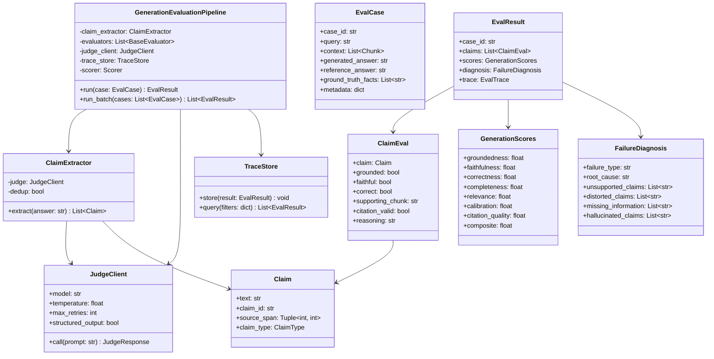
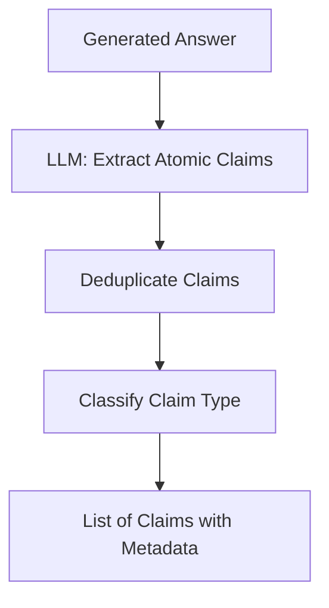
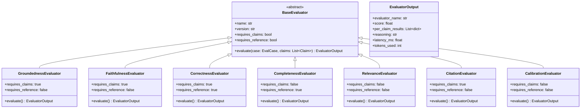
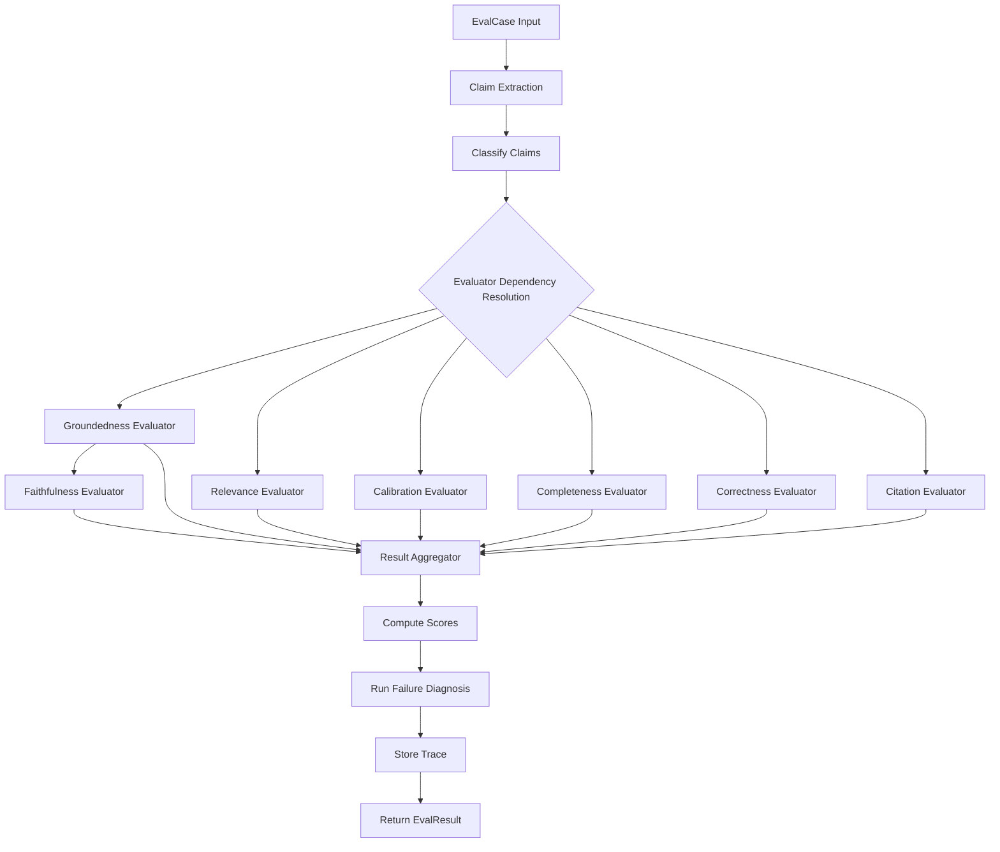
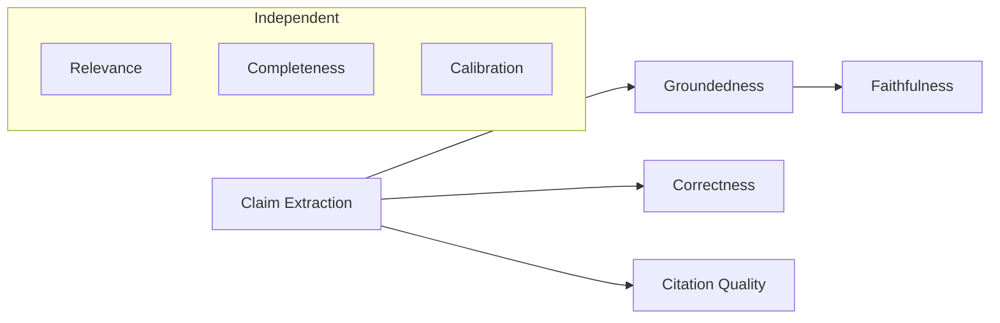
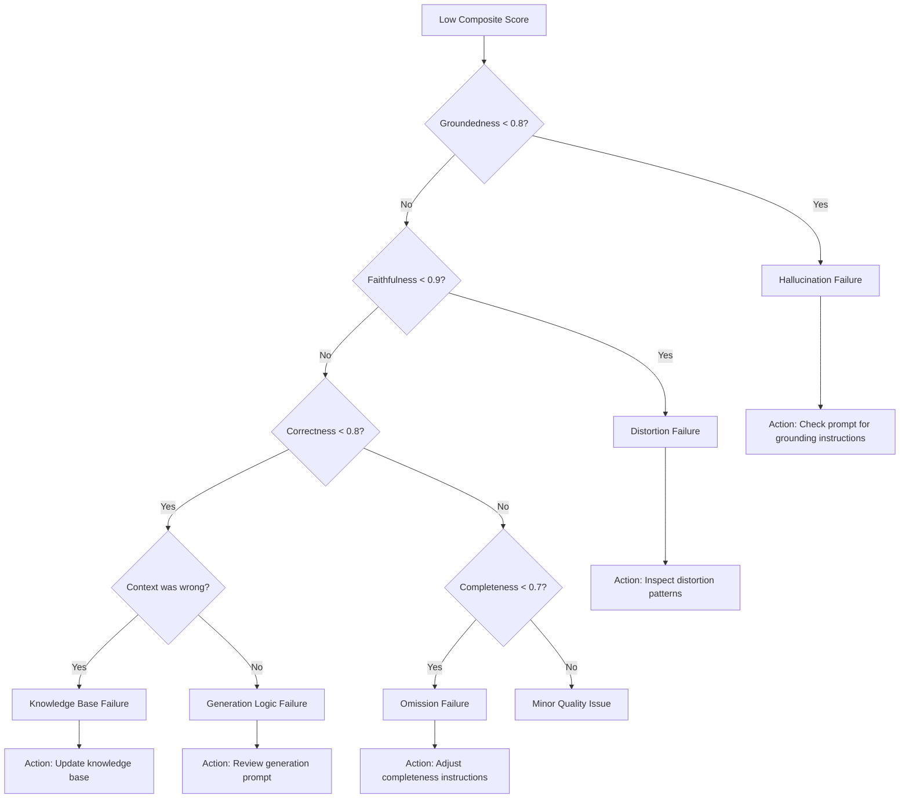
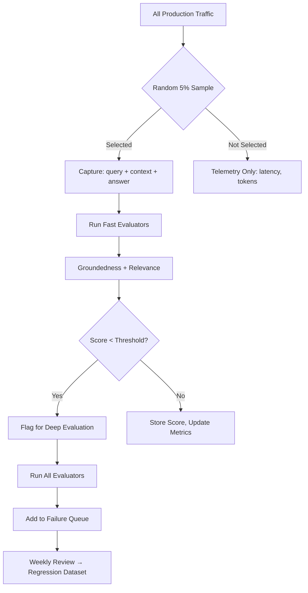

# Generation Evaluation — Practical Implementation Guide

## Table of Contents

- [Overview](#overview)
- [System Architecture](#system-architecture)
- [Phase 1: Claim Extraction Pipeline](#phase-1-claim-extraction-pipeline)
  - [Why Claims Are the Fundamental Unit](#why-claims-are-the-fundamental-unit)
  - [Claim Extractor Design](#claim-extractor-design)
  - [Claim Extraction Prompt](#claim-extraction-prompt)
- [Phase 2: Implementing Generation Evaluators](#phase-2-implementing-generation-evaluators)
  - [Evaluator Architecture](#evaluator-architecture)
  - [Evaluator 1: Groundedness](#evaluator-1-groundedness)
  - [Evaluator 2: Faithfulness](#evaluator-2-faithfulness)
  - [Evaluator 3: Correctness](#evaluator-3-correctness)
  - [Evaluator 4: Completeness](#evaluator-4-completeness)
  - [Evaluator 5: Answer Relevance](#evaluator-5-answer-relevance)
  - [Evaluator 6: Citation Quality](#evaluator-6-citation-quality)
  - [Evaluator 7: Calibration](#evaluator-7-calibration)
- [Phase 3: Judge Prompt Engineering](#phase-3-judge-prompt-engineering)
  - [Groundedness Judge Prompt](#groundedness-judge-prompt)
  - [Faithfulness Judge Prompt](#faithfulness-judge-prompt)
  - [Correctness Judge Prompt](#correctness-judge-prompt)
  - [Completeness Judge Prompt](#completeness-judge-prompt)
- [Phase 4: Evaluation Pipeline](#phase-4-evaluation-pipeline)
  - [Pipeline Flow](#pipeline-flow)
  - [Orchestration Decisions](#orchestration-decisions)
  - [Dependency Graph Between Evaluators](#dependency-graph-between-evaluators)
- [Phase 5: Scoring and Aggregation](#phase-5-scoring-and-aggregation)
  - [Per-Claim Scoring](#per-claim-scoring)
  - [Per-Case Aggregation](#per-case-aggregation)
  - [Dataset-Level Aggregation](#dataset-level-aggregation)
- [Phase 6: Storage and Tracing](#phase-6-storage-and-tracing)
- [Phase 7: Failure Diagnosis Pipeline](#phase-7-failure-diagnosis-pipeline)
- [Phase 8: Production Integration](#phase-8-production-integration)
  - [Sampling Strategy](#sampling-strategy)
  - [Alerting Rules](#alerting-rules)
- [Implementation Roadmap](#implementation-roadmap)
- [Tools and Libraries](#tools-and-libraries)
- [Anti-Patterns to Avoid](#anti-patterns-to-avoid)

---

## Overview

This document translates the theoretical generation evaluation framework into a concrete implementation plan. The core insight driving this design:

> **Evaluate at the claim level, not the answer level.**

Instead of asking "Is this answer good?", we decompose the answer into atomic claims and evaluate each one independently for groundedness, faithfulness, and correctness. This produces far richer diagnostics and makes failures actionable.

---

## System Architecture



---

## Phase 1: Claim Extraction Pipeline

### Why Claims Are the Fundamental Unit

Evaluating an entire answer as one unit produces scores like "Faithfulness = 0.7" — but tells you nothing about *what* failed. Claim-level evaluation produces:

| Claim | Grounded | Faithful | Correct |
|-------|----------|----------|---------|
| "Warranty is 30 days" | ✓ | ✓ | ✓ |
| "Covers manufacturing defects" | ✓ | ✓ | ✓ |
| "Priority support included" | ✗ | ✗ | ✗ |

Now you know exactly which claim is the problem.

### Claim Extractor Design



**Claim types to classify:**

| Type | Description | Example |
|------|-------------|---------|
| FACTUAL | Verifiable statement of fact | "Warranty is 30 days" |
| PROCEDURAL | A step or instruction | "First, disconnect the power" |
| CONDITIONAL | Statement with conditions | "If unused, days carry over" |
| OPINION | Subjective or hedged | "This is generally recommended" |
| META | About the answer itself | "Based on the documentation..." |

Only FACTUAL, PROCEDURAL, and CONDITIONAL claims need groundedness/faithfulness evaluation.

### Claim Extraction Prompt

```text
SYSTEM:
You are a claim extraction system. Given a generated answer,
extract every atomic factual claim. Each claim must be:
- A single, self-contained statement
- Independently verifiable
- Not a duplicate of another extracted claim

INPUT:
Generated Answer:
{generated_answer}

TASK:
Extract all atomic claims. For each, identify the claim type.

OUTPUT FORMAT:
{
  "claims": [
    {
      "text": "...",
      "type": "FACTUAL|PROCEDURAL|CONDITIONAL|OPINION|META"
    }
  ]
}
```

---

## Phase 2: Implementing Generation Evaluators

### Evaluator Architecture



### Evaluator 1: Groundedness

**What it measures:** Can every claim in the answer be traced back to evidence in the provided context?

**Algorithm:**

```text
claims = claim_extractor.extract(generated_answer)
verifiable_claims = filter(claims, type in [FACTUAL, PROCEDURAL, CONDITIONAL])

for each claim in verifiable_claims:
    result = judge.check_grounding(claim, context_chunks)
    → { supported: bool, supporting_chunk_id: str, reasoning: str }

groundedness = count(supported_claims) / count(verifiable_claims)
```

**Key distinction from Faithfulness:** Groundedness only checks "Is there evidence?" — it doesn't check whether the evidence was correctly interpreted.

---

### Evaluator 2: Faithfulness

**What it measures:** Did the model correctly preserve the meaning of the evidence it used?

**Algorithm:**

```text
# Only evaluate claims that ARE grounded (have evidence)
grounded_claims = filter(claims, grounded == true)

for each claim in grounded_claims:
    supporting_evidence = get_supporting_chunk(claim)
    result = judge.check_faithfulness(claim, supporting_evidence)
    → { faithful: bool, distortion_type: str, reasoning: str }

faithfulness = count(faithful_claims) / count(grounded_claims)
```

**Distortion types to detect:**

| Distortion | Example |
|-----------|---------|
| Negation flip | "NOT eligible" → "eligible" |
| Scope expansion | "manufacturing defects only" → "all damages" |
| Causality reversal | "A causes B" → "B causes A" |
| Quantifier change | "up to 5 days" → "at least 5 days" |
| Condition removal | "if approved" → (stated unconditionally) |

---

### Evaluator 3: Correctness

**What it measures:** Does the answer match the ground truth / reference answer?

**Requires:** A reference answer or ground truth facts.

**Algorithm:**

```text
# Approach A: Claim-level (preferred)
for each claim in verifiable_claims:
    result = judge.check_correctness(claim, reference_answer, ground_truth_facts)
    → { correct: bool, reasoning: str }

correctness = count(correct_claims) / count(verifiable_claims)

# Approach B: Semantic equivalence (when no claim decomposition needed)
result = judge.compare_answers(generated_answer, reference_answer, query)
→ { equivalent: bool, score: 0.0-1.0, differences: list }
```

**When correctness ≠ faithfulness:** If the knowledge base is outdated, a faithful answer (copies context correctly) may be incorrect (doesn't match reality). This distinction is critical for identifying knowledge base failures vs generation failures.

---

### Evaluator 4: Completeness

**What it measures:** Did the answer include all necessary information from the context?

**Algorithm:**

```text
# Approach A: Against ground truth facts
if ground_truth_facts available:
    for each fact in ground_truth_facts:
        present = judge.is_fact_in_answer(fact, generated_answer)
    completeness = count(present) / count(ground_truth_facts)

# Approach B: Against context (no ground truth)
key_information = judge.extract_key_facts(query, context)
for each info in key_information:
    present = judge.is_fact_in_answer(info, generated_answer)
completeness = count(present) / count(key_information)
```

**Critical for:** Procedural answers (all steps needed), compliance (all conditions mentioned), medical/legal (all warnings included).

---

### Evaluator 5: Answer Relevance

**What it measures:** Did the answer actually address the user's question?

**Algorithm:**

```text
result = judge.assess_relevance(query, generated_answer)
→ {
    addresses_question: bool,
    off_topic_content: list,
    relevance_score: 0.0-1.0,
    reasoning: str
  }
```

**Lightweight alternative (no LLM needed):** Generate hypothetical questions from the answer, then measure semantic similarity between those questions and the original query. High similarity = relevant answer.

---

### Evaluator 6: Citation Quality

**What it measures:** Are citations present, correct, and complete?

**Algorithm:**

```text
citations = extract_citations(generated_answer)
# e.g., [Source: policy.pdf, Section 4.2]

for each citation in citations:
    # Does the cited source exist in context?
    exists = citation.source in context_sources
    
    # Does the cited source actually support the claim?
    claim = get_claim_for_citation(citation)
    supports = judge.verify_citation(claim, cited_chunk)

citation_precision = count(valid_citations) / count(all_citations)
citation_recall = count(cited_claims) / count(claims_needing_citation)

# Also check for hallucinated citations
hallucinated = count(citations where source not in context)
```

**Metrics produced:**
- Citation precision (cited sources actually support claims)
- Citation recall (important claims have citations)
- Citation hallucination rate (made-up sources)

---

### Evaluator 7: Calibration

**What it measures:** Does the model appropriately express uncertainty when evidence is insufficient?

**Algorithm:**

```text
# Detect cases where context is insufficient
context_sufficiency = sufficiency_evaluator.evaluate(case)

if context_sufficiency.score < 0.5:
    # Context is insufficient — model SHOULD express uncertainty
    expresses_uncertainty = judge.check_uncertainty_expression(generated_answer)
    # Look for: "I don't have enough information", "Based on limited context",
    # hedging language, refusal to answer
    
    if expresses_uncertainty:
        calibration = 1.0  # Well-calibrated
    else:
        calibration = 0.0  # Overconfident despite insufficient evidence

elif context_sufficiency.score > 0.8:
    # Context is sufficient — model should NOT be overly uncertain
    expresses_uncertainty = judge.check_uncertainty_expression(generated_answer)
    
    if expresses_uncertainty:
        calibration = 0.5  # Under-confident
    else:
        calibration = 1.0  # Appropriately confident
```

---

## Phase 3: Judge Prompt Engineering

### Groundedness Judge Prompt

```text
SYSTEM:
You are evaluating whether a specific claim from an AI-generated
answer is supported by the provided context.

RUBRIC:
- SUPPORTED: The claim can be directly inferred from the context
- NOT SUPPORTED: The claim cannot be found in or inferred from the context
- PARTIALLY SUPPORTED: Part of the claim is supported, part is not

INPUT:
Claim: {claim_text}

Context:
{formatted_context_chunks}

TASK:
1. Search the context for evidence supporting this claim.
2. Quote the relevant evidence if found.
3. Determine if the claim is supported.

OUTPUT FORMAT:
{
  "verdict": "SUPPORTED|NOT_SUPPORTED|PARTIALLY_SUPPORTED",
  "evidence": "exact quote from context or null",
  "supporting_chunk_id": "chunk_id or null",
  "reasoning": "..."
}
```

### Faithfulness Judge Prompt

```text
SYSTEM:
You are evaluating whether an AI-generated claim correctly
preserves the meaning of the source evidence. This is NOT about
whether the claim is true — it's about whether the interpretation
is accurate.

INPUT:
Original Evidence: {supporting_chunk_content}
Generated Claim: {claim_text}

TASK:
1. Identify what the evidence actually states.
2. Compare the claim against the evidence.
3. Check for distortions: negation flips, scope changes,
   causality reversals, quantifier changes, condition removals.
4. Determine if the claim faithfully represents the evidence.

OUTPUT FORMAT:
{
  "faithful": true/false,
  "distortion_type": "none|negation|scope|causality|quantifier|condition",
  "original_meaning": "what the evidence says",
  "claim_meaning": "what the claim says",
  "reasoning": "..."
}
```

### Correctness Judge Prompt

```text
SYSTEM:
You are evaluating whether a generated claim is factually correct
by comparing it against the reference answer.

INPUT:
Question: {query}
Generated Claim: {claim_text}
Reference Answer: {reference_answer}

TASK:
1. Determine what the reference answer says about this topic.
2. Compare the generated claim against the reference.
3. Determine if they are semantically equivalent, contradictory,
   or if the claim makes statements not addressed by the reference.

OUTPUT FORMAT:
{
  "correct": true/false,
  "explanation": "...",
  "contradiction": "exact contradiction if any, else null"
}
```

### Completeness Judge Prompt

```text
SYSTEM:
You are evaluating whether an AI-generated answer includes all
the important information that should be communicated given the
question and available context.

INPUT:
Question: {query}
Context: {formatted_context}
Generated Answer: {generated_answer}

TASK:
1. Given the question, identify all key pieces of information
   in the context that should appear in a complete answer.
2. Check which of these are present in the generated answer.
3. Identify what is missing.

OUTPUT FORMAT:
{
  "required_information": ["...", "..."],
  "present": ["...", "..."],
  "missing": ["...", "..."],
  "completeness_score": 0.0-1.0
}
```

---

## Phase 4: Evaluation Pipeline

### Pipeline Flow



### Orchestration Decisions

| Decision | Recommendation | Rationale |
|----------|---------------|-----------|
| Claim extraction | Run first, share results | All claim-level evaluators depend on it |
| Groundedness → Faithfulness | Sequential (dependency) | Faithfulness only runs on grounded claims |
| Other evaluators | Parallel | No dependencies between them |
| Caching | Cache by (claim_hash + context_hash + evaluator_version) | Avoid re-evaluating unchanged inputs |
| Retries | 3 retries with exponential backoff | LLM output parsing may fail |
| Timeout | 45s per evaluator, 5min per case | Prevent pipeline stalls |

### Dependency Graph Between Evaluators



**Critical path:** Claim Extraction → Groundedness → Faithfulness (sequential, ~3 LLM calls)

**Parallel track:** Relevance, Completeness, Calibration, Correctness, Citation (independent, run concurrently)

---

## Phase 5: Scoring and Aggregation

### Per-Claim Scoring

Each claim produces a verdict:

```yaml
claim_id: "c-003"
text: "Priority support is included."
type: FACTUAL

verdicts:
  grounded: false
  faithful: null          # Not evaluated (not grounded)
  correct: false
  supporting_chunk: null
  citation_valid: false

reasoning:
  groundedness: "No mention of priority support in any context chunk"
  correctness: "Reference answer does not mention priority support"
```

### Per-Case Aggregation

```yaml
case_id: "gen-eval-042"
total_claims: 5
verifiable_claims: 4

scores:
  groundedness: 0.75      # 3/4 verifiable claims grounded
  faithfulness: 1.0       # 3/3 grounded claims faithful (1 not grounded, excluded)
  correctness: 0.75       # 3/4 verifiable claims correct
  completeness: 0.80      # 4/5 required facts present
  relevance: 0.95         # answer mostly addresses the question
  calibration: 1.0        # confidence appropriate to evidence
  citation_quality: 0.67  # 2/3 citations valid

  composite: 0.83         # weighted aggregate
```

### Dataset-Level Aggregation

Compute across the entire evaluation dataset:

| Metric | Mean | P25 | P50 | P75 | P99 Failures |
|--------|------|-----|-----|-----|-------------|
| Groundedness | 0.91 | 0.85 | 0.94 | 1.0 | 0.33 |
| Faithfulness | 0.96 | 0.92 | 1.0 | 1.0 | 0.50 |
| Correctness | 0.88 | 0.80 | 0.90 | 1.0 | 0.25 |
| Completeness | 0.82 | 0.75 | 0.85 | 0.92 | 0.40 |

**Always include P99 failures** — these represent your worst cases and are what users complain about.

---

## Phase 6: Storage and Tracing

Every evaluated case should be stored with full provenance:

```yaml
trace:
  case_id: str
  timestamp: datetime
  pipeline_version: str
  
  input:
    query: str
    context_chunks: List[ChunkRef]
    generated_answer: str
    reference_answer: str

  claim_extraction:
    model: "gpt-4o"
    prompt_version: "v2.1"
    claims: List[Claim]
    latency_ms: 1840
    tokens: 420

  evaluator_traces:
    - evaluator: "groundedness_v3"
      model: "gpt-4o"
      per_claim_results: [...]
      score: 0.75
      latency_ms: 3200
      tokens: 890

    - evaluator: "faithfulness_v2"
      # ...

  aggregate_scores:
    groundedness: 0.75
    faithfulness: 1.0
    correctness: 0.75
    completeness: 0.80
    relevance: 0.95
    calibration: 1.0
    citation_quality: 0.67
    composite: 0.83

  diagnosis:
    failure_type: "hallucination"
    hallucinated_claims: ["Priority support is included."]
    root_cause: "LLM generated claim with no supporting evidence"

  metadata:
    environment: "ci"
    git_sha: "abc123"
    experiment_id: "exp-2026-08"
```

**Storage recommendations:**

| Scale | Storage | Why |
|-------|---------|-----|
| < 10K evaluations | PostgreSQL + JSONB | Simple, queryable |
| 10K–1M evaluations | PostgreSQL + object store for traces | Keep metadata queryable, raw traces in S3 |
| > 1M evaluations | Dedicated evaluation platform | LangSmith, Braintrust, Arize Phoenix |

---

## Phase 7: Failure Diagnosis Pipeline

After scoring, automatically classify the failure type:



**Failure taxonomy:**

| Failure Type | Root Cause | Typical Fix |
|-------------|-----------|-------------|
| Hallucination | LLM invents facts not in context | Strengthen grounding instructions in prompt |
| Distortion | LLM misinterprets evidence | Add "quote directly" or "do not paraphrase" instructions |
| Knowledge Base Failure | Context is outdated/wrong | Update source documents |
| Omission | LLM skips important information | Add "be comprehensive" or checklist instructions |
| Over-confidence | LLM answers despite insufficient context | Add calibration instructions ("say I don't know") |
| Citation hallucination | LLM invents sources | Provide explicit chunk IDs in prompt |

---

## Phase 8: Production Integration

### Sampling Strategy



### Alerting Rules

| Condition | Severity | Action |
|-----------|----------|--------|
| Groundedness mean drops below 0.85 | Critical | Page on-call, block next deployment |
| Faithfulness drops 5%+ vs 7-day average | Warning | Investigate prompt/model changes |
| Hallucination rate exceeds 10% for any segment | Critical | Immediate investigation |
| Completeness below 0.60 for procedural queries | Warning | Review generation prompt |
| Citation hallucination rate exceeds 5% | Warning | Fix citation mechanism |
| Calibration score below 0.5 | Info | Consider adding uncertainty instructions |

---

## Implementation Roadmap

| Week | Milestone | Deliverable |
|------|-----------|-------------|
| 1 | Dataset + Claim Extractor | 100 annotated cases, working claim extraction |
| 2 | Groundedness evaluator | End-to-end groundedness scoring on gold dataset |
| 3 | Faithfulness + Correctness | Both evaluators working, judge prompts tuned |
| 4 | Full pipeline wiring | All 7 evaluators orchestrated, traces stored |
| 5 | Judge calibration | Measure agreement vs human on 50 cases, iterate prompts |
| 6 | Failure diagnosis | Automated failure classification, actionable reports |
| 7 | CI/CD integration | Pipeline runs on every PR, regression gates active |
| 8 | Production sampling | 5% live traffic evaluated, dashboards + alerts |

---

## Tools and Libraries

| Purpose | Recommended Tools |
|---------|-------------------|
| LLM Judge calls | LiteLLM (model-agnostic), OpenAI SDK with structured outputs |
| Claim extraction | Custom prompt + JSON parsing, or spaCy for rule-based claims |
| Evaluation frameworks | Ragas (faithfulness/correctness), DeepEval (broad metrics) |
| Pipeline orchestration | Python asyncio for parallelism, Prefect for scheduling |
| Storage | PostgreSQL + JSONB for metadata, S3 for raw traces |
| Dashboards | Grafana (metrics), Streamlit (interactive debugging) |
| Experiment tracking | MLflow or Weights & Biases |
| Citation parsing | Regex + custom parser for your citation format |

---

## Anti-Patterns to Avoid

| Anti-Pattern | Why It's Bad | What to Do Instead |
|-------------|-------------|-------------------|
| Evaluating whole answer without claim decomposition | Can't identify which part failed | Always decompose into claims first |
| Using "Score 1-10" prompts | Low reliability, no reasoning | Use structured rubric with reasoning-first |
| Same model for generation and judging | Self-preference bias | Use a different model family as judge |
| Only measuring faithfulness | Misses completeness, relevance, calibration | Use all 7 evaluators (at least top 4) |
| Treating groundedness = faithfulness | They measure different things | Grounded ≠ correct interpretation |
| No failure diagnosis | Scores without action | Automate root cause classification |
| Ignoring calibration | System answers confidently with no evidence | Measure and reward appropriate uncertainty |
| Running full eval on every production request | Prohibitively expensive | Sample 5%, run lightweight first, deep-dive on failures |
| Not versioning judge prompts | Can't reproduce or compare results | Hash + version every prompt template |
| Averaging across all query types | Hides failure clusters | Always segment by intent, difficulty, domain |
