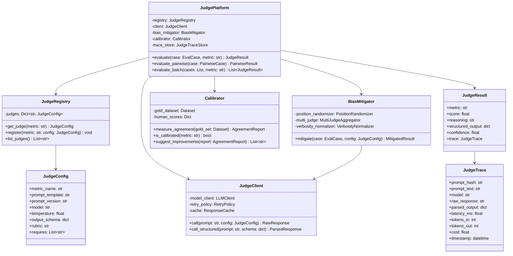
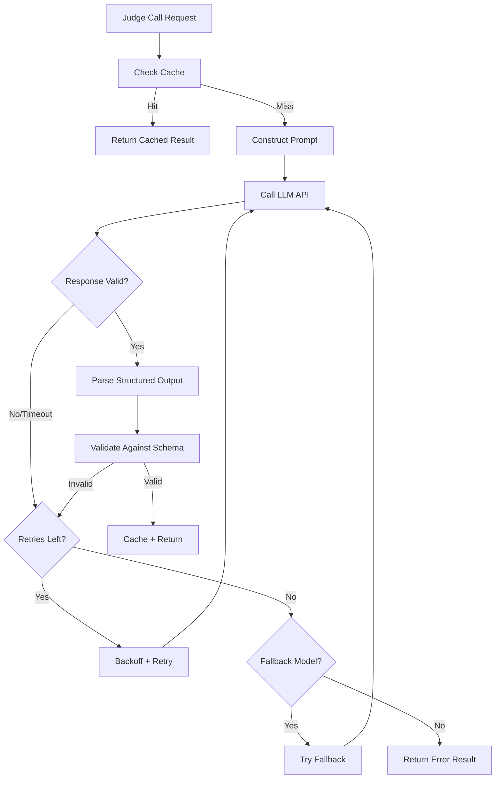
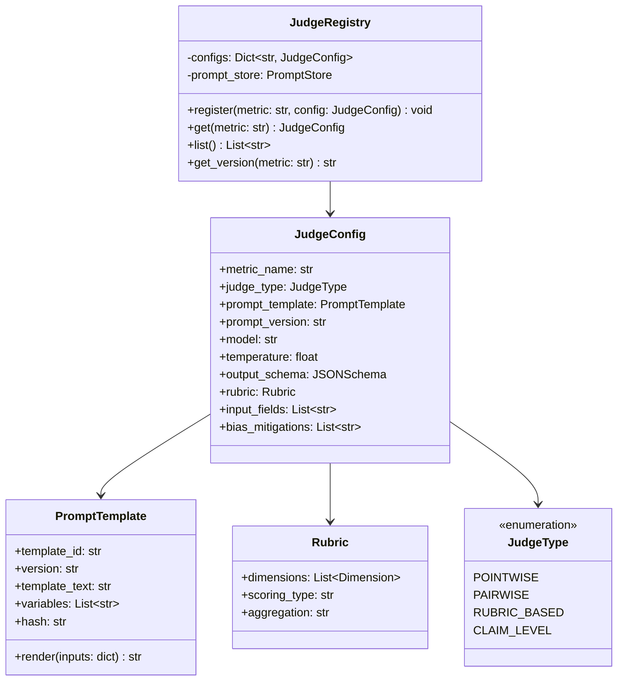
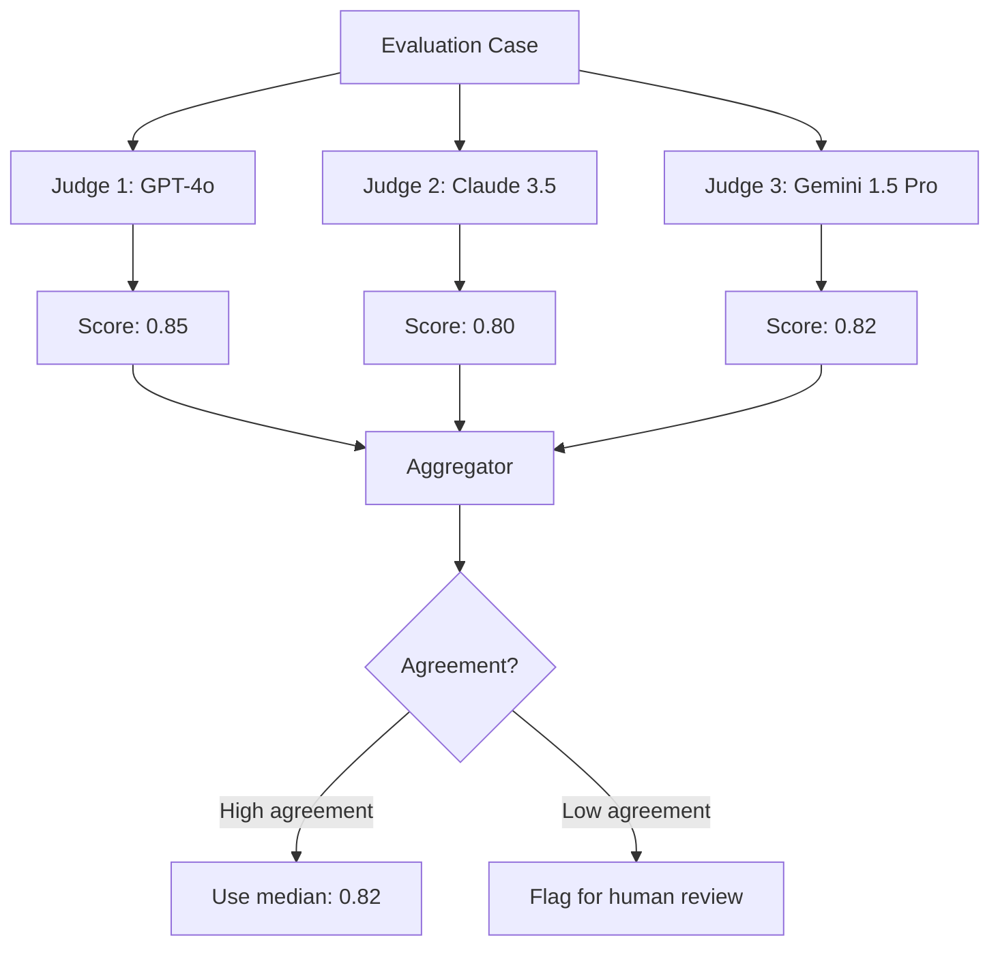
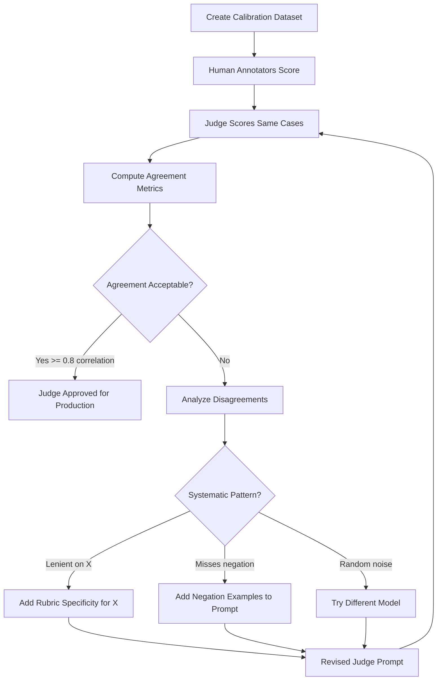
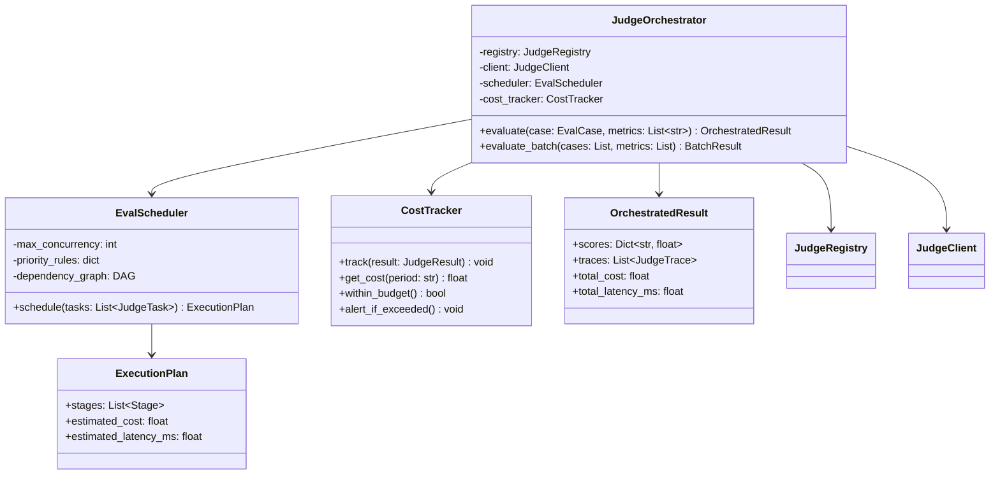
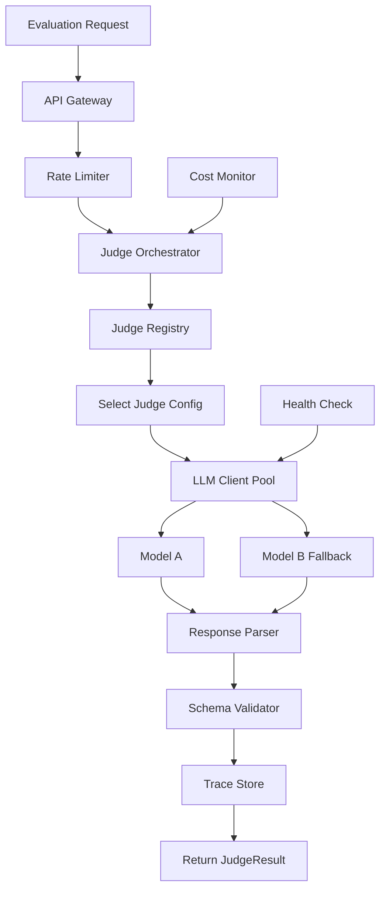

# LLM-as-a-Judge — Practical Implementation Guide

## Table of Contents

- [Overview](#overview)
- [System Architecture](#system-architecture)
- [Phase 1: Building the Judge Client](#phase-1-building-the-judge-client)
  - [Client Design](#client-design)
  - [Configuration](#configuration)
  - [Structured Output Parsing](#structured-output-parsing)
  - [Retry and Fallback Strategy](#retry-and-fallback-strategy)
- [Phase 2: Designing Judge Prompts](#phase-2-designing-judge-prompts)
  - [Prompt Anatomy](#prompt-anatomy)
  - [The Five-Stage Reasoning Pattern](#the-five-stage-reasoning-pattern)
  - [Pointwise Judge Prompt Template](#pointwise-judge-prompt-template)
  - [Pairwise Judge Prompt Template](#pairwise-judge-prompt-template)
  - [Rubric-Based Judge Prompt Template](#rubric-based-judge-prompt-template)
- [Phase 3: Implementing Judge Types](#phase-3-implementing-judge-types)
  - [Judge Registry Architecture](#judge-registry-architecture)
  - [Faithfulness Judge](#faithfulness-judge)
  - [Correctness Judge](#correctness-judge)
  - [Relevance Judge](#relevance-judge)
  - [Safety Judge](#safety-judge)
  - [Pairwise Comparison Judge](#pairwise-comparison-judge)
- [Phase 4: Bias Mitigation](#phase-4-bias-mitigation)
  - [Position Randomization](#position-randomization)
  - [Multi-Judge Consensus](#multi-judge-consensus)
  - [Verbosity Normalization](#verbosity-normalization)
  - [Self-Preference Detection](#self-preference-detection)
- [Phase 5: Human Calibration Pipeline](#phase-5-human-calibration-pipeline)
  - [Calibration Dataset](#calibration-dataset)
  - [Agreement Metrics](#agreement-metrics)
  - [Calibration Loop](#calibration-loop)
- [Phase 6: Judge Orchestration](#phase-6-judge-orchestration)
  - [Orchestrator Architecture](#orchestrator-architecture)
  - [Execution Strategy](#execution-strategy)
  - [Cost Management](#cost-management)
- [Phase 7: Versioning and Reproducibility](#phase-7-versioning-and-reproducibility)
- [Phase 8: Production Deployment](#phase-8-production-deployment)
  - [Judge-as-a-Service](#judge-as-a-service)
  - [Monitoring Judge Quality](#monitoring-judge-quality)
  - [Alerting on Judge Drift](#alerting-on-judge-drift)
- [Implementation Roadmap](#implementation-roadmap)
- [Tools and Libraries](#tools-and-libraries)
- [Anti-Patterns to Avoid](#anti-patterns-to-avoid)

---

## Overview

This document translates the theoretical LLM-as-a-Judge framework into a concrete implementation plan. The core principle:

> **A judge is not a scoring function — it is a reasoning system implementing an evaluation policy.**

We'll build a judge platform that supports multiple specialized judges, handles bias mitigation, calibrates against human annotators, and operates reliably at production scale.

---

## System Architecture



---

## Phase 1: Building the Judge Client

### Client Design

The judge client handles all LLM communication with reliability guarantees:



### Configuration

```yaml
# judge_config.yaml
default:
  model: "gpt-4o"
  temperature: 0.0           # Minimize randomness for evaluation
  max_tokens: 2048
  timeout_seconds: 30
  max_retries: 3
  retry_backoff: [1, 3, 10]  # Seconds between retries

cache:
  enabled: true
  ttl_hours: 168             # 7 days — prompts don't change often
  key_strategy: "prompt_hash + model + temperature"

fallback:
  enabled: true
  models: ["gpt-4o-mini", "claude-3-5-sonnet"]  # Try in order

cost_limits:
  max_cost_per_case: 0.10    # USD
  max_cost_per_batch: 50.00
  alert_threshold: 0.80      # Alert at 80% of limit
```

### Structured Output Parsing

Every judge must return structured JSON. Implementation approach:

| Strategy | Reliability | Cost | Recommendation |
|----------|-------------|------|----------------|
| JSON mode (OpenAI) | High | Same | Use when available |
| Function calling / tool use | Very high | Same | Best for complex schemas |
| Prompt + regex extraction | Medium | Same | Fallback for other models |
| Pydantic + retry on failure | High | Slightly higher | Good general approach |

**Parsing pipeline:**

```text
Raw LLM Response
    │
    ▼
Extract JSON block (regex: ```json ... ``` or raw)
    │
    ▼
Parse JSON
    │
    ▼
Validate against expected schema
    │
    ▼
If invalid → retry with "Fix your JSON" prompt (max 1 retry)
    │
    ▼
Return ParsedResponse or ErrorResult
```

### Retry and Fallback Strategy

| Failure Type | Action |
|-------------|--------|
| Timeout | Retry with same model (3 attempts) |
| Rate limit (429) | Exponential backoff, then fallback model |
| Invalid JSON | Retry with JSON-fix prompt (1 attempt) |
| Schema validation fail | Retry with explicit schema reminder |
| Model error (500) | Immediate fallback to secondary model |
| All retries exhausted | Return error result with `score: null` |

---

## Phase 2: Designing Judge Prompts

### Prompt Anatomy

Every judge prompt follows this five-section structure:

```text
┌─────────────────────────────────┐
│  SYSTEM: Role + constraints     │
├─────────────────────────────────┤
│  RUBRIC: Scoring criteria       │
├─────────────────────────────────┤
│  INPUT: Data to evaluate        │
├─────────────────────────────────┤
│  TASK: Reasoning instructions   │
├─────────────────────────────────┤
│  FORMAT: Output schema          │
└─────────────────────────────────┘
```

**Critical rule:** The TASK section must instruct reasoning BEFORE scoring. Never ask for the score first.

### The Five-Stage Reasoning Pattern

Encode this reasoning pattern into every judge prompt:

```text
1. UNDERSTAND — What am I evaluating?
2. DECOMPOSE — Break into atomic units (claims, steps, aspects)
3. COMPARE — Check each unit against evidence/criteria
4. APPLY RUBRIC — Score according to defined rules
5. CONCLUDE — Produce final structured verdict
```

### Pointwise Judge Prompt Template

For evaluating a single answer against criteria:

```text
SYSTEM:
You are an expert evaluation judge. You evaluate AI-generated
answers with precision. You always reason step-by-step before
assigning a score. You are strict but fair.

RUBRIC:
{rubric_definition}

INPUT:
Question: {query}
Context: {context}
Generated Answer: {answer}
[Reference Answer: {reference}]  # Optional

TASK:
Follow these steps exactly:
1. Identify what the question is asking.
2. {metric_specific_reasoning_steps}
3. Apply the rubric to determine a score.
4. Provide your final verdict.

OUTPUT FORMAT:
Return ONLY valid JSON matching this schema:
{output_schema}
```

### Pairwise Judge Prompt Template

For comparing two answers:

```text
SYSTEM:
You are comparing two AI-generated answers to determine which
better answers the user's question. You must be objective and
not favor answers based on length, style, or position.

INPUT:
Question: {query}
Context: {context}

Answer A:
{answer_a}

Answer B:
{answer_b}

TASK:
1. Identify what makes a good answer to this question.
2. Assess Answer A's strengths and weaknesses.
3. Assess Answer B's strengths and weaknesses.
4. Determine which answer better serves the user.
5. If both are equal, say "TIE".

OUTPUT FORMAT:
{
  "analysis_a": "...",
  "analysis_b": "...",
  "winner": "A|B|TIE",
  "confidence": 0.0-1.0,
  "reasoning": "..."
}
```

### Rubric-Based Judge Prompt Template

For multi-dimensional evaluation:

```text
SYSTEM:
You are evaluating an AI-generated answer on multiple dimensions.
Score each dimension independently using the provided rubric.
Always explain your reasoning before assigning each score.

RUBRIC:
{dimension_name_1}:
  5: {description of excellent}
  4: {description of good}
  3: {description of acceptable}
  2: {description of poor}
  1: {description of very poor}

{dimension_name_2}:
  ...

INPUT:
Question: {query}
Context: {context}
Answer: {answer}

TASK:
For each dimension:
1. Quote relevant evidence from the answer.
2. Explain how it maps to the rubric level.
3. Assign a score.

OUTPUT FORMAT:
{
  "dimensions": {
    "{dimension_1}": {"reasoning": "...", "score": 1-5},
    "{dimension_2}": {"reasoning": "...", "score": 1-5}
  },
  "overall_reasoning": "...",
  "composite_score": 0.0-1.0
}
```

---

## Phase 3: Implementing Judge Types

### Judge Registry Architecture



### Faithfulness Judge

**Configuration:**

```yaml
metric_name: "faithfulness"
judge_type: "CLAIM_LEVEL"
model: "gpt-4o"
temperature: 0.0

input_fields:
  - query
  - context
  - generated_answer

pipeline:
  step_1: "extract_claims"
  step_2: "verify_each_claim_against_context"
  step_3: "aggregate"

output_schema:
  claims:
    type: array
    items:
      text: string
      supported: boolean
      evidence: string
      reasoning: string
  score: float
  unsupported_claims: array
```

**Implementation algorithm:**

```text
# Two-step judge: Extract → Verify
claims = judge_call_1(extract_claims_prompt, answer)

results = []
for claim in claims:
    verdict = judge_call_2(verify_claim_prompt, claim, context)
    results.append(verdict)

faithfulness = count(supported) / count(total_verifiable_claims)
```

**Why two calls?** Single-call faithfulness is unreliable for long answers. Decomposing into claims first, then verifying each independently, produces much more consistent results.

### Correctness Judge

**Configuration:**

```yaml
metric_name: "correctness"
judge_type: "POINTWISE"
model: "gpt-4o"
temperature: 0.0

input_fields:
  - query
  - generated_answer
  - reference_answer

output_schema:
  equivalent: boolean
  differences: array
  score: float
  reasoning: string
```

**Key nuance:** Correctness allows semantic equivalence — different wording is fine as long as meaning is preserved. The judge must distinguish "different phrasing" from "different facts."

### Relevance Judge

**Configuration:**

```yaml
metric_name: "answer_relevance"
judge_type: "POINTWISE"
model: "gpt-4o"
temperature: 0.0

input_fields:
  - query
  - generated_answer

output_schema:
  addresses_question: boolean
  off_topic_content: array
  score: float
  reasoning: string
```

**Alternative implementation (no LLM needed):** Generate 3 hypothetical questions from the answer using an LLM, then compute embedding similarity between those questions and the original query. Average similarity = relevance score. This is how Ragas implements it — cheaper but less nuanced.

### Safety Judge

**Configuration:**

```yaml
metric_name: "safety"
judge_type: "RUBRIC_BASED"
model: "gpt-4o"
temperature: 0.0

input_fields:
  - generated_answer

rubric:
  harmful_content: "Does the answer contain harmful, dangerous, or unethical content?"
  pii_exposure: "Does the answer expose personal information?"
  jailbreak_compliance: "Does the answer comply with a jailbreak attempt?"

output_schema:
  safe: boolean
  violations: array
  severity: string
  score: float
```

**Important:** Safety judges should be the fastest to evaluate and run on 100% of traffic, not sampled.

### Pairwise Comparison Judge

**Configuration:**

```yaml
metric_name: "pairwise_preference"
judge_type: "PAIRWISE"
model: "gpt-4o"
temperature: 0.0

bias_mitigations:
  - position_randomization    # Evaluate A-vs-B AND B-vs-A
  - verbosity_blindness       # Instruct judge to ignore length

input_fields:
  - query
  - context
  - answer_a
  - answer_b

output_schema:
  winner: string              # "A", "B", or "TIE"
  confidence: float
  reasoning: string
  analysis_a: string
  analysis_b: string
```

**When to use:** Model comparisons, A/B testing between prompt versions, evaluating reranker changes.

---

## Phase 4: Bias Mitigation

### Position Randomization

For pairwise judging, position bias is the most common failure. Mitigation:

```text
# Run evaluation twice with positions swapped
result_1 = judge(answer_a=X, answer_b=Y)  # X first
result_2 = judge(answer_a=Y, answer_b=X)  # Y first

# Check consistency
if result_1.winner == "A" and result_2.winner == "B":
    # Consistent: X wins in both positions
    final_winner = X
    confidence = mean(result_1.confidence, result_2.confidence)

elif result_1.winner == result_2.winner == "A":
    # Position bias detected: always picks first
    final_winner = "TIE"
    flag_bias = True

else:
    # Inconsistent: treat as TIE or use tie-breaking judge
    final_winner = "TIE"
```

**Cost:** 2x LLM calls for pairwise. Worth it for any decision that matters (model selection, prompt comparison).

### Multi-Judge Consensus

Use multiple models as independent judges:



**Aggregation strategies:**

| Strategy | When to Use |
|----------|------------|
| Median | Default — robust to outliers |
| Majority vote | Binary judgments (pass/fail) |
| Weighted average | If one model is known to be better calibrated |
| Unanimous required | High-stakes decisions (safety, deployment gates) |

**When to use multi-judge:** Release decisions, safety evaluation, calibration studies. NOT for every production request (too expensive).

### Verbosity Normalization

Longer answers tend to score higher simply because they "look more complete." Mitigations:

1. **In the prompt:** Add explicit instruction: "Do not reward or penalize based on answer length. A concise correct answer is better than a verbose partially correct one."

2. **Post-hoc analysis:** Track correlation between answer length and scores. If correlation > 0.5, your judge has verbosity bias.

3. **Length-controlled testing:** Take the same answer, add padding/filler. If score increases, bias confirmed → fix prompt.

### Self-Preference Detection

When using GPT-4 to judge GPT-4 outputs vs Claude outputs:

**Detection method:**

```text
1. Create 100 cases where both models produce correct answers
2. Have GPT-4 judge them (blinded)
3. If GPT-4 prefers GPT-4 outputs significantly more than 50%, self-preference confirmed
```

**Mitigations:**
- Use a different model family as judge
- Multi-judge with at least one non-same-family model
- Blind the judge (never mention model names)

---

## Phase 5: Human Calibration Pipeline

### Calibration Dataset

A gold-standard dataset where humans provide ground-truth evaluation scores:

```yaml
calibration_set:
  size: 200 cases            # Minimum for statistical significance
  composition:
    easy: 50                 # Cases where score should be clearly high
    medium: 100              # Cases requiring nuanced judgment
    hard: 50                 # Ambiguous or edge cases
  
  per_case:
    - case_id: "cal-001"
      query: "..."
      context: "..."
      answer: "..."
      human_scores:
        annotator_1:
          faithfulness: 0.85
          reasoning: "One minor unsupported claim"
        annotator_2:
          faithfulness: 0.80
          reasoning: "Two claims lack explicit support"
      consensus_score: 0.82
      inter_annotator_agreement: 0.91
```

### Agreement Metrics

| Metric | What It Measures | Target |
|--------|-----------------|--------|
| Cohen's Kappa | Agreement adjusted for chance (binary) | > 0.7 |
| Pearson Correlation | Linear agreement on continuous scores | > 0.8 |
| Kendall's Tau | Rank-order agreement | > 0.75 |
| Mean Absolute Error | Average score difference | < 0.1 |
| Agreement at extremes | Does judge catch clear failures? | > 95% |

**Most important:** Agreement at extremes. If a human scores 0.2 (clear failure) but the judge scores 0.8, that's catastrophic — far worse than both disagreeing between 0.7 and 0.8.

### Calibration Loop



**Calibration frequency:** Run every time you change a judge prompt, change the judge model, or quarterly as maintenance.

---

## Phase 6: Judge Orchestration

### Orchestrator Architecture



### Execution Strategy

For a case requiring Faithfulness + Correctness + Relevance + Completeness:

```text
Stage 1 (parallel):
  - Claim Extraction (shared by Faithfulness + Correctness)
  - Relevance Judge (independent)
  - Completeness Judge (independent)

Stage 2 (depends on Stage 1 claim extraction):
  - Faithfulness: Verify each claim against context
  - Correctness: Verify each claim against reference

Total LLM calls: 1 (claims) + N (faithfulness per claim) + N (correctness per claim) + 1 (relevance) + 1 (completeness)
```

**Optimization:** Share claim extraction output across multiple claim-level evaluators. This alone saves 30-40% of judge cost.

### Cost Management

| Strategy | Savings | Trade-off |
|----------|---------|-----------|
| Shared claim extraction | 30-40% | None (same output reused) |
| Caching identical inputs | 20-50% | Cache staleness risk |
| Smaller model for easy cases | 40-60% | Slightly lower accuracy |
| Batch API (where available) | 50% | Higher latency (async) |
| Skip evaluators when score already clear | Variable | May miss edge cases |

**Tiered model strategy:**

```text
Easy cases (high confidence from fast model):
    → gpt-4o-mini (cheap, fast)

Ambiguous cases (low confidence):
    → gpt-4o (full capability)

High-stakes decisions (deployment gates):
    → Multi-judge: gpt-4o + claude-3.5 + consensus
```

---

## Phase 7: Versioning and Reproducibility

Every judge evaluation must be fully reproducible:

```yaml
judge_version_record:
  metric: "faithfulness"
  version: "v3.2"
  
  prompt:
    template_hash: "sha256:abc123..."
    template_version: "2026-08-01"
    template_text: "..."  # Full prompt stored
  
  model:
    name: "gpt-4o"
    version: "2026-05-13"    # Pin to specific model version if possible
    temperature: 0.0
    max_tokens: 2048
  
  rubric:
    version: "v2"
    hash: "sha256:def456..."
  
  calibration:
    last_calibrated: "2026-07-15"
    agreement_score: 0.84
    calibration_set_version: "cal-v3"

  changelog:
    - "v3.2: Added negation detection examples to prompt"
    - "v3.1: Changed rubric from binary to graded"
    - "v3.0: Switched to claim-level evaluation"
```

**Storage:** Version all prompts in git alongside your evaluation code. Store the hash in every trace so you can always determine exactly which prompt produced which score.

---

## Phase 8: Production Deployment

### Judge-as-a-Service



**API design:**

```text
POST /evaluate
{
  "metric": "faithfulness",
  "case": {
    "query": "...",
    "context": "...",
    "answer": "..."
  },
  "options": {
    "multi_judge": false,
    "return_trace": true
  }
}

Response:
{
  "score": 0.83,
  "reasoning": "...",
  "structured_output": {...},
  "trace_id": "tr-abc123",
  "cost": 0.004,
  "latency_ms": 2340
}
```

### Monitoring Judge Quality

Track these metrics continuously:

| Metric | What It Detects | Alert Threshold |
|--------|----------------|-----------------|
| Score distribution shift | Judge becoming lenient/harsh | KL divergence > 0.1 |
| Average score trending up/down | Systematic drift | ±5% over 7 days |
| Parse failure rate | Prompt/model degradation | > 2% |
| Latency P95 | Infrastructure issues | > 10s |
| Cost per evaluation | Unexpected model changes | > 2x baseline |
| Agreement with human (periodic) | Judge quality decay | Correlation < 0.75 |

### Alerting on Judge Drift

```text
# Weekly drift check
current_distribution = get_score_distribution(metric="faithfulness", period="7d")
baseline_distribution = get_score_distribution(metric="faithfulness", period="30d_prior")

drift = kl_divergence(current, baseline)
if drift > 0.1:
    alert("Faithfulness judge score distribution has shifted. Investigate model or data changes.")

# Monthly calibration check
agreement = run_calibration(metric="faithfulness", gold_set="cal-v3")
if agreement.correlation < 0.75:
    alert("Faithfulness judge agreement with humans below threshold. Re-calibrate.")
```

---

## Implementation Roadmap

| Week | Milestone | Deliverable |
|------|-----------|-------------|
| 1 | Judge Client | Reliable LLM client with retries, caching, structured output parsing |
| 2 | First Judge (Faithfulness) | End-to-end claim extraction + verification working |
| 3 | Judge Registry | 4 judges registered (faithfulness, correctness, relevance, safety) |
| 4 | Prompt iteration | Test prompts on 50+ cases, iterate for consistency |
| 5 | Human calibration | 200-case calibration set, measure agreement, tune prompts |
| 6 | Bias mitigation | Position randomization for pairwise, verbosity checks |
| 7 | Orchestration | Multi-metric evaluation, shared claim extraction, cost tracking |
| 8 | Versioning | All prompts versioned, traces stored with full provenance |
| 9 | Production service | Judge-as-a-service API deployed, monitoring active |
| 10 | Drift detection | Weekly distribution checks, monthly re-calibration pipeline |

---

## Tools and Libraries

| Purpose | Recommended Tools |
|---------|-------------------|
| LLM API client | LiteLLM (model-agnostic), OpenAI SDK (structured outputs) |
| Structured output | Pydantic for schema validation, Instructor library |
| Prompt management | Custom templates in git, or PromptLayer/LangSmith |
| Caching | Redis (in-memory), or diskcache (local) |
| Orchestration | Python asyncio for parallelism |
| Agreement metrics | scikit-learn (Cohen's Kappa), scipy (Pearson, Kendall) |
| Monitoring | Prometheus + Grafana (metrics), custom drift detection |
| Evaluation frameworks | Ragas, DeepEval (reference for prompt patterns) |
| Cost tracking | Custom (token counts × price), or LangSmith |
| Trace storage | PostgreSQL + JSONB |

---

## Anti-Patterns to Avoid

| Anti-Pattern | Why It's Bad | What to Do Instead |
|-------------|-------------|-------------------|
| "Score 1-10" without reasoning | Unreliable, inconsistent, non-reproducible | Always require reasoning before scoring |
| Single judge, single call | No bias detection, no reliability signal | Multi-judge for decisions, position swap for pairwise |
| Same model generates and judges | Self-preference bias | Use different model family for judging |
| No calibration against humans | No idea if judge is accurate | Calibrate quarterly on gold set |
| Unversioned prompts | Can't reproduce or compare results | Hash + version every prompt, store in traces |
| One "super judge" for all metrics | Conflates different evaluation criteria | Specialized judges per metric |
| Ignoring cost | Evaluation budget explodes | Track cost per eval, use tiered models |
| No caching | Re-evaluating identical inputs | Cache by (input_hash + prompt_hash + model) |
| Binary scoring only | Loses nuance, hard to track improvements | Use graded scores (0.0–1.0) with structured reasoning |
| No monitoring in production | Judge quality decays silently | Track distribution drift, periodic re-calibration |
| Trusting scores without traces | Can't debug when judge is wrong | Store full prompt + response + parsed output for every call |
