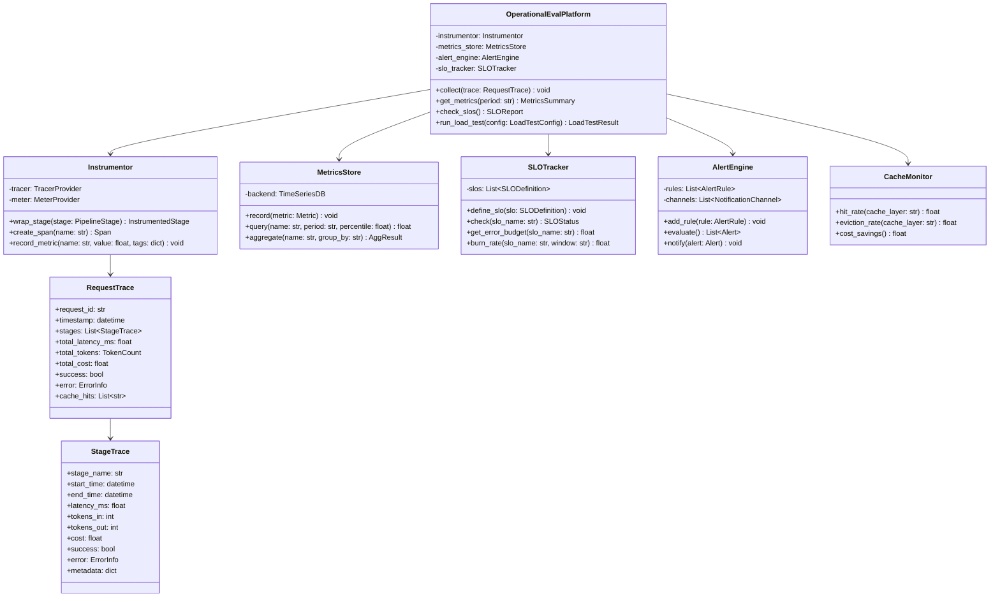
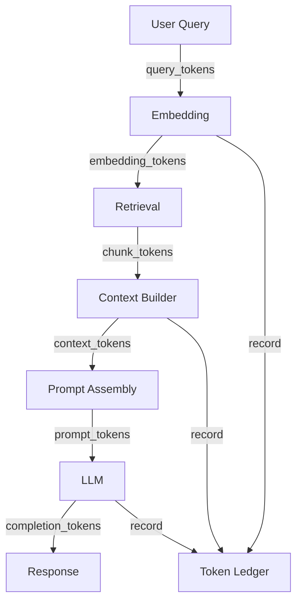
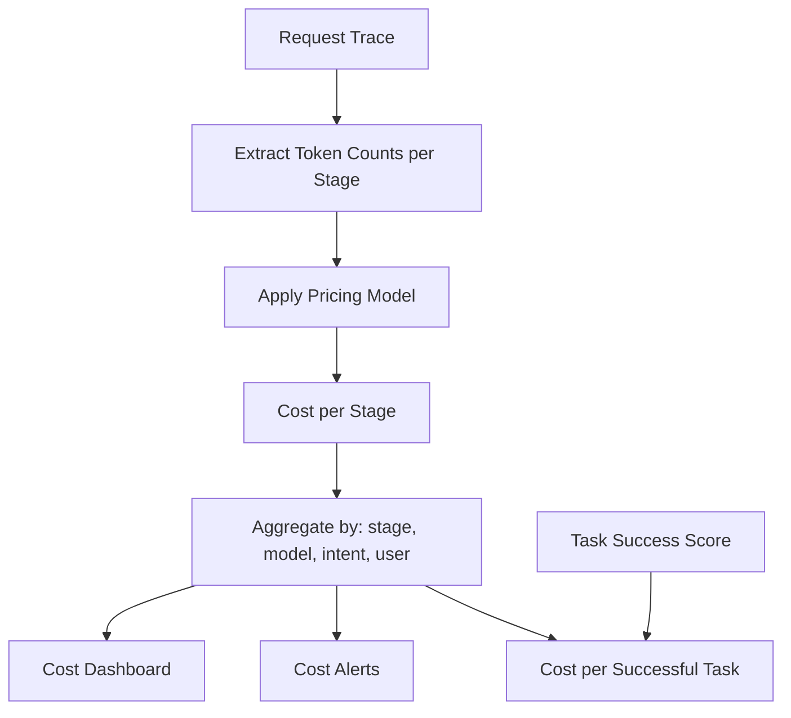
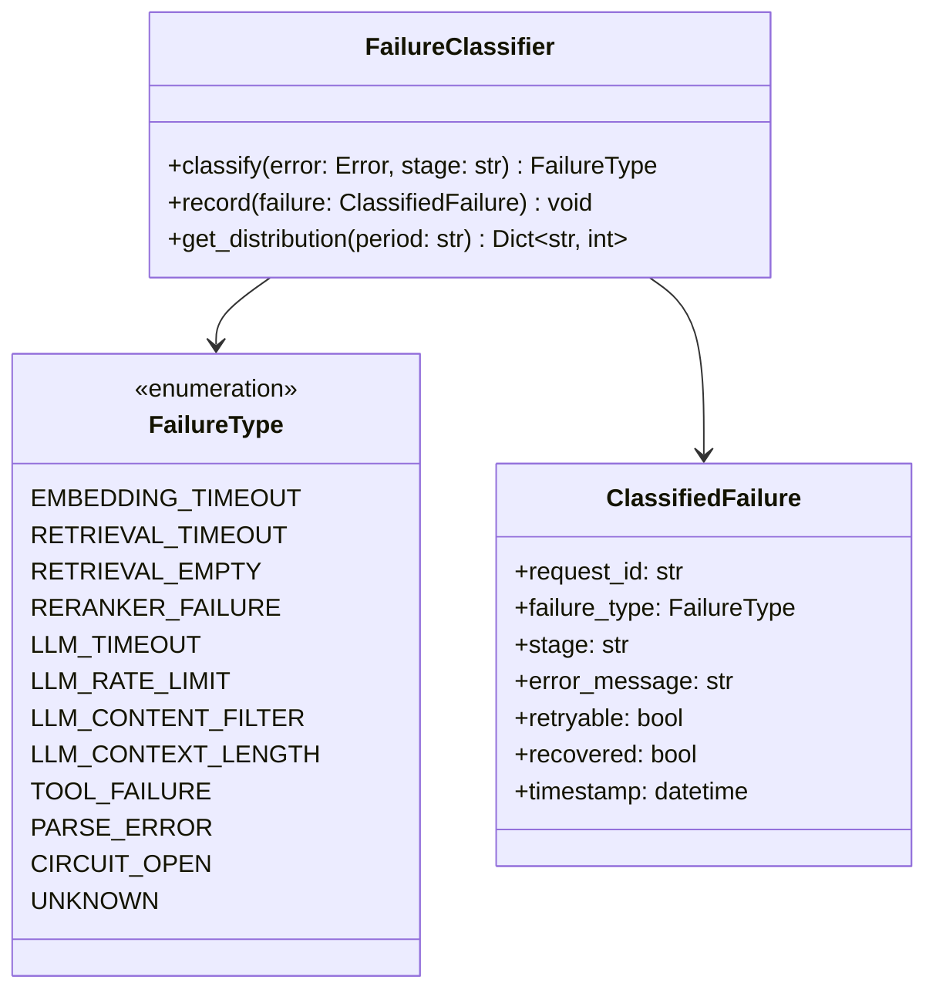
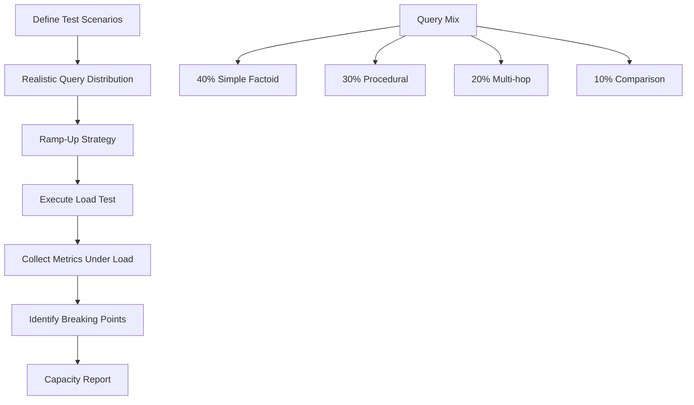
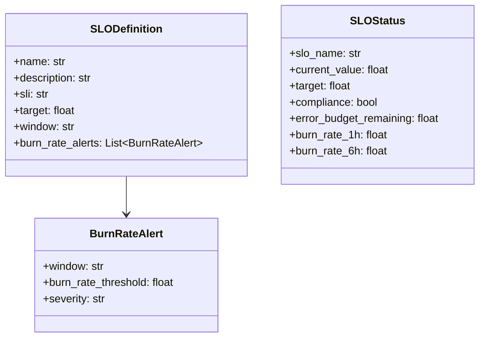
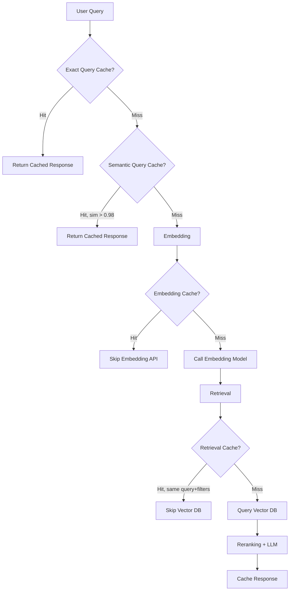
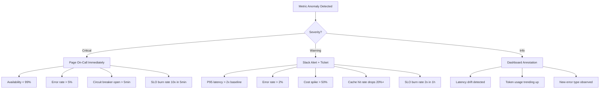

# Operational Evaluation — Practical Implementation Guide

## Table of Contents

- [Overview](#overview)
- [System Architecture](#system-architecture)
- [Phase 1: Instrumentation Layer](#phase-1-instrumentation-layer)
  - [Tracing Architecture](#tracing-architecture)
  - [What to Instrument](#what-to-instrument)
  - [Span Design](#span-design)
  - [Metrics Collection Points](#metrics-collection-points)
- [Phase 2: Performance Monitoring](#phase-2-performance-monitoring)
  - [Latency Tracking](#latency-tracking)
  - [Stage-Level Waterfall](#stage-level-waterfall)
  - [Time to First Token (TTFT)](#time-to-first-token-ttft)
  - [Throughput Metrics](#throughput-metrics)
- [Phase 3: Efficiency Monitoring](#phase-3-efficiency-monitoring)
  - [Token Accounting](#token-accounting)
  - [Context Utilization Tracking](#context-utilization-tracking)
  - [Cost Attribution Pipeline](#cost-attribution-pipeline)
- [Phase 4: Reliability Monitoring](#phase-4-reliability-monitoring)
  - [Failure Classification](#failure-classification)
  - [Circuit Breaker Pattern](#circuit-breaker-pattern)
  - [Health Check Design](#health-check-design)
- [Phase 5: Scalability Testing](#phase-5-scalability-testing)
  - [Load Test Design](#load-test-design)
  - [Capacity Planning](#capacity-planning)
- [Phase 6: SLO Definition and Enforcement](#phase-6-slo-definition-and-enforcement)
  - [SLO Framework](#slo-framework)
  - [Error Budget Tracking](#error-budget-tracking)
  - [SLO as Deployment Gate](#slo-as-deployment-gate)
- [Phase 7: Caching Strategy](#phase-7-caching-strategy)
  - [Cache Layers](#cache-layers)
  - [Cache Effectiveness Metrics](#cache-effectiveness-metrics)
- [Phase 8: Operational Dashboard and Alerting](#phase-8-operational-dashboard-and-alerting)
  - [Dashboard Layout](#dashboard-layout)
  - [Alert Hierarchy](#alert-hierarchy)
  - [Runbook Integration](#runbook-integration)
- [Phase 9: Correlation Analysis](#phase-9-correlation-analysis)
- [Phase 10: Operational Regression Testing](#phase-10-operational-regression-testing)
- [Implementation Roadmap](#implementation-roadmap)
- [Tools and Libraries](#tools-and-libraries)
- [Anti-Patterns to Avoid](#anti-patterns-to-avoid)

---

## Overview

This document translates the theoretical operational evaluation framework into a concrete implementation plan. The core principle:

> **A RAG system is a distributed system. Evaluate it like one — with traces, SLOs, error budgets, and capacity planning.**

We'll build an instrumentation and monitoring layer that tracks performance, efficiency, reliability, and scalability across every stage of the RAG pipeline, with automated alerting and deployment gates.

---

## System Architecture



---

## Phase 1: Instrumentation Layer

### Tracing Architecture

Every request through the RAG pipeline must produce a structured trace:

```mermaid
flowchart LR
    A[User Request] --> B[Trace ID Generated]
    B --> C[Query Processing Span]
    C --> D[Embedding Span]
    D --> E[Retrieval Span]
    E --> F[Reranking Span]
    F --> G[Context Construction Span]
    G --> H[LLM Span]
    H --> I[Post-Processing Span]
    I --> J[Response Returned]
    J --> K[Trace Completed + Stored]
```



Each span records: start time, end time, success/failure, input/output size, cost, and custom attributes.

### What to Instrument

| Stage | Key Measurements | Custom Attributes |
|-------|-----------------|-------------------|
| Query Processing | Latency, rewrite applied | Original query, rewritten query, detected intent |
| Embedding | Latency, model, dimensions | Token count, batch size, cache hit |
| Vector Retrieval | Latency, candidates returned | Index name, filter applied, top-K |
| Hybrid Search | Latency, keyword + dense scores | Weighting, fusion method |
| Reranking | Latency, reordering delta | Model, input/output count |
| Context Construction | Latency, tokens selected | Chunks selected, chunks dropped, dedup actions |
| LLM | Latency, TTFT, tokens in/out | Model, temperature, prompt template, streaming |
| Post-Processing | Latency | Citations extracted, format applied |
| Tool Calls | Latency per tool, success/failure | Tool name, arguments, retries |

### Span Design

```yaml
# Example span for the LLM stage
span:
  name: "llm_generation"
  trace_id: "tr-abc123"
  span_id: "sp-def456"
  parent_span_id: "sp-root"
  start_time: "2026-08-08T15:30:00.000Z"
  end_time: "2026-08-08T15:30:03.120Z"
  
  attributes:
    model: "gpt-4o"
    temperature: 0.1
    prompt_template: "rag_answer_v3"
    prompt_tokens: 2847
    completion_tokens: 312
    total_tokens: 3159
    ttft_ms: 245
    tokens_per_second: 98.4
    streaming: true
    cost_usd: 0.0187
    cache_hit: false
    
  status: "OK"
  error: null
```

### Metrics Collection Points

Emit these metrics from instrumentation (counter/histogram/gauge):

```text
# Counters (monotonically increasing)
rag.requests.total{status, intent, model}
rag.tokens.total{stage, direction}
rag.errors.total{stage, error_type}
rag.cache.hits.total{layer}
rag.cache.misses.total{layer}

# Histograms (distributions)
rag.latency.ms{stage, percentile}
rag.ttft.ms{model}
rag.tokens.per_request{direction}
rag.cost.per_request{stage}
rag.chunks.retrieved{query_type}
rag.chunks.used{query_type}

# Gauges (current state)
rag.queue.depth{}
rag.concurrent.requests{}
rag.cache.size.bytes{layer}
rag.index.size.vectors{}
```

---

## Phase 2: Performance Monitoring

### Latency Tracking

Never use averages. Always compute percentiles:

**Implementation:**

```text
# For each request trace:
record_histogram("rag.latency.total", trace.total_latency_ms, tags={intent, model})

# For each stage:
for stage in trace.stages:
    record_histogram(f"rag.latency.{stage.name}", stage.latency_ms)
```

**Dashboard query (Prometheus/Grafana):**

```text
histogram_quantile(0.50, rag_latency_total)  → P50
histogram_quantile(0.90, rag_latency_total)  → P90
histogram_quantile(0.95, rag_latency_total)  → P95
histogram_quantile(0.99, rag_latency_total)  → P99
```

### Stage-Level Waterfall

Visualize where time is spent for every request:

```text
Request tr-abc123 (Total: 3,465 ms)
├─ query_processing    ████                          42 ms (1.2%)
├─ embedding           ████                          38 ms (1.1%)
├─ vector_retrieval    ██████                        72 ms (2.1%)
├─ reranking           ████████████                 210 ms (6.1%)
├─ context_builder     ████                          45 ms (1.3%)
├─ llm_generation      ██████████████████████████  3,012 ms (86.9%)
└─ post_processing     ███                           46 ms (1.3%)
```

**Implementation:** Store per-stage latencies in every trace. Aggregate P50/P95 per stage. Alert when any non-LLM stage exceeds its historical P95 by 2x.

### Time to First Token (TTFT)

For streaming responses, TTFT determines perceived speed:

```text
# Capture in LLM span
ttft = time_of_first_token - time_of_request_to_llm

record_histogram("rag.ttft.ms", ttft, tags={model})
```

**SLO target:** TTFT < 500ms for P95. Users perceive delays > 1s as "slow."

### Throughput Metrics

```text
# Tokens per second (generation throughput)
tokens_per_sec = completion_tokens / (generation_latency_ms / 1000)
record_gauge("rag.throughput.tokens_per_sec", tokens_per_sec)

# Requests per second (system throughput)
# Computed by metrics backend from counter rate
rate(rag.requests.total[1m])
```

---

## Phase 3: Efficiency Monitoring

### Token Accounting

Track every token that flows through the system:



**Token Ledger per request:**

```yaml
token_accounting:
  request_id: "tr-abc123"
  query_tokens: 24
  retrieved_chunk_tokens: 4820       # Total from all retrieved chunks
  context_tokens_used: 2847          # Actually sent to LLM
  system_prompt_tokens: 340
  total_prompt_tokens: 3211
  completion_tokens: 312
  
  efficiency:
    context_utilization: 0.59        # 2847 / 4820
    prompt_overhead: 0.11            # system_prompt / total_prompt
    tokens_per_useful_fact: 450      # estimate
```

### Context Utilization Tracking

Measure how much of retrieved content actually contributes to the answer:

**Algorithm:**

```text
# After generation, check which chunks were "used"
# Option A: LLM-based (expensive, accurate)
used_chunks = judge.identify_used_evidence(answer, context_chunks)
utilization = len(used_chunks) / len(context_chunks)

# Option B: Heuristic (cheap, approximate)
# Check if any sentence in the answer has high similarity to each chunk
for chunk in context_chunks:
    max_sim = max(similarity(sentence, chunk) for sentence in answer_sentences)
    if max_sim > 0.7:
        used_chunks.append(chunk)
utilization = len(used_chunks) / len(context_chunks)
```

**Target:** Context utilization > 60%. Below 40% means you're wasting tokens and money.

### Cost Attribution Pipeline



**Pricing model (update when prices change):**

```yaml
pricing:
  embedding:
    model: "text-embedding-3-small"
    cost_per_1k_tokens: 0.00002
  
  llm:
    gpt-4o:
      input_per_1k: 0.0025
      output_per_1k: 0.01
    gpt-4o-mini:
      input_per_1k: 0.00015
      output_per_1k: 0.0006
  
  reranker:
    cohere-rerank-v3:
      cost_per_search: 0.001
  
  vector_db:
    cost_per_query: 0.00001   # Approximate
```

**Cost per Successful Task:**

```text
cost_per_success = total_cost / (total_requests * task_success_rate)

# If cost = $0.025/request and success = 80%:
# cost_per_success = $0.025 / 0.80 = $0.03125
```

---

## Phase 4: Reliability Monitoring

### Failure Classification

Don't lump all errors into "500". Classify them:



**Implementation:**

```text
# Classify each failure and record
try:
    result = stage.execute(input)
except TimeoutError:
    record_failure(EMBEDDING_TIMEOUT if stage == "embedding" else LLM_TIMEOUT)
except RateLimitError:
    record_failure(LLM_RATE_LIMIT)
except ContentFilterError:
    record_failure(LLM_CONTENT_FILTER)
except EmptyResultError:
    record_failure(RETRIEVAL_EMPTY)
```

### Circuit Breaker Pattern

Prevent cascade failures when an upstream service is down:

```text
# Per-stage circuit breaker
circuit_breaker:
  embedding:
    failure_threshold: 5          # Open after 5 consecutive failures
    recovery_timeout_sec: 30      # Try again after 30s
    half_open_requests: 2         # Allow 2 test requests
    
  llm:
    failure_threshold: 3
    recovery_timeout_sec: 60
    fallback: "gpt-4o-mini"       # Use cheaper model when primary is down
    
  reranker:
    failure_threshold: 5
    recovery_timeout_sec: 30
    fallback: "skip"              # Skip reranking, use retrieval order
```

### Health Check Design

```yaml
# /health endpoint returns:
health:
  status: "healthy|degraded|unhealthy"
  timestamp: "2026-08-08T15:30:00Z"
  
  components:
    embedding_model:
      status: "healthy"
      latency_p95_ms: 42
      error_rate_1h: 0.001
      
    vector_db:
      status: "healthy"
      latency_p95_ms: 68
      index_size: 2_400_000
      
    llm_primary:
      status: "degraded"
      latency_p95_ms: 4200       # Above normal
      error_rate_1h: 0.02
      rate_limit_remaining: 120
      
    reranker:
      status: "healthy"
      latency_p95_ms: 190

  overall: "degraded"
  degradation_reason: "LLM latency elevated, rate limit pressure"
```

---

## Phase 5: Scalability Testing

### Load Test Design



**Load test configuration:**

```yaml
load_test:
  scenarios:
    - name: "steady_state"
      rps: 50                        # Requests per second
      duration_minutes: 30
      
    - name: "ramp_up"
      start_rps: 10
      end_rps: 200
      ramp_duration_minutes: 15
      hold_duration_minutes: 10
      
    - name: "spike"
      baseline_rps: 50
      spike_rps: 500
      spike_duration_seconds: 60

  query_distribution:
    simple_factoid: 0.40
    procedural: 0.30
    multi_hop: 0.20
    comparison: 0.10

  success_criteria:
    p95_latency_max_ms: 5000
    error_rate_max: 0.02
    throughput_min_rps: 40
```

### Capacity Planning

After load testing, produce a capacity model:

| Metric | 10 RPS | 50 RPS | 100 RPS | 200 RPS |
|--------|--------|--------|---------|---------|
| P95 Latency | 3.2s | 3.8s | 5.1s | 12.4s |
| Error Rate | 0.1% | 0.5% | 2.1% | 15% |
| GPU Utilization | 30% | 65% | 88% | 99% |
| Vector DB CPU | 15% | 40% | 72% | 95% |
| Cost/hour | $12 | $58 | $115 | $230 |

**Bottleneck identification:** The first resource to saturate determines your scaling limit. Usually: LLM API rate limits → Vector DB CPU → Reranker GPU.

---

## Phase 6: SLO Definition and Enforcement

### SLO Framework



**Recommended SLOs for RAG systems:**

| SLO Name | SLI (Service Level Indicator) | Target | Window |
|----------|-------------------------------|--------|--------|
| Availability | `successful_requests / total_requests` | 99.9% | 30 days |
| Latency | `requests_under_4s / total_requests` | 95% | 30 days |
| TTFT | `requests_with_ttft_under_500ms / streaming_requests` | 90% | 30 days |
| Task Success | `successful_tasks / total_tasks` | 90% | 30 days |
| Cost Efficiency | `requests_under_$0.05 / total_requests` | 95% | 30 days |

### Error Budget Tracking

```text
# 99.9% availability over 30 days = 43 minutes of allowed downtime
error_budget_total = (1 - slo_target) * window_minutes
# = 0.001 * 43200 = 43.2 minutes

# Current consumption
errors_this_window = count(failed_requests, last_30d)
budget_consumed = errors_this_window / total_requests_this_window / (1 - slo_target)

# If budget_consumed > 1.0 → SLO violated
# If budget_consumed > 0.8 → Warning, slow down changes
```

**Decision framework:**

| Error Budget Remaining | Action |
|----------------------|--------|
| > 50% | Safe to experiment, deploy freely |
| 20–50% | Deploy with caution, smaller batches |
| 5–20% | Freeze non-critical changes, investigate |
| < 5% | Incident response mode, revert recent changes |

### SLO as Deployment Gate

```text
# CI/CD pipeline check
pre_deploy:
  - run: operational_regression_test
  - check: all_slos_have_budget_remaining > 20%
  - check: no_active_burn_rate_alerts
  
  if any check fails:
    block_deployment
    notify: "Deployment blocked — SLO budget insufficient"
```

---

## Phase 7: Caching Strategy

### Cache Layers



**Cache layer configuration:**

| Layer | Key | TTL | Hit Rate Target |
|-------|-----|-----|-----------------|
| Response cache | hash(query + filters) | 1 hour | 10–30% |
| Semantic cache | embedding similarity > 0.98 | 4 hours | 5–15% |
| Embedding cache | hash(text + model) | 7 days | 40–70% |
| Retrieval cache | hash(embedding + top_k + filters) | 1 hour | 15–30% |
| Chunk content cache | chunk_id | 24 hours | 80–95% |

### Cache Effectiveness Metrics

```text
# Track per layer
for layer in [response, semantic, embedding, retrieval]:
    hit_rate = cache_hits[layer] / (cache_hits[layer] + cache_misses[layer])
    cost_saved = cache_hits[layer] * avg_cost_per_miss[layer]
    latency_saved = cache_hits[layer] * avg_latency_per_miss[layer]

# Report
cache_report:
  total_cost_saved_daily: $142
  total_latency_saved_daily: 48 hours (cumulative across requests)
  overall_hit_rate: 35%
```

**When to invalidate:**
- Document updated → invalidate retrieval + response caches for affected chunks
- Model changed → invalidate all embedding + response caches
- Prompt changed → invalidate all response caches

---

## Phase 8: Operational Dashboard and Alerting

### Dashboard Layout

**Section 1: Real-Time Health (top of dashboard)**

| Metric | Current | SLO Target | Status |
|--------|---------|-----------|--------|
| Availability | 99.95% | 99.9% | ✅ |
| P95 Latency | 3.8s | < 4s | ✅ |
| Error Rate | 0.3% | < 1% | ✅ |
| TTFT P95 | 420ms | < 500ms | ✅ |

**Section 2: Stage Waterfall (middle)**

| Stage | P50 | P95 | P99 | % of Total |
|-------|-----|-----|-----|-----------|
| Embedding | 32ms | 45ms | 82ms | 1% |
| Retrieval | 58ms | 95ms | 180ms | 3% |
| Reranking | 155ms | 220ms | 340ms | 6% |
| LLM | 2.4s | 3.5s | 6.8s | 85% |
| Post-processing | 38ms | 52ms | 95ms | 1% |

**Section 3: Efficiency (middle)**

| Metric | Value | Trend |
|--------|-------|-------|
| Avg Prompt Tokens | 2,100 | → |
| Context Utilization | 62% | ↗ |
| Cache Hit Rate | 38% | ↗ |
| Cost/Request | $0.022 | → |
| Cost/Successful Task | $0.026 | ↘ |

**Section 4: Reliability (bottom)**

| Metric | 1h | 24h | 7d |
|--------|-----|-----|-----|
| Success Rate | 99.7% | 99.6% | 99.5% |
| LLM Timeouts | 2 | 18 | 95 |
| Rate Limits Hit | 0 | 3 | 12 |
| Circuit Breaker Trips | 0 | 0 | 1 |

### Alert Hierarchy



### Runbook Integration

Every alert should link to a runbook:

```yaml
alert_rules:
  - name: "llm_latency_degraded"
    condition: "rag_latency_llm_p95 > 5000ms for 5m"
    severity: "warning"
    runbook: "runbooks/llm-latency-high.md"
    actions:
      - "Check LLM provider status page"
      - "Check rate limit remaining"
      - "Consider fallback to gpt-4o-mini"
      - "Check prompt token count (context too large?)"

  - name: "retrieval_empty_spike"
    condition: "rate(rag_errors_total{type='RETRIEVAL_EMPTY'}[5m]) > 0.05"
    severity: "warning"
    runbook: "runbooks/retrieval-empty.md"
    actions:
      - "Check vector DB health"
      - "Check if index was recently rebuilt"
      - "Check if query distribution shifted"
      - "Verify embedding model is same version"
```

---

## Phase 9: Correlation Analysis

Correlate operational metrics with quality metrics to find optimization opportunities:

**Analysis 1: Latency vs Quality**

```text
# Does increasing latency (more retrieval/reranking) improve quality?
Group requests by latency bucket:
  Fast (< 2s): task_success = 88%
  Medium (2-4s): task_success = 93%
  Slow (4-8s): task_success = 94%
  Very slow (> 8s): task_success = 91%  # Diminishing returns!

Insight: Beyond 4s, extra computation doesn't help.
```

**Analysis 2: Context Size vs Quality**

```text
# Does more context improve answers?
Group by prompt tokens:
  Small (< 1500): task_success = 82%
  Medium (1500-3000): task_success = 92%
  Large (3000-6000): task_success = 93%
  Very large (> 6000): task_success = 89%  # Worse!

Insight: Optimal context is 1500-3000 tokens. More hurts.
```

**Analysis 3: Cost vs Quality**

```text
# What's the cheapest configuration that maintains quality?
Configurations tested:
  A (gpt-4o, top-20, reranker): success=94%, cost=$0.035
  B (gpt-4o, top-10, reranker): success=93%, cost=$0.025
  C (gpt-4o, top-10, no reranker): success=91%, cost=$0.021
  D (gpt-4o-mini, top-10, reranker): success=88%, cost=$0.008

Insight: Config B is best cost/quality trade-off.
```

**Implementation:** Run these analyses weekly on production data. Store results and surface in dashboard.

---

## Phase 10: Operational Regression Testing

Before every deployment, validate operational properties haven't degraded:

```yaml
operational_regression_suite:
  test_cases: 500                  # Representative production queries
  
  assertions:
    latency:
      p50_max_increase: "10%"      # vs baseline
      p95_max_increase: "20%"
      p99_max_increase: "30%"
      
    cost:
      mean_max_increase: "15%"
      
    reliability:
      error_rate_max: "1%"
      timeout_rate_max: "0.5%"
      
    efficiency:
      context_utilization_min: "50%"
      cache_hit_rate_min: "30%"
      
    throughput:
      rps_min: 40                  # Must handle at least this

  baseline: "last_production_deployment"
  
  on_failure:
    block_deployment: true
    report_to: "#rag-platform-alerts"
```

**Run in CI/CD:**

```text
Git Push → Build → Unit Tests → Integration Tests → Operational Regression → Quality Regression → Deploy
```

---

## Implementation Roadmap

| Week | Milestone | Deliverable |
|------|-----------|-------------|
| 1 | Instrumentation | OpenTelemetry spans on all RAG stages, basic trace export |
| 2 | Metrics pipeline | Prometheus metrics emitted, Grafana connected |
| 3 | Latency dashboard | Stage waterfall, percentile tracking, TTFT |
| 4 | Cost tracking | Token accounting, cost attribution per stage and model |
| 5 | Reliability monitoring | Failure classification, circuit breakers, health endpoint |
| 6 | SLO definition | 5 SLOs defined, error budget tracking, burn rate alerts |
| 7 | Caching layer | Response + embedding + retrieval caches, hit rate tracking |
| 8 | Load testing | Baseline capacity model, bottleneck identification |
| 9 | Alerting | Alert rules, runbooks, escalation paths configured |
| 10 | Operational regression | CI/CD gate, correlation analysis pipeline, weekly reports |

---

## Tools and Libraries

| Purpose | Recommended Tools |
|---------|-------------------|
| Tracing | OpenTelemetry (spans + context), Jaeger or Tempo (backend) |
| Metrics | Prometheus (collection), Grafana (visualization) |
| Logging | Structured JSON logs, Loki or Elasticsearch |
| Alerting | Grafana Alerting, PagerDuty, or Opsgenie |
| Load testing | Locust (Python), k6 (JavaScript), or custom async harness |
| Caching | Redis (response/retrieval), local LRU (embedding) |
| Cost tracking | Custom (token counts × pricing), or LangSmith/Helicone |
| SLO tracking | Sloth (Prometheus-based), or custom SLO service |
| Circuit breakers | tenacity (Python), or custom implementation |
| Dashboards | Grafana (metrics), Streamlit (ad-hoc analysis) |

---

## Anti-Patterns to Avoid

| Anti-Pattern | Why It's Bad | What to Do Instead |
|-------------|-------------|-------------------|
| Measuring only average latency | Hides P99 tail latency that users experience | Always use percentiles (P50, P95, P99) |
| No stage-level breakdown | Can't identify which component is slow | Instrument every stage independently |
| Ignoring cost until bill arrives | Budget overruns, no optimization signal | Track cost per request from day 1 |
| No cache strategy | Repeated identical work, unnecessary cost | Implement multi-layer caching |
| Single error bucket | Can't distinguish retrieval failures from LLM timeouts | Classify failures by stage and type |
| No SLOs defined | No objective measure of "good enough" | Define SLOs before production launch |
| Load testing only at launch | Capacity degrades as data grows | Run load tests monthly or after major changes |
| Alerting on averages | Catches problems too late | Alert on percentiles and burn rates |
| No correlation analysis | Optimize wrong thing (e.g., latency that doesn't affect quality) | Regularly correlate ops metrics with quality |
| Operational metrics in isolation | Can't answer "does faster = better for users?" | Connect ops metrics to task success |
| No circuit breakers | One failing component cascades everywhere | Implement per-stage circuit breakers with fallbacks |
