# Retrieval Evaluation — Practical Implementation Guide

> Companion to `retrieval.md`. That doc covers *what* and *why*. This one covers **how** — ground truth creation, metric computation, per-stage evaluation, comparison frameworks, and automation.

---

## Table of Contents

- [Architecture Overview](#architecture-overview)
- [Evaluation Class Structure](#evaluation-class-structure)
- [Tools & Dependencies](#tools--dependencies)
- [1. Building Ground Truth](#1-building-ground-truth)
  - [Method 1 — Human Annotation](#method-1--human-annotation)
  - [Method 2 — LLM-as-Annotator](#method-2--llm-as-annotator)
  - [Method 3 — Synthetic Generation](#method-3--synthetic-generation)
  - [Binary vs Graded Relevance](#binary-vs-graded-relevance)
- [2. Metrics — How to Compute Each One](#2-metrics--how-to-compute-each-one)
  - [Recall@K](#recallk)
  - [Precision@K](#precisionk)
  - [Hit Rate (Hit@K)](#hit-rate-hitk)
  - [Mean Reciprocal Rank (MRR)](#mean-reciprocal-rank-mrr)
  - [nDCG@K](#ndcgk)
  - [Choosing the Right K](#choosing-the-right-k)
- [3. Retrieval Pipeline Evaluation (Per-Stage)](#3-retrieval-pipeline-evaluation-per-stage)
- [4. Comparison Framework — Retriever A vs B](#4-comparison-framework--retriever-a-vs-b)
- [5. Debugging Retrieval Failures](#5-debugging-retrieval-failures)
- [6. Dashboard & Automation](#6-dashboard--automation)
- [Quick Reference — All Metrics](#quick-reference--all-metrics)
- [FAQ](#faq)

---

## Architecture Overview

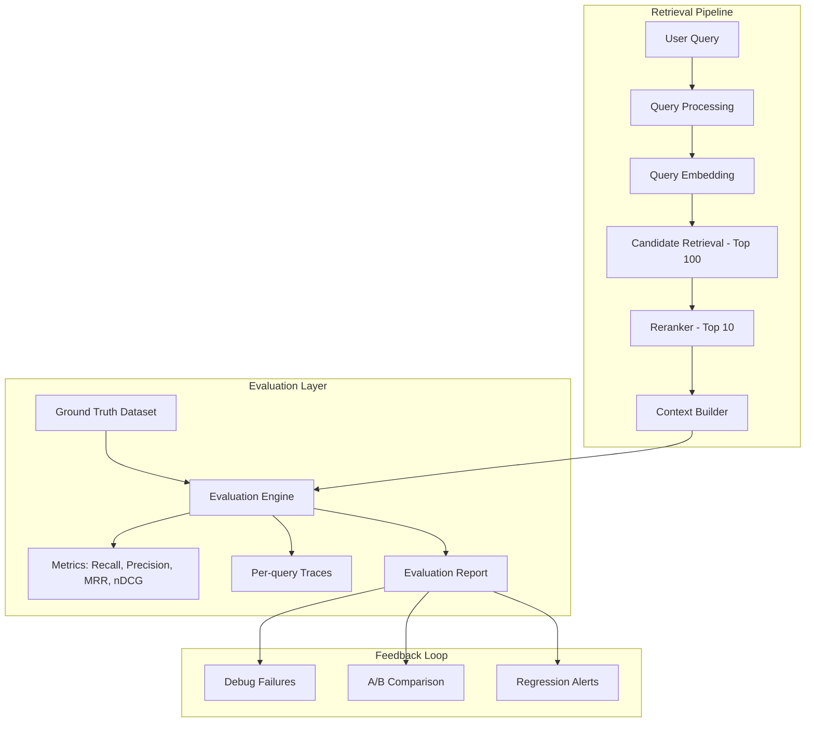

---

## Evaluation Class Structure

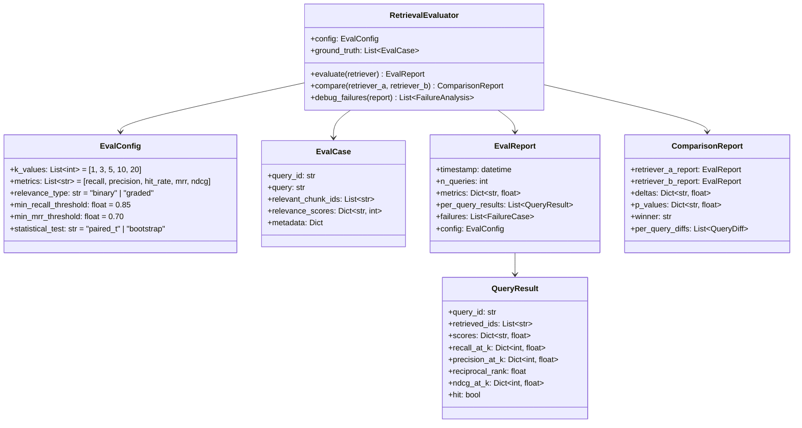

---

## Tools & Dependencies

| Category | Tools |
|----------|-------|
| Retrieval metrics | `ranx`, `pytrec_eval`, or manual computation |
| Embeddings | `sentence-transformers`, OpenAI Embeddings |
| Rerankers | `cross-encoder`, Cohere Rerank, `flashrank` |
| Vector DB | `qdrant-client`, `chromadb`, `pgvector` |
| Statistical tests | `scipy.stats` (paired t-test, Wilcoxon), bootstrap |
| LLM annotation | `openai`, `litellm` |
| Visualization | `matplotlib`, `seaborn` |
| Dataset management | `pandas`, JSON/YAML files |
| Orchestration | `prefect`, `airflow`, cron |


---

## 1. Building Ground Truth

> Without ground truth, no retrieval metric can exist. This is step zero.

A ground truth dataset is a collection of `(query, relevant_chunks)` pairs that define what **should** have been retrieved.

### Ground Truth Data Structure

```yaml
# evaluation_dataset.yaml
- query_id: "q_001"
  query: "How do I configure OAuth for our internal API?"
  relevant_chunk_ids: ["chunk_28", "chunk_91"]
  relevance_scores:          # Optional: for graded relevance
    chunk_28: 3              # Perfect answer
    chunk_91: 2              # Useful background
    chunk_15: 1              # Tangentially related
  metadata:
    category: "authentication"
    difficulty: "medium"
    source: "human_annotated"
```

### Method 1 — Human Annotation

**When to use:** High-stakes evaluation, establishing benchmark quality.

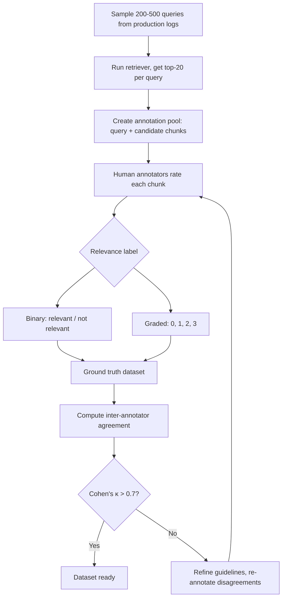

**Implementation approach:**
1. Export 200–500 representative queries from production logs
2. Run your current retriever with K=20 to generate candidate chunks per query
3. Present annotators with: `(query, chunk)` pairs
4. Annotators label: relevant (1) or not (0) — or graded (0–3)
5. Use 2+ annotators per pair, resolve disagreements
6. Measure inter-annotator agreement (Cohen's κ) — aim for > 0.7

**Cost:** ~2–5 minutes per query × 300 queries = 10–25 hours of annotation work

### Method 2 — LLM-as-Annotator

**When to use:** Bootstrapping quickly, iterating on retriever changes, scaling annotation.

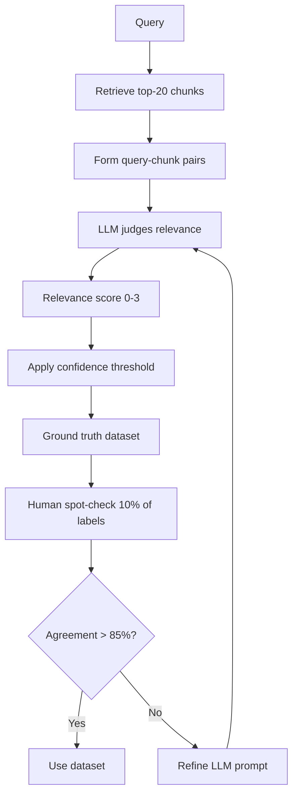

**LLM annotation prompt pattern:**

```text
Given the following query and document chunk, rate the relevance:

Query: {query}
Chunk: {chunk_text}

Rate on a scale of 0-3:
- 0: Completely irrelevant
- 1: Tangentially related but doesn't answer the query
- 2: Contains useful background or partial answer
- 3: Directly and completely answers the query

Respond with ONLY the number.
```

**Key considerations:**
- Use a strong model (GPT-4o, Claude) for annotation
- Always validate with human spot-checks (10–20% sample)
- LLM annotators tend to be more generous — calibrate threshold accordingly
- Cost: ~$0.01–0.05 per judgment × 20 chunks × 300 queries = $60–300

### Method 3 — Synthetic Generation

**When to use:** No production queries yet, testing new KB content, expanding evaluation set.

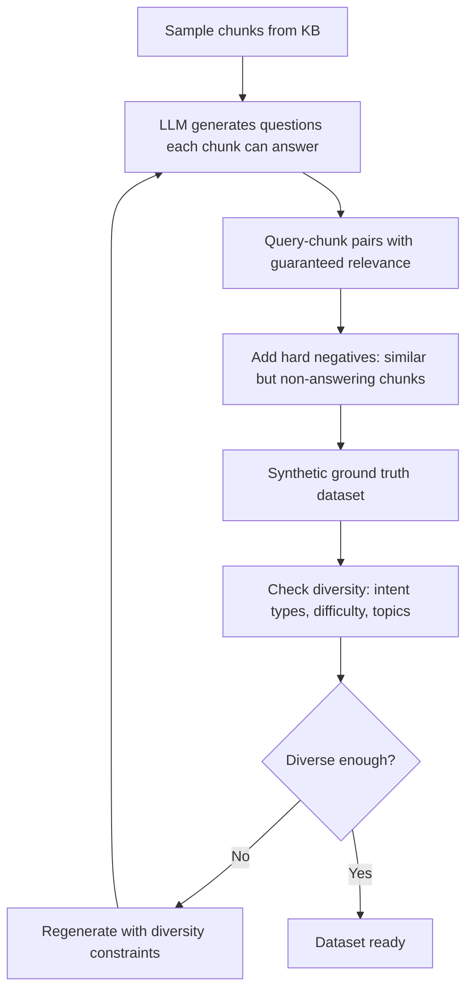

**Approach:**
1. Sample 300–500 chunks from your KB
2. For each chunk, ask LLM: "Generate 1–3 questions that this chunk can fully answer"
3. The generating chunk becomes the ground truth relevant document
4. Add **hard negatives**: retrieve top-5 chunks for each generated question, exclude the source chunk — these are plausible but incorrect results
5. Result: guaranteed `(query, relevant_chunk)` pairs

**Generation prompt:**

```text
Given this document chunk, generate 2 realistic questions a user might ask 
that this chunk can fully answer. Make questions natural and varied in phrasing.

Chunk: {chunk_text}

Questions:
```

### Binary vs Graded Relevance

| Aspect | Binary (0/1) | Graded (0–3) |
|--------|-------------|--------------|
| Annotation effort | Low | Higher |
| Metrics supported | Recall, Precision, Hit Rate, MRR | All above + nDCG |
| When to use | Starting out, simple retrieval | Reranker evaluation, ranking optimization |
| Ground truth format | `relevant_chunk_ids: [list]` | `relevance_scores: {chunk_id: score}` |

**Recommendation:** Start with binary. Move to graded when you add a reranker or need to distinguish "good ranking" from "perfect ranking."

### How Many Eval Cases Do You Need?

| Dataset Size | Suitable For |
|-------------|--------------|
| 50–100 | Smoke tests, sanity checks |
| 200–300 | Meaningful metric computation, initial benchmarking |
| 500+ | Statistical significance in A/B tests |
| 1000+ | Fine-grained analysis by category/difficulty |

### Maintaining Ground Truth Over Time

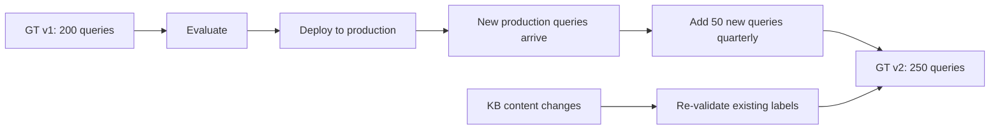

Ground truth must evolve with your KB. When documents are updated, deleted, or re-chunked, existing labels may become invalid.


---

## 2. Metrics — How to Compute Each One

> Every metric answers a different question about retrieval quality. Use them together, not in isolation.

### Recall@K

**Question:** "Of all relevant chunks, how many did the retriever find in the top K?"

**Formula:**

```
Recall@K = |relevant ∩ retrieved_top_k| / |relevant|
```

**Worked example:**

```
Ground truth relevant: {chunk_28, chunk_91, chunk_15}    (3 relevant)
Retrieved top-5:       [chunk_91, chunk_10, chunk_28, chunk_44, chunk_77]

Relevant found in top-5: {chunk_91, chunk_28} = 2

Recall@5 = 2 / 3 = 0.667
```

**Computation approach:**

```mermaid
flowchart LR
    GT[Ground truth relevant set] --> INTER[Set intersection]
    RET[Retrieved top-K list] --> SET[Convert to set]
    SET --> INTER
    INTER --> COUNT[Count intersection]
    COUNT --> DIV[Divide by total relevant count]
    DIV --> RECALL[Recall@K score]
```

**Per-query, then average across all queries:**

```
Mean_Recall@K = (1/N) × Σ Recall@K(query_i)
```

**When Recall@K = 1.0:** All relevant chunks appear in top-K. The LLM has full evidence.
**When Recall@K = 0.0:** None of the relevant chunks were retrieved. The LLM is flying blind.

**Key insight:** Recall is the most critical metric for RAG because if the evidence isn't retrieved, no LLM can produce a correct answer.

---

### Precision@K

**Question:** "Of the K chunks retrieved, how many are actually relevant?"

**Formula:**

```
Precision@K = |relevant ∩ retrieved_top_k| / K
```

**Worked example:**

```
Ground truth relevant: {chunk_28, chunk_91}
Retrieved top-5:       [chunk_91, chunk_10, chunk_28, chunk_44, chunk_77]

Relevant found in top-5: {chunk_91, chunk_28} = 2

Precision@5 = 2 / 5 = 0.40
```

**When Precision@K is low:** You're stuffing irrelevant context into the LLM's prompt, wasting tokens and potentially confusing it.

**When Precision@K is high:** Almost everything retrieved is useful — clean context.

**Tradeoff with Recall:** Increasing K typically increases Recall but decreases Precision. You're casting a wider net (more hits) but also catching more noise.

---

### Hit Rate (Hit@K)

**Question:** "Did at least ONE relevant chunk appear in the top K?"

**Formula:**

```
Hit@K = 1 if |relevant ∩ retrieved_top_k| > 0 else 0

Mean_Hit_Rate@K = (1/N) × Σ Hit@K(query_i)
```

**Worked example:**

```
Query A: relevant = {chunk_28} → retrieved top-5 contains chunk_28 → Hit = 1
Query B: relevant = {chunk_55} → retrieved top-5 does NOT contain chunk_55 → Hit = 0
Query C: relevant = {chunk_12, chunk_99} → retrieved top-5 contains chunk_12 → Hit = 1

Mean Hit Rate@5 = (1 + 0 + 1) / 3 = 0.667
```

**When to use:** When most questions only need one chunk to answer correctly. Simpler than Recall but less informative for multi-evidence questions.

---

### Mean Reciprocal Rank (MRR)

**Question:** "How early in the ranked list does the FIRST relevant chunk appear?"

**Formula:**

```
Reciprocal Rank = 1 / rank_of_first_relevant_chunk

MRR = (1/N) × Σ (1 / rank_i)
```

**Worked example:**

```
Query A: first relevant chunk at rank 1 → RR = 1/1 = 1.000
Query B: first relevant chunk at rank 3 → RR = 1/3 = 0.333
Query C: first relevant chunk at rank 7 → RR = 1/7 = 0.143
Query D: no relevant chunk in top-K   → RR = 0

MRR = (1.000 + 0.333 + 0.143 + 0) / 4 = 0.369
```

**Computation approach:**

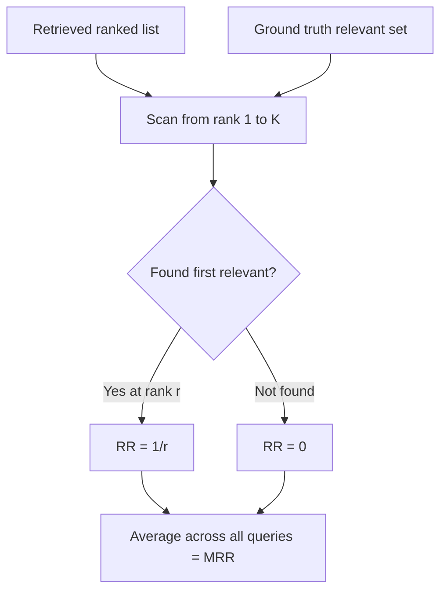

**Key insight:** MRR rewards retrievers that put the best chunk at position 1. A retriever with high Recall but low MRR retrieves the right stuff but buries it at the bottom — bad for systems that only use top-3 chunks.

---

### nDCG@K

**Question:** "Are the most relevant chunks ranked highest?" (requires graded relevance)

**Formula (step by step):**

```
Step 1 — DCG@K (Discounted Cumulative Gain):
    DCG@K = Σ(i=1 to K) [ relevance(i) / log2(i + 1) ]

Step 2 — Ideal DCG (IDCG@K):
    Sort all relevant chunks by relevance score descending
    Compute DCG@K on this ideal ranking

Step 3 — nDCG@K:
    nDCG@K = DCG@K / IDCG@K
```

**Worked example:**

```
Graded relevance scores: chunk_A=3, chunk_B=2, chunk_C=1, chunk_D=0

Actual retrieval order:   [chunk_D(0), chunk_A(3), chunk_C(1), chunk_B(2), ...]
DCG@4 = 0/log2(2) + 3/log2(3) + 1/log2(4) + 2/log2(5)
       = 0 + 1.893 + 0.500 + 0.861 = 3.254

Ideal order:              [chunk_A(3), chunk_B(2), chunk_C(1), chunk_D(0), ...]
IDCG@4 = 3/log2(2) + 2/log2(3) + 1/log2(4) + 0/log2(5)
        = 3.0 + 1.262 + 0.500 + 0 = 4.762

nDCG@4 = 3.254 / 4.762 = 0.683
```

**Computation approach:**

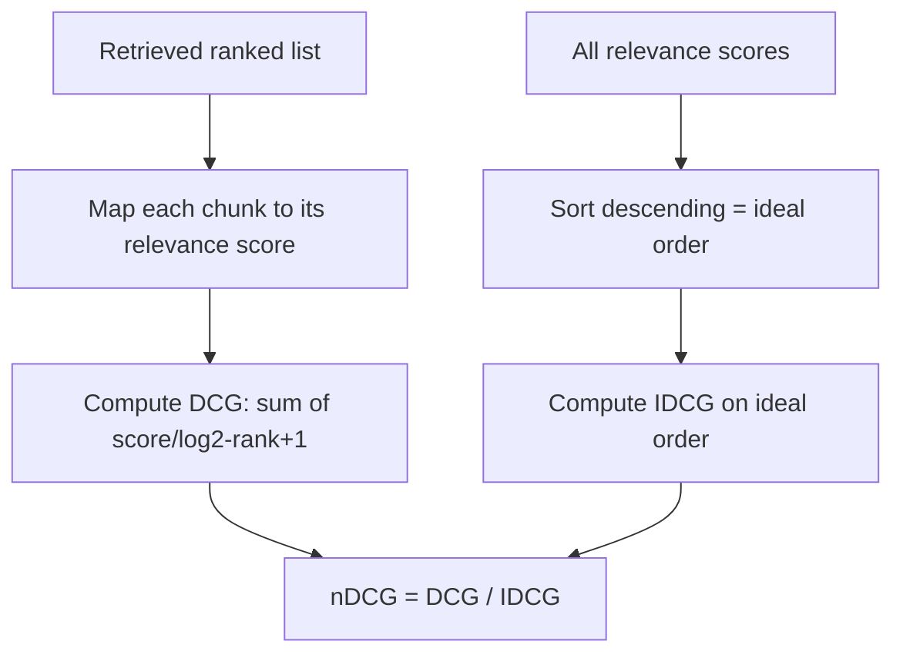

**Key insight:** nDCG is the gold standard metric when you have a reranker. It captures whether your reranker is placing the "3-star" chunks above the "1-star" chunks. Recall/Precision can't distinguish this.

**When nDCG = 1.0:** Perfect ranking — every chunk is in its ideal position.
**When nDCG is low but Recall is high:** You retrieved the right stuff but ranked it poorly — your reranker needs work.

---

### Choosing the Right K

| K Value | Use Case |
|---------|----------|
| K=1 | "Can the retriever get it right on the first try?" (most demanding) |
| K=3 | Typical for production systems with small context windows |
| K=5 | Standard evaluation point, good balance |
| K=10 | Pre-reranker evaluation: "Is the answer in the candidate pool?" |
| K=20 | Recall ceiling: "Does the retriever even know about this chunk?" |

**Practical pattern:** Evaluate at multiple K values simultaneously to understand the retrieval funnel:

```
Recall@1  = 0.45  →  First guess hits 45% of the time
Recall@5  = 0.78  →  In top-5, we capture 78%
Recall@10 = 0.91  →  Candidate pool is good
Recall@20 = 0.96  →  Almost everything is reachable
```

If Recall@20 is low, the problem is in **candidate retrieval** (embedding model, index).
If Recall@20 is high but Recall@5 is low, the problem is in **ranking** (reranker, scoring).

---

### Metrics Summary Table

| Metric | Requires | Answers | Best For |
|--------|----------|---------|----------|
| Recall@K | Binary relevance | Did we find the evidence? | RAG systems (most critical) |
| Precision@K | Binary relevance | Is the context clean? | Context window optimization |
| Hit Rate@K | Binary relevance | Did at least one hit? | Single-answer questions |
| MRR | Binary relevance | How early is the first hit? | Ranking quality (top-1 focus) |
| nDCG@K | Graded relevance | Is the ranking optimal? | Reranker evaluation |


---

## 3. Retrieval Pipeline Evaluation (Per-Stage)

> A retrieval pipeline has multiple stages. Evaluating only the final output hides WHERE failures occur.

### Stage-by-Stage Evaluation

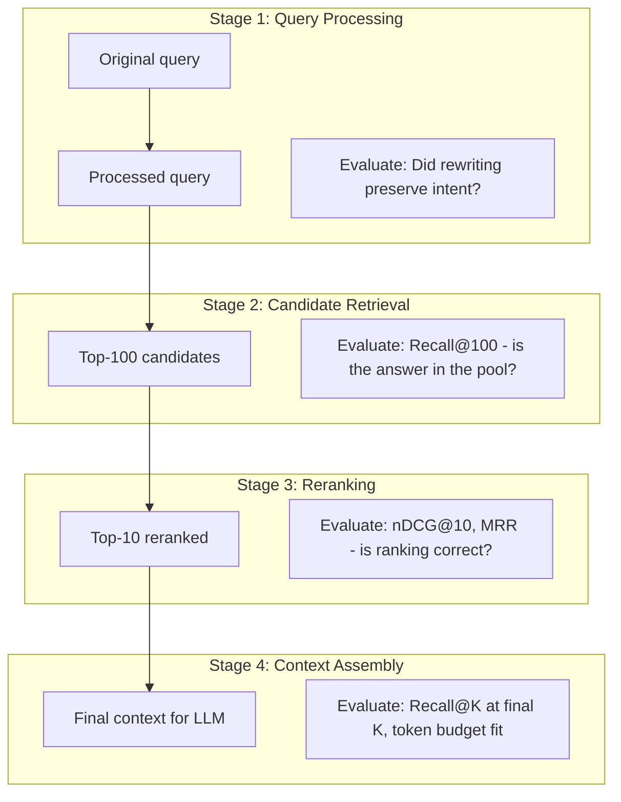

### What to Measure at Each Stage

| Stage | Metric | What It Reveals |
|-------|--------|-----------------|
| **Query Processing** | Intent preservation rate (LLM judge) | Does query rewriting/expansion change meaning? |
| **Candidate Retrieval** | Recall@100 | Is the answer even in the candidate pool? |
| **Candidate Retrieval** | Retrieval latency (P50, P95) | Is the vector search fast enough? |
| **Reranking** | Recall@10 vs Recall@100 | Does reranking discard relevant chunks? |
| **Reranking** | nDCG@10 improvement over pre-rerank | Is the reranker actually helping? |
| **Reranking** | MRR improvement | Does reranking push the best chunk higher? |
| **Context Assembly** | Final Recall@K (where K = context window chunks) | After all filtering, is evidence present? |
| **Context Assembly** | Token utilization | Are we using the context window efficiently? |

### Diagnosing Which Stage Failed

```mermaid
flowchart TD
    FAIL[Low Recall@5 in final output] --> CHECK1{Recall@100 high?}
    CHECK1 -->|No| PROBLEM1[❌ Candidate retrieval problem]
    CHECK1 -->|Yes| CHECK2{Recall@10 high after reranking?}
    CHECK2 -->|No| PROBLEM2[❌ Reranker problem - discarding relevant chunks]
    CHECK2 -->|Yes| CHECK3{Recall@K in final context high?}
    CHECK3 -->|No| PROBLEM3[❌ Context assembly problem - filtering/truncation]
    CHECK3 -->|Yes| NOT_RETRIEVAL[✅ Retrieval is fine - problem is downstream]

    PROBLEM1 --> FIX1[Fix: better embedding model, hybrid search, index issues]
    PROBLEM2 --> FIX2[Fix: different reranker, adjust rerank threshold]
    PROBLEM3 --> FIX3[Fix: increase K, adjust deduplication, fix token budget]
```

### Evaluating Hybrid Retrieval

If using hybrid search (dense + sparse), evaluate components independently:

| Configuration | How to Evaluate |
|--------------|-----------------|
| Dense only (vector search) | Recall@K with dense retrieval alone |
| Sparse only (BM25/keyword) | Recall@K with keyword retrieval alone |
| Hybrid (combined) | Recall@K of the fused result |
| Fusion weight tuning | Grid search over weights, maximize Recall@K |

**Example evaluation matrix:**

```
                    Recall@10
Dense only:         0.72
Sparse only:        0.61
Hybrid (0.7/0.3):   0.84
Hybrid (0.5/0.5):   0.81
Hybrid (0.3/0.7):   0.76
```

This tells you: dense dominates but sparse adds value. Optimal fusion = 0.7 dense + 0.3 sparse.

### Evaluating Query Expansion / Rewriting

```mermaid
flowchart LR
    ORIG[Original query] --> RET_ORIG[Retrieve with original]
    ORIG --> REWRITE[Rewrite/expand query]
    REWRITE --> RET_NEW[Retrieve with rewritten]
    
    RET_ORIG --> RECALL_A[Recall@K original]
    RET_NEW --> RECALL_B[Recall@K rewritten]
    
    RECALL_A --> COMPARE[Compare: did rewriting help?]
    RECALL_B --> COMPARE
    COMPARE --> DELTA[Per-query delta]
```

**Key question:** Does query rewriting improve retrieval, or does it sometimes change the intent and hurt results?

Measure:
- **Win rate:** % of queries where rewriting improved Recall@K
- **Lose rate:** % where it got worse
- **Neutral rate:** % unchanged

If lose rate > 10%, the rewriting strategy needs guardrails.


---

## 4. Comparison Framework — Retriever A vs B

> Every retriever change must be validated with a structured comparison before deployment.

### When to Compare

- Changing embedding model
- Adjusting chunk size or overlap
- Adding/removing a reranker
- Modifying hybrid search weights
- Upgrading vector DB or index type
- Adding query expansion/rewriting

### Comparison Architecture

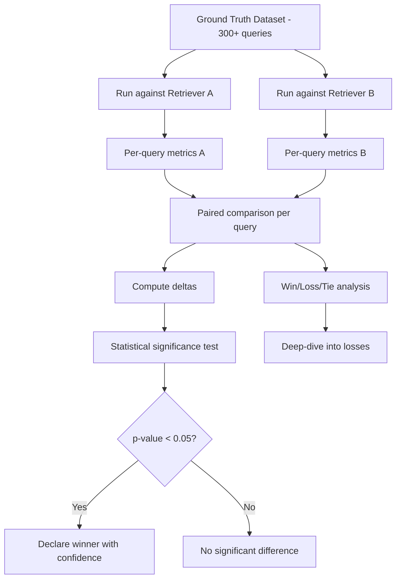

### Comparison Metrics Table Template

| Metric | Retriever A | Retriever B | Delta | p-value | Verdict |
|--------|-------------|-------------|-------|---------|---------|
| Recall@5 | 0.78 | 0.84 | +0.06 | 0.003 | ✅ B wins |
| Precision@5 | 0.42 | 0.39 | -0.03 | 0.12 | — No sig. diff |
| MRR | 0.65 | 0.71 | +0.06 | 0.008 | ✅ B wins |
| nDCG@10 | 0.72 | 0.77 | +0.05 | 0.015 | ✅ B wins |
| Hit Rate@5 | 0.88 | 0.91 | +0.03 | 0.06 | — Marginal |
| Latency P50 (ms) | 45 | 120 | +75 | — | ⚠️ A is faster |

### Statistical Significance

Don't trust aggregate numbers alone. Use per-query paired tests:

**Approach 1 — Paired t-test:**
- For each query, compute `delta_i = metric_B(query_i) - metric_A(query_i)`
- Test if mean(delta) ≠ 0

**Approach 2 — Bootstrap confidence interval:**
- Resample query set with replacement 1000 times
- Compute metric delta on each resample
- If 95% CI doesn't include 0 → significant

**Approach 3 — Win/Loss/Tie:**
- Per query: B wins if its metric is higher, A wins if lower, tie if equal
- Report: "B wins on 180/300 queries, A wins on 85, tie on 35"
- More intuitive than p-values for stakeholders

### Decision Framework

```mermaid
flowchart TD
    START[Compare A vs B] --> Q1{Recall@K improves?}
    Q1 -->|No| KEEP_A[Keep A — recall is king in RAG]
    Q1 -->|Yes| Q2{Any critical regressions?}
    Q2 -->|Yes| INVESTIGATE[Analyze: which queries regressed?]
    Q2 -->|No| Q3{Latency acceptable?}
    Q3 -->|Yes| SHIP_B[Ship B ✅]
    Q3 -->|No| OPTIMIZE[Optimize B's latency before shipping]
    INVESTIGATE --> CATEGORY[Categorize regressions]
    CATEGORY --> FIXABLE{Fixable without losing gains?}
    FIXABLE -->|Yes| FIX[Fix and re-evaluate]
    FIXABLE -->|No| TRADEOFF[Present tradeoff to team]
```

### What to Examine in Regressions

When Retriever B is better overall but worse on some queries:

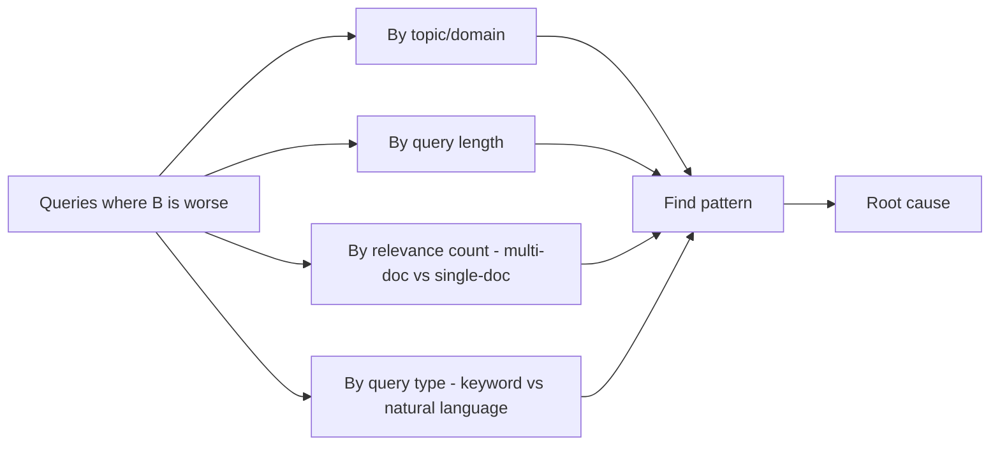

Common regression patterns:
- B worse on **short keyword queries** → sparse search was removed or downweighted
- B worse on **multi-document questions** → new embedding model has narrower attention
- B worse on **specific domain** → domain vocabulary not well-represented in new model
- B worse on **long queries** → token truncation in query embedding


---

## 5. Debugging Retrieval Failures

> When metrics drop, you need a systematic way to find the root cause.

### Failure Taxonomy

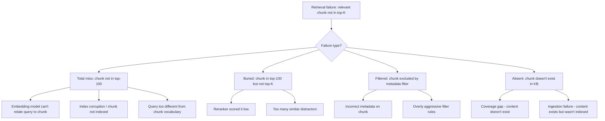

### Debugging Checklist

For a specific failing query:

1. **Is the relevant chunk in the index?** → Query vector DB by chunk ID
2. **What's the similarity score?** → Compute cosine similarity between query embedding and chunk embedding directly
3. **Where does it rank without filters?** → Retrieve with no metadata filters, check position
4. **Is it a filter issue?** → Compare filtered vs unfiltered retrieval results
5. **Is it an embedding issue?** → Try different query phrasings, check if similarity improves
6. **Is it a reranker issue?** → Check pre-rerank vs post-rerank position

### Retrieval Trace Format

For every evaluation query, capture a full trace:

```yaml
trace:
  query_id: "q_042"
  query: "What's the travel reimbursement policy?"
  query_embedding_norm: 0.998
  
  candidate_retrieval:
    method: "hybrid (0.7 dense + 0.3 bm25)"
    candidates_returned: 100
    latency_ms: 34
    relevant_in_candidates: ["chunk_88"]  # ground truth chunks found
    recall_at_100: 1.0
  
  reranking:
    model: "cross-encoder/ms-marco-MiniLM-L-12-v2"
    input_count: 100
    output_count: 10
    latency_ms: 87
    relevant_in_top10: ["chunk_88"]
    recall_at_10: 1.0
    chunk_88_rank_before: 14
    chunk_88_rank_after: 3
  
  final_output:
    top_k: 5
    retrieved: ["chunk_22", "chunk_55", "chunk_88", "chunk_91", "chunk_3"]
    recall_at_5: 1.0
    precision_at_5: 0.20
    reciprocal_rank: 0.333  # first relevant at rank 3
```

---

## 6. Dashboard & Automation

### Production Dashboard Metrics

| Metric | What to Track | Alert Threshold |
|--------|---------------|-----------------|
| Recall@5 (aggregate) | Weekly trend | Drop > 5% week-over-week |
| MRR | Weekly trend | Drop > 0.05 |
| Hit Rate@5 | Daily | Drop below 0.85 |
| Retrieval latency P95 | Real-time | > 500ms |
| Empty retrieval rate | Daily | Queries with 0 results > 5% |
| Candidate pool size | Daily | Mean pool < 50 (indicates index issues) |

### Automation Pipeline

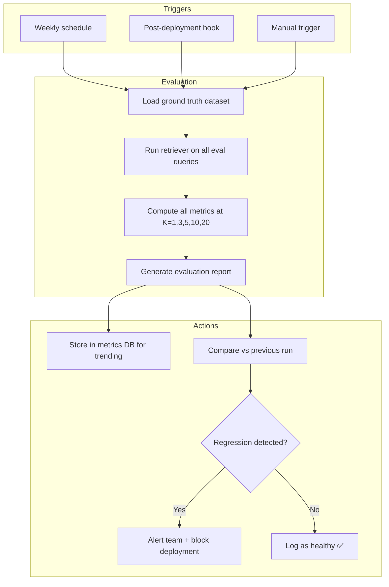

### Recommended Evaluation Cadence

| Event | What to Run | Why |
|-------|-------------|-----|
| **Every deployment** | Full eval on golden set | Catch regressions before users |
| **Weekly** | Full eval + trend analysis | Track drift over time |
| **After KB changes** | Recall@K on affected queries | Validate new content helps |
| **Quarterly** | Ground truth refresh + full eval | Keep eval dataset relevant |

### CI/CD Integration

Retrieval evaluation as a quality gate:

```mermaid
flowchart LR
    PR[PR: change retriever config] --> CI[CI pipeline triggered]
    CI --> EVAL[Run retrieval eval on golden set]
    EVAL --> CHECK{Recall@5 ≥ baseline - 0.02?}
    CHECK -->|Yes| PASS[✅ Gate passes]
    CHECK -->|No| BLOCK[❌ Block merge, notify author]
    PASS --> MERGE[Allow merge]
```

---

## Quick Reference — All Metrics

| Metric | Formula | Range | Higher is Better? | Key Question |
|--------|---------|-------|-------------------|--------------|
| Recall@K | `\|relevant ∩ top_k\| / \|relevant\|` | 0–1 | Yes | Did we find the evidence? |
| Precision@K | `\|relevant ∩ top_k\| / K` | 0–1 | Yes | Is the context clean? |
| Hit Rate@K | `1 if any relevant in top_k else 0` | 0 or 1 | Yes | At least one hit? |
| MRR | `1 / rank_of_first_relevant` | 0–1 | Yes | How early is the first hit? |
| nDCG@K | `DCG@K / IDCG@K` | 0–1 | Yes | Is the ranking optimal? |

---

## FAQ

### Ground Truth

**Q: How do I build ground truth if I have no production queries?**

Use synthetic generation (Method 3). Sample chunks from your KB, ask an LLM to generate questions each chunk answers, then add hard negatives. This gives you guaranteed (query, relevant_chunk) pairs. Replace with real queries as production data arrives.

**Q: How often should I update my ground truth dataset?**

Quarterly at minimum. Also update when: (a) you re-chunk the KB (chunk IDs change), (b) major new content is added, (c) you notice eval results no longer correlate with user satisfaction. Stale ground truth gives false confidence.

**Q: Binary or graded relevance — which should I choose?**

Start with binary (relevant/not-relevant). It supports Recall, Precision, Hit Rate, and MRR — which cover most needs. Move to graded (0-3) only when you add a reranker and need nDCG to evaluate ranking quality.

**Q: Can I use an LLM to generate ground truth without any human validation?**

Not for your primary benchmark. LLM-generated labels are useful for rapid iteration and scaling, but you need human validation on at least 10–20% of labels to trust the dataset. LLMs tend to be overly generous (marking tangentially related chunks as relevant).

---

### Metrics

**Q: Which is the single most important metric for RAG retrieval?**

Recall@K (at your production K value). If the evidence isn't retrieved, no downstream model can produce a correct answer. All other metrics are secondary to recall in a RAG context.

**Q: My Recall@10 is 0.95 but Recall@5 is 0.70. What does this mean?**

Your candidate retrieval is excellent (the right chunks ARE in the pool) but your ranking is poor (they're not in the top positions). This is a reranker problem. Either add a reranker or tune the one you have.

**Q: Precision@5 is only 0.30. Is that bad?**

It depends. Precision@5 = 0.30 means 1.5 out of 5 chunks are relevant. If your queries typically have 1–2 relevant chunks, this is mathematically normal (max possible Precision@5 with 2 relevant chunks = 0.40). Low precision is only problematic if it means the LLM is receiving confusing or contradictory context.

**Q: When should I use nDCG instead of Recall?**

When you have a reranker and want to measure whether it's ranking the best chunks first. Recall says "did we find it?" — nDCG says "did we rank it well?" They answer different questions. If you're comparing two rerankers that both achieve the same Recall@10, nDCG will distinguish which one puts the gold chunk at position 1 vs position 8.

**Q: What's a "good" MRR score?**

- MRR > 0.80: Excellent — first relevant chunk is usually at rank 1
- MRR 0.50–0.80: Good — first relevant chunk is in top 2-3
- MRR < 0.50: Poor — relevant content is buried deep in results

---

### Pipeline & Comparison

**Q: How many queries do I need for a statistically significant A/B comparison?**

At least 200–300 for a paired t-test to detect a 5% difference in Recall with p<0.05. For smaller effects, you need more (500+). Alternatively, use bootstrap confidence intervals which are more robust with smaller samples.

**Q: My reranker improves nDCG but hurts Recall. Is that possible?**

Yes. If the reranker outputs only the top-K and discards the rest, it can accidentally exclude relevant chunks that were in the original candidate pool. Always measure Recall@K before and after reranking. A good reranker should never decrease Recall — only improve ranking within the same recall ceiling.

**Q: Should I evaluate my retriever end-to-end (query to final answer) or in isolation?**

Both, but for different purposes. Evaluate retrieval in isolation (Recall, MRR, nDCG) to understand retriever quality independently. Evaluate end-to-end (answer correctness) to understand total system quality. If end-to-end is bad but retrieval metrics are good, the problem is in generation, not retrieval.

**Q: How do I evaluate when there's no single "correct" retrieval?**

Some queries are genuinely ambiguous or have multiple valid answer paths. In these cases: (a) mark all valid chunks as relevant in ground truth, (b) use Hit Rate rather than Recall (any valid path is fine), (c) use LLM-as-judge to assess whether retrieved context is "sufficient to answer" rather than matching specific chunk IDs.

---

### Operations

**Q: How do I run retrieval evaluation without affecting production?**

Use a read-only evaluation path: same index, same retriever logic, but queries come from your eval dataset (not live users). Run during off-peak hours if you're concerned about load. Most vector DBs handle eval traffic easily alongside production.

**Q: What's the minimum viable retrieval evaluation I should start with?**

1. Create 100 ground truth (query, relevant_chunks) pairs — even manually
2. Compute Recall@5 and Hit Rate@5
3. Run after every retriever change

This takes < 1 day to set up and catches the most catastrophic regressions. Expand from there.

**Q: How do I handle evaluation when chunk IDs change (after re-chunking)?**

This is the hardest practical problem. Options:
- Re-annotate ground truth (expensive but correct)
- Map old chunk IDs to new ones using content overlap (if content didn't change, just chunk boundaries)
- Use content-based ground truth instead of ID-based: "this query's answer is contained in text X" → search for chunks containing text X in the new chunking


